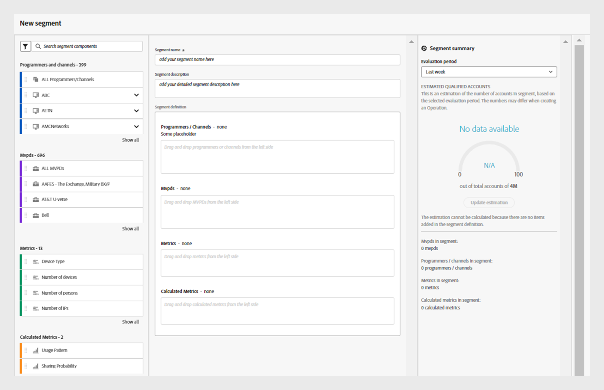

# Build segments in [!UICONTROL Account IQ] {#build-segment}

To build a new segment for account sharing analysis:

1. Go to **Segments** and select **[!UICONTROL Create new segment]** located at the upper-right. 

   

   *Figure: Create new segment*

1. Add a name of your segment in **[!UICONTROL Segment name]**.
1. Add a detailed description of your segment in **Segment description**.
1. Drag **Programmers and channels** from the segment components at the left and drop into the **Programmers/Channels** section within the segment definition.

   >[!NOTE]
   >
   >You can add either programmers or channels in the **Programmers/Channels** section.  

   * If you drag a **channel** as a first item and drop it into **Programmers/Channels** section, you can only add channels as the next items.

   * If you drag a **programmer** as a first item and drop it into **Programmers/Channels** section, it triggers a decision dialog as follows.

    
    
    *Figure: Add Programmers/Channels as a programmer or its channels*

   You need to determine if you prefer a segment based on the channels linked to the programmer or if you want to compare specific programmers.
        
   Select **As a programmer** to add programmers to the **Programmers/Channels** section and not the individual channels. 

   Select **As its channels** to add individual channels of a programmer or alternatively, drag a programmer and drop it to the **Programmers/Channels** section to add all of its channels. 

1. Drag **MVPDs** from the segment components at the left and drop into the **MVPDs** section within the segment definition.
1. Drag **Metrics** from the segment components at the left and drop into the **Metrics** section within the segment definition.

   When a metric is added in the segment definition, you have the option to  choose an operator and assign a value to the respective metric.

   
   
   *Figure: Select an operator and set a value for the added metric*

   **Select an operator**, and then **Select an option** from the dropdown menu. You can raise the values using the upward arrow and lower them using the downward arrow.

1. Drag **Calculated Metrics** from the segment components at the left and drop into the **Calculated Metrics** section within the segment definition.
   
   When a calculated metric is added in the segment definition, you have the option to  choose an operator and assign a value to the respective metric.

    **Select an operator**, and then **Select an option** from the dropdown menu.

1. View the segment summary and **Save segment**.

The segment you've created is now visible in the segment list.

