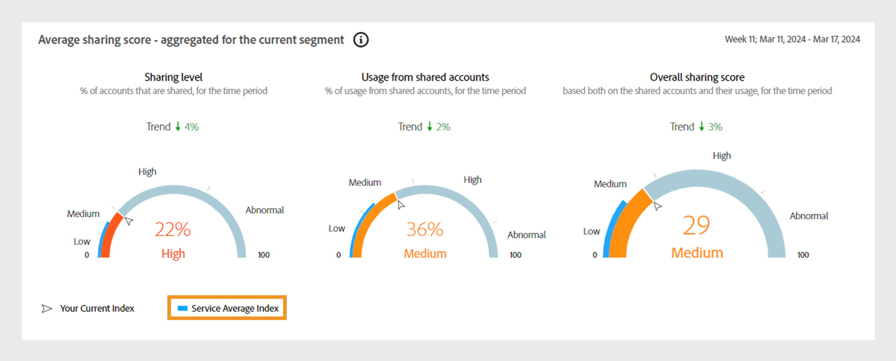
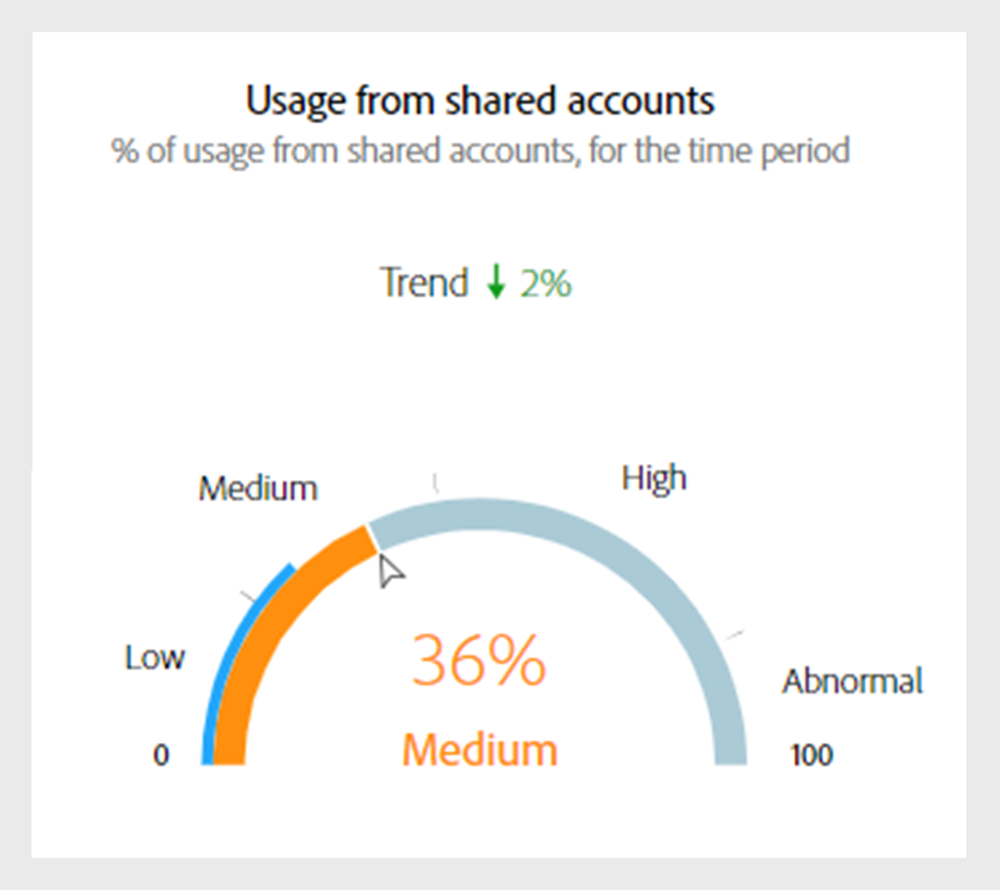
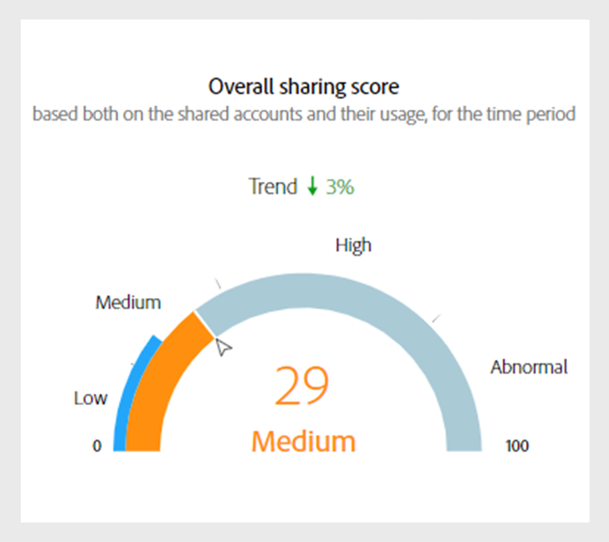
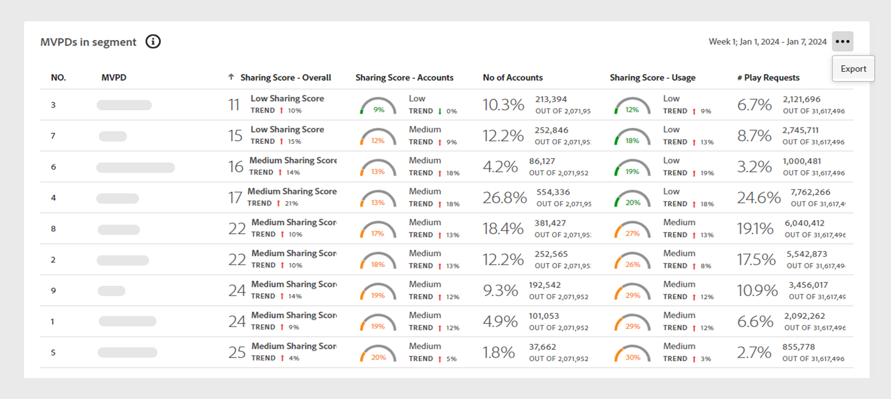
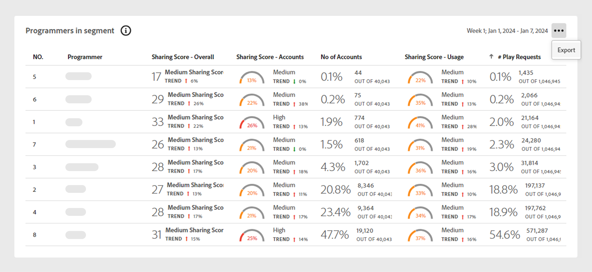

# Data panels on Dashboard {#data-panels}

Once you've selected segment and time interval, the dashboard displays various data panels in a form of tables and graphs. These panels provides the analysis of credential sharing statistics of the subscriber accounts in the selected segment.

The table below outlines the availability of data panels for different [personas](/help/accountiq/personas-aiq.md): 

|Data panels|D2C services|TVE Programmers|TVE MVPDs|
|---|---|---|---|
|[Average sharing score - aggregated for the current segment](#aggregated-sharing)|Available|Available|Available|
|[MVPDs and Programmers in segment](#mvpds-programmers-segment)|Available|Available|Available|
|[Sharing score by channels and MVPDs](#sharin-score-by-channels-and-mvpds)|Unavailable|Available|Unavailable|
|[Accounts sharing probability](#accounts-sharing-probability)|Available|Available|Available|
|[Number of accounts and usage by sharing probability level](#number-of-accounts-usage-sharing-probability)|Available|Available|Available|

## Average sharing score - aggregated for the current segment {#aggregated-sharing}

The Aggregated Sharing Score panel provides a top line readout summarizing the quantity and impact of sharing in terms of accounts and streaming volume.

The metrics help you understand the magnitude (ranging from low, medium, high to abnormal) of credential sharing by your subscribers, hence providing a measure of the need to act upon it.

*Figure: Average sharing score panel - aggregated for the current segment*

The following metrics are components of the Average Sharing Score.

### Sharing level {#sharing-level}

The sharing level gauge shows the percentage of all your shared subscriber accounts in the defined segment during the selected time interval.  

The number of percentage is calculated based on an average of the sharing probability computed for every account in the set of selected MVPDs that has streamed from a one of the selected programmer channels during the selected time interval.

*Figure: Sharing level*

The Trend indicator shows the percentage change in the value of the metric from the previous time interval.

### Usage from shared accounts {#usage-from-shared-accounts}

The gauge indicates the percent of usage by the shared accounts among all subscriber accounts for the defined segment and time period. These ranges—named Low, Medium, High, and Abnormal—are based on the industry average.

You can also see the Trend indicator, which depicts a rise or fall in the usage from shared accounts compared to the previous time interval.

*Figure: Usage from shared accounts*

### Overall sharing score {#overall-sharing-score}

Overall sharing score is combination of sharing scores including "Sharing level" and "z Usage from shared accounts".

It provides a percentage that reflects the comparative impact of sharing in relation to the industry. It's purpose is similar to that of a credit score, summarizing the situation with a single number. But in this case, the higher the number, the greater the potential harm.

*Figure: Overall sharing score*

## MVPDs and Programmers in segment {#mvpds-programmers-segment}

+++Programmer- MVPDs in segment

When you log in as a **Programmer** user, this table provides a comparative view of the different Aggregated Sharing Scores for the MVPDs in the current segment.

Select the column headings to sort the data.

*Figure: Sharing Score by MVPDs in segment*

Use **Export** to download the data in a csv file. View [export data panel reports](/help/accountiq/export-reports.md) for more information

+++

+++MVPD- Programmers in segment

When you log in as an **MVPD** user, this table provides a comparative view of the different Aggregated Sharing Scores for the Programmers in the current segment.

Select the column headings to sort the data.

*Figure: Sharing Score by Programmers in segment*

Use **Export** to download the data in a csv file. View [export data panel reports](/help/accountiq/export-reports.md) for more information.

+++

## Sharing score by channels and MVPDs  {#sharin-score-by-channels-and-mvpds}

When you log in as a Programmer user, this table provides a comparative view of sharing scores of the selected channels for the MVPDs in the current segment.

Select the column headings to sort the data.

*Figure: Sharing scores by channels and MVPDs*

## Accounts sharing probability {#accounts-sharing-probability}

This chart partitions accounts into ranges of sharing probability quintiles from very low (0-20%) to very high (80-100%).

>[!NOTE]
>
>The bar graph uses a logarithmic scale.

*Figure: Numbers and percentages of subscriber accounts in different sharing probability ranges*

## Number of accounts and usage by sharing probability level {#number-of-accounts-usage-sharing-probability}

This panel provides a tabular view of  accounts partitioned into ranges of sharing probability quintiles from very low (0-20%) to very high (80-100%) with each quintile's associated usage from shared accounts.

*Figure: Number of accounts, trends, and usages falling in various probability ranges*

Use **Export** to download the data in a csv file. View [export data panel reports](/help/accountiq/export-reports.md) for more information.
