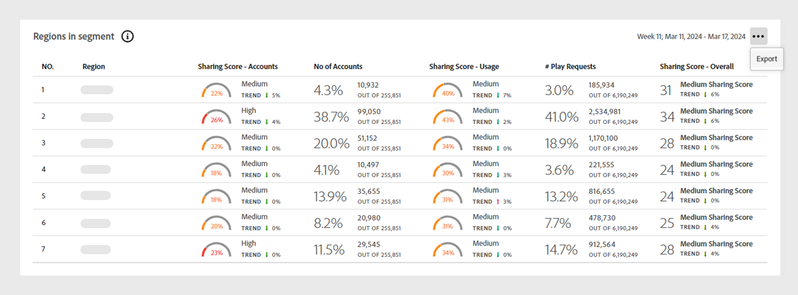

# Data panels on Dashboard {#data-panels}

Once you've selected a segment and time interval, the dashboard will display various data panels, tables, and graphs that reflect a high level view sharing for the segment.

The table below outlines the availability and differences among the data panels in various [versions](/help/accountiq/versions-aiq.md) of Account IQ: 

|Data panels|D2C services|TVE Programmers|TVE MVPDs|
|---|---|---|---|
|[Average sharing score-aggregated for the current segment](#aggregated-sharing)|Available and consistent|Available and consistent|Available and consistent|
|[Video categories in segment](#video-categories-segment)|Available with slight variations|Available with slight variations|Available with slight variations|
|[Sharing score by channels and MVPDs](#sharin-score-by-channels-and-mvpds)|Unavailable|Available|Unavailable|
|[Accounts sharing probability](#accounts-sharing-probability)|Available and consistent|Available and consistent|Available and consistent|
|[Number of accounts and usage by sharing probability level](#number-of-accounts-usage-sharing-probability)|Available and consistent|Available and consistent|Available and consistent|

## Average sharing score-aggregated for the current segment {#aggregated-sharing}

The Aggregated Sharing Score panel provides a top line readout summarizing the quantity and impact of sharing in terms of accounts and streaming volume.

The metrics help you understand the magnitude (ranging from low, medium, high to abnormal) of credential sharing by your subscribers, measured in terms of accounts and consumption.

*Average sharing score panel-aggregated for the current segment*

>[!NOTE]
>
> The blue indicator in the **Average sharing score-aggregated for the current segment** serves different purposes for D2C services compared to TV Everywhere. For D2C services, it represents the **Service Average Index** as shown below. If you log in as a Programmer or MVPD, this label changes to **Industry Average Index**.  

The following metrics are components of the Average Sharing Score.

### Sharing level {#sharing-level}

The sharing level gauge shows the percentage of all your shared subscriber accounts in the defined segment during the selected time interval.  

The percentage is calculated based on an average of the sharing probability computed for every account in the segment that has streamed at least once during the selected time interval.

The Trend indicator shows the percentage change in the value of the metric from the previous time interval.

{width="350" align="left"}

*Sharing level*

### Usage from shared accounts {#usage-from-shared-accounts}

The gauge indicates the percent of usage by the shared accounts among all subscriber accounts for the defined segment and time period. These ranges named Low, Medium, High, and Abnormal are based on an industry average.

The Trend indicator, which depicts a rise or fall in the usage from shared accounts compared to the previous time interval.

{width="350" align="left"}

*Usage from shared accounts*

### Overall sharing score {#overall-sharing-score}

Overall sharing score is combination of sharing scores including "Sharing level" and "Usage from shared accounts".

It provides a score that reflects the overall impact of sharing. Its purpose is similar to that of a credit score, summarizing the situation with a single number. But in this case, the higher the number, the greater the sharing level.

{width="350" align="left"}

*Overall sharing score*

## Video categories in segment {#video-categories-segment}

+++D2C services: Regions in segment

When you log in as a **D2C** service, this table provides a comparative view of the different Aggregated Sharing Scores for the [video categories](/help/accountiq/product-concepts.md#video-category-def) in the current segment.

>[!NOTE]
>
> The video category shown in the image, such as **Regions** is just an example. When you log in to Account IQ, this panel will display your company's specific video category.

*Sharing Score by Regions in segment*

Select **Export** to download the data in a csv file. Learn [how to export data panel reports](/help/accountiq/export-reports.md).

+++

+++Programmers: MVPDs in segment

When you log in as a **Programmer**, this table provides a comparative view of the different Aggregated Sharing Scores for the MVPDs in the current segment.

Select the column headings to sort the data.

*Sharing Score by MVPDs in segment*

Select **Export** to download the data in a csv file. Learn [how to export data panel reports](/help/accountiq/export-reports.md).

+++

+++MVPDs: Programmers in segment

When you log in as an **MVPD**, this table provides a comparative view of the different Aggregated Sharing Scores for the Programmers in the current segment.

Select the column headings to sort the data.

*Sharing Score by Programmers in segment*

Select **Export** to download the data in a csv file. Learn [how to export data panel reports](/help/accountiq/export-reports.md).

+++

## Sharing score by channels and MVPDs  {#sharin-score-by-channels-and-mvpds}

When you log in as a Programmer, this table provides a comparative view of sharing scores of the selected channels for the MVPDs in the current segment.

Select the column headings to sort the data.

*Sharing scores by channels and MVPDs*

## Accounts sharing probability {#accounts-sharing-probability}

This chart partitions accounts into ranges of sharing probability quintiles from very low (0-20%) to very high (80-100%). Read more about the ranges of [Account sharing probability](#accounts-sharing-probability).

>[!NOTE]
>
>The bar graph uses a logarithmic scale.

*Numbers and percentages of subscriber accounts in different sharing probability ranges*

## Number of accounts and usage by sharing probability level {#number-of-accounts-usage-sharing-probability}

This panel provides a tabular view of  accounts partitioned into ranges of sharing probability quintiles from very low (0-20%) to very high (80-100%) with each quintile's associated usage from shared accounts. Read more about the ranges of [Account sharing probability](#accounts-sharing-probability).

*Number of accounts, trends, and usages falling in various probability ranges*

Select **Export** to download the data in a csv file. Learn [how to export data panel reports](/help/accountiq/export-reports.md)

