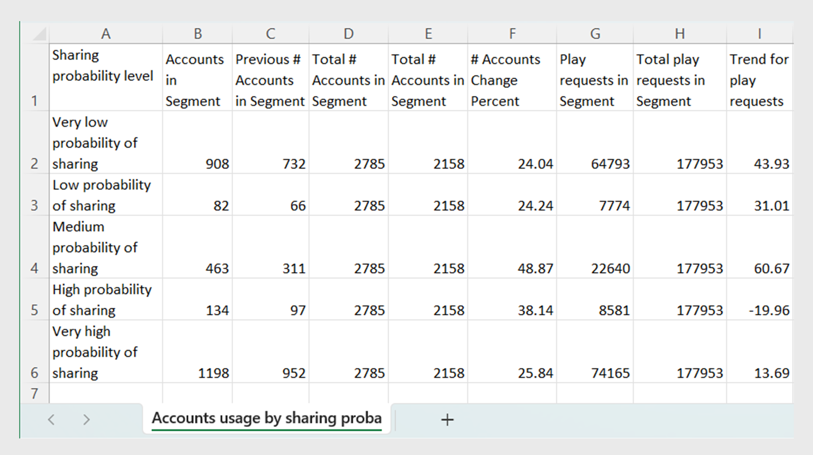

# Export reports from data panels {#export-reports}

The Dashboard in [!UICONTROL Account IQ] displays tables and graphs for analyzing credential sharing statistics of the subscriber accounts in the selected segment. Apart from viewing the sharing patterns, scores, and account usage metrics, you can also export them from these tables.

As Programmers and MVPDs, you can export the following data panels:

* [MVPDs and Programmers in segment](data-panels.md#mvpds-programmers-segment) 
* [Number of accounts and usage by sharing probability level](data-panels.md#number-of-accounts-usage-sharing-probability)

To export reports for a specific segment, follow these steps:

1. Log in with your authorized programmer or MVPD credentials.
1. Select a desired segment and time interval from segment and time interval panel. Know [how to select segment and time interval](segments-timeinterval.md).

   If required, refer to the instructions for [creating a new segment](work-with-segments.md#create-new-segment) and [editing segment](work-with-segments.md#create-new-segment).

1. Navigate to the data panel you want to export. 

   For example, the **Number of accounts and usage by sharing probability level** is referred below.

   {align="left"}

   *Figure: Export Number of accounts and usage by sharing probability level*

1. Select **[!UICONTROL Export]** option located in the upper-right corner of the data panel.
1. Choose the location to save the file on your local machine.

   You can rename your file in the **File name**.

1. Select **[!UICONTROL Save]** to initiate the export process.

1. Locate the exported file on your local machine to find the file. The report is saved in CSV format. 

   You can open the exported reports using a preferred CSV viewer or editor.

The exported report is displayed below.

   {align="left"}

   *Figure: Exported report*
