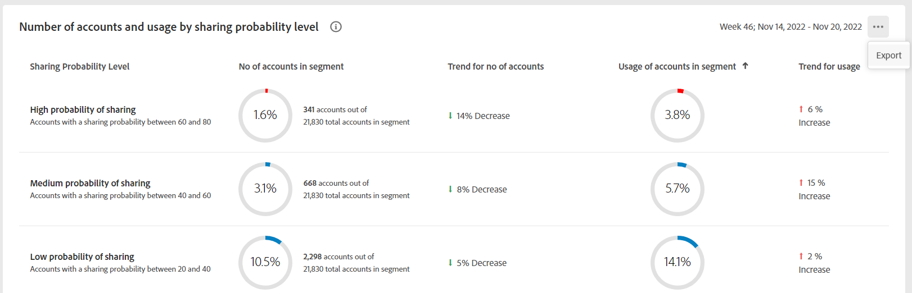

# Export metrics for an MVPD and selected programmers {#export-metric}

The Dashboard in [!UICONTROL Account IQ] displays tables and graphs for credential sharing statistics of the subscriber accounts in the selected segment. Apart from viewing the sharing patterns and scores, you can also export the account usage metrics and sharing scores for the subscribers of the MVPDs and channels in the selected segment from these tables.

To export metrics for an MVPD and selected programmers, once you are logged in as an authorized MVPD user:

1. Define a desired segment following the steps in [How to define segment and select timeinterval](/help/accountiq/howto-select-segment-timeinterval.md) for evaluation from [segment and timeinterval](/help/accountiq/segments-timeinterval.md) panel.

1. Go to one of the following panels:

    * [!UICONTROL Programmers in segment]
    

    * [!UICONTROL Number of accounts and usage by sharing probability level]

      

1. Select **[!UICONTROL Export]** option available in the upper-right corner of the panel.

The data is exported in CSV format, and the file is downloaded locally on your device. You can use desired CSV viewer and editor to open the exported reports.

* Programmers in segment

    

     
* Number of accounts and usage by sharing probability level

    
