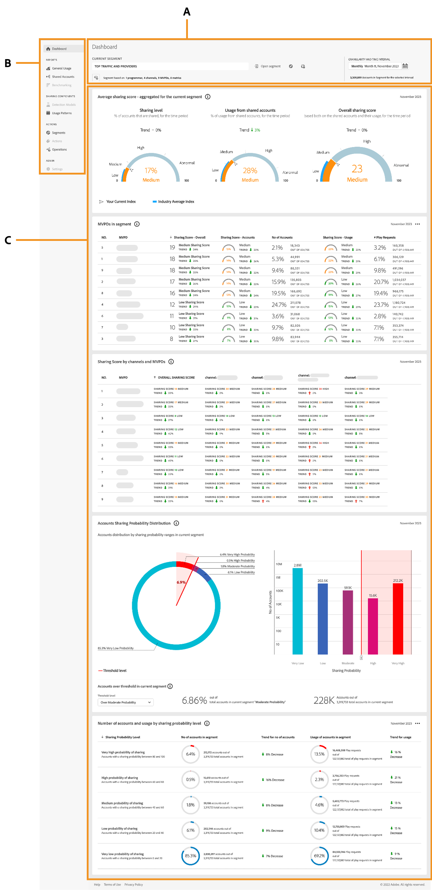

# Introduction to dashboard {#introduction-dashboard}

The Dashboard summarizes and aggregates data in a collection of graphs and reports designed to provide a high-level overview of the scope and impact of account sharing. It provides a single page containing the major reports and metrics from [!UICONTROL Account IQ].

>[!NOTE]
>
>The majority of data panels on the Programmers and MVPD dashboards are identical. However, certain data panels may vary in availability or appear slightly different for each user type. 

+++Programmer- dashboard

{align="left"}

*Figure: The dashboard for programmer users*

**A.** Segment and time interval panel **B.** Page navigation **C.** Data panels

+++

+++MVPD- dashboard

The dashboard for MVPD users is slightly different from those of the programmer users.

![dashboard of [!UICONTROL Account IQ] for MVPD users](assets/dashboard-mvpd.png){align="left"}

*Figure: The dashboard for MVPD users*

**A.** Segment and time interval panel **B.** Page navigation **C.** Data panels

+++

The dashboard for programmer and MVPD users includes:

* **Segments and time interval panel**: This panel enables you to select segments and time intervals to generate account sharing reports, providing a summary of the selected segment.
* **Page navigation**: These tabs allows you to navigate and explore across various sections and pages of Account IQ.
* **Data panels**: The panels display account sharing reports in a form of tables and graphs and offer to export data on your local machine. 
