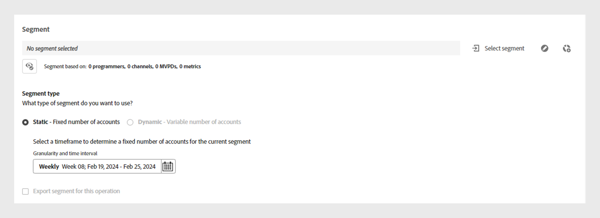
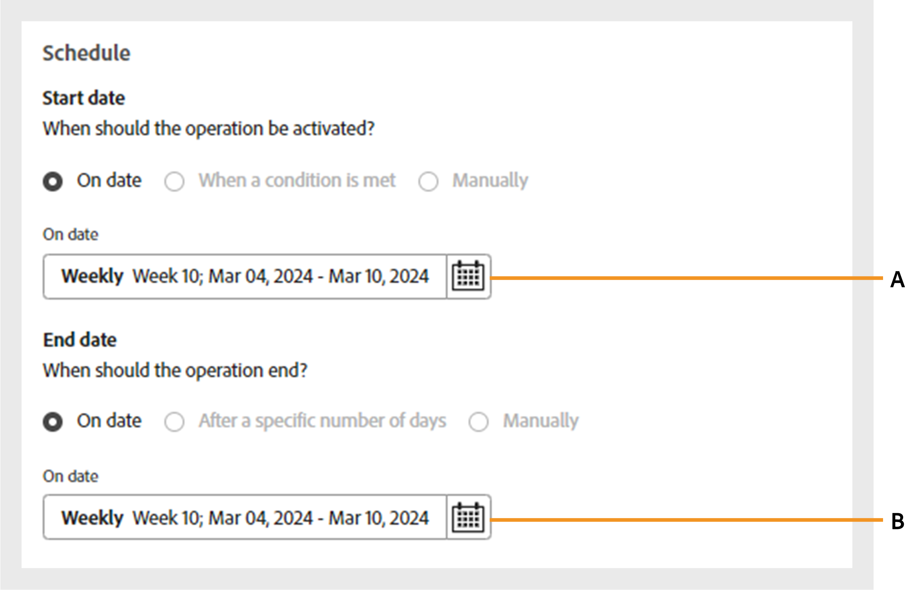

# Operations {#operations-tab-next-steps}

Once you've analyzed your subscriber's usage patterns and identified instances of password sharing for a selected segment using [!DNL Account IQ] analytics, you can take targeted actions through focused procedures called operations in [!DNL Account IQ]. 

**Operations** allow you to effectively track and manage credential sharing towards a group of accounts to mitigate password sharing and enhance the experience for valued subscribers. 

You can apply actions to a defined [segment](/help/accountiq/product-concepts.md#segment-def) to address password sharing within a specific [time interval](/help/accountiq/product-concepts.md#time-interval-def), and schedule the operation to execute at a future date. These actions include restrictions to minimize password sharing or ease constraints on non-sharing accounts.

Using operations, you not only specify actions and their scope, but also gauge their outcomes.

By evaluating the outcomes, you can refine your strategy to optimize effects, whether by converting borrowers, mitigating credential sharing, or reducing churn.

You can perform various functions with operations:

* [View operation reports](#operation-reports)
* [Create new operation](#create-new-operation)
* [Stop operation](#stop-operation)

## View operation reports {#operation-reports}

You can review the effects of an operation through operation reports. To view operation report, select **Operations** tab under **Actions** in left panel of Account IQ application. A list of operations available in the system is displayed. You can access key details about each operation in a tabular format. The details include:

* Name of the operation 
* Current status (such as Scheduled, Running, Ended, Error, or Stopped)
* Progress completion percentage
* Target audience or segment on which the operation is applied 
* Type of action selected for the operation
* Start date of the operation
* End date of the operation
* Date the operation was created
* Last modification date of the operation

*List and details of existing operations in Account IQ*

Select the desired **Operation Name** from the list of operations. The following reports are displayed:

### Operation performance {#operation-performance}

The operation performance provides a top line readout summarizing the number of accounts impacted, operation progress, and the overall sharing score of the accounts in the segment during the operation's [evaluation period](/help/accountiq/product-concepts.md#evaluation-period-def).

*Operation performance report*

**A.** Impacted accounts **B.** Operation progress **C.** Overall sharing score

#### Impacted accounts {#impacted-accounts}

This number displays the count of subscriber accounts affected by the action taken during the operation's evaluation period.

#### Operation progress {#operation-progress}

This gauge shows the number of days and the percentage of the operation completed out of the planned schedule.

#### Overall sharing score {#overall-sharing-score}

This line graph represents the [overall sharing score](/help/accountiq/data-panels.md#overall-sharing-score) that includes the sharing level and usage from shared accounts in each week during the operation's evaluation period.

### Operation impact: accounts in segment {#impact-accounts}
   
This report is displayed as a stacked column graph that illustrates the impact of an operation over time. 

*Operation impact on accounts in segment graph*

The x-axis represents the operation's [evaluation period](/help/accountiq/product-concepts.md#evaluation-period-def), while the y-axis indicates the status of accounts in the operation's segment. Each bar in the graph is divided into three colors:

* Pink represents the number of accounts meeting the segment's conditions used in this operation.

* Blue represents the number of active accounts that were originally in the segment but did not meet the segment's conditions during each week or month in the operation's [evaluation period](/help/accountiq/product-concepts.md#evaluation-period-def).

* Grey represents the accounts that were inactive during the evaluation period.

>[!NOTE]
>
>The first pink bar represents the number of accounts meeting the operation segment's conditions at the beginning of the evaluation period.

Over time, the graph illustrates changes in account behavior relative to the original criteria (for example, having a sharing probability of more than 90 and using more than 5 devices have become inactive).

### Operation impact: shared accounts metrics {#impact-shared-accounts}

The shared accounts metrics provide an overview of sharing level and play requests by the subscriber accounts in the operation's segment during the operation's [evaluation period](/help/accountiq/product-concepts.md#evaluation-period-def).

#### Sharing level {#share-level}

This line graph represents [sharing level](/help/accountiq/data-panels.md#sharing-level) each week over the operation's evaluation period.

{width="550" align="left"}

*Sharing level line graph*

#### Number of play requests {#play-requests}

This line graph represents [play requests](/help/accountiq/general-usage-reports.md#playreq-uniquesubs) each week in the operation's evaluation period.

{width="550" align="left"}

*Number of play requests line graph*

### Operation impact: general usage metrics {#impact-general-usage}

The general usage metrics provide an overview of average number of devices, IPs, and locations in the operation's segment during the operation's [evaluation period](/help/accountiq/product-concepts.md#evaluation-period-def). 

#### Number of devices {#devices}

This line graph represents the average [number of devices](/help/accountiq/general-usage-reports.md#devices-week-account) each week in the operation's evaluation period.

{width="550" align="left"}

*Number of devices line graph*

#### Number of IPs and locations {#IPs-locations}

This line graph represents the average [number of IPs](/help/accountiq/general-usage-reports.md#ip-week-account) and [locations](/help/accountiq/general-usage-reports.md#locations-week-account) each week in the operation's evaluation period.

{width="550" align="left"}

*Number of IPs and locations line graph*

To close the report and go back to the main **Operations** page, select **Operations** tab under **Actions** in left navigation.

## Create new operation {#create-new-operation}

When you go to the **Operations** tab under **Actions** in the left panel, select **Create new operation** at the top of the **Operations** page.

To create new operation, follow the instructions in the following sections:

* [Operation details](#operation-details)
* [Segment](#segment)
* [Action](#action)
* [Schedule](#schedule)

### Operation details {#operation-details}

In this section, type the name for the operation in **Operation name**.

   >[!TIP]
   >
   >Describe the purpose of the operation or the nature of the action in **operation name** for quick identification. The option to **Add description and tags** will be available in future releases.

   

   *Add Operation name*

### Segment {#segment}

In this section, click on **Select segment** and choose a segment to which you want to use this operation. Learn [how to select a segment](/help/accountiq/segments-timeinterval.md#segment-selection).

Once you've selected a segment, use  icon to view the detailed segment summary. Read more about [segment summary](segments-timeinterval.md#segment-summary).

*Select segment and time interval*

>[!NOTE]
>
>The [video categories](product-concepts.md#video-category-def) shown in the previous image, such as **MVPDs**, **Programmers**, and **Channels** represent the labels used in the TV Everywhere version of Account IQ. If you're logged in as a D2C service, these labels display your company's specific video categories.

If required, use  icon to edit the selected segment or   icon to create new segment. For more details, refer to the instructions for [creating a new segment](work-with-segments.md#create-new-segment) or [editing a segment](work-with-segments.md#edit-segment).

>[!IMPORTANT]
>
>**Segment type** named **[!UICONTROL Fixed number of accounts]** is currently selected by default. The option to select **[!UICONTROL Variable number of accounts]** will be available in upcoming releases.

Select **Granularity and time interval** to monitor the operation during a specific period. Know more about [how to select granularity and time interval](/help/accountiq/segments-timeinterval.md#granularity-timeinterval).

### Action {#action}

In this section, choose an **Action** you want to perform on the selected segment from the dropdown menu.

*Select the type of Action*

There are two options available:

* Select **CM Policy** for the concurrency monitoring system integrated with Account IQ.

* Select **External actions** to create and process workflows external to Account IQ and not integrated with Account IQ system.

>[!NOTE]
>
>External actions may not always directly relate to password sharing but can still impact it, such as launching of a new season.

### Schedule {#schedule}

In this section, select the **Start date** and **End date** from the date-picker to set the activation for the operation.

>[!IMPORTANT]
>
>Currently, the default activation **Start date** and **End date** are set to **On date**. The option to select **When a condition is met** and **Manually** will be available in upcoming releases.
   
>[!NOTE]
>
>Ensure that both the start date and end date align with the granularity selected for evaluation in **Step 4**. 

* If you've opted for granularity aggregated by weeks, select the start and end dates in weeks (for example, Week 10).
* If you've opted for granularity aggregated by months, select the start and end dates in months.
   

*Select Start date and End date from the date-picker*

**A.** Start date picker **B.** End date picker

>[!NOTE]
>
>The **Start date** must be later than both the evaluation period and the current date, while the **End date** must be later than the Start date and the current date in order to schedule and execute operations in the future period.

Select **Save operation** at the top of the **Operations** page to process a new operation.

## Stop operation {#stop-operation}

You can only stop the operations that are currently in **Running** status. To stop an existing operation, follow these steps:

1. Navigate to the **Operations** tab under **Actions** in  the left navigation of Account IQ application.
1. Select **Options** menu of the operation you want to stop.

   

   *Select Options menu to stop the operation*
   
1. Select **Stop**.

