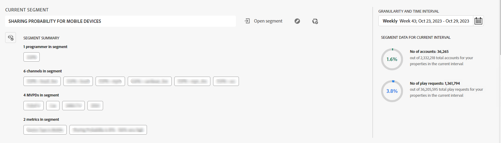
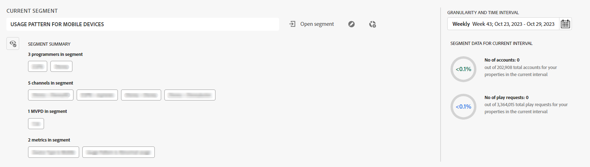

# Subscriber segments and time frame {#cohorts-segments}

When you log into Account IQ, the segment launcher panel at the top allows you to specify the subscriber [segment](/help/accountiq/product-concepts.md#segment-segmet-def) for filtering results when viewing reports on subscriber sharing behavior and patterns. A default segment named-All accounts in your properties is already selected, and you see the following options in the segment launcher:

**A** Currently selected segment name 
**B** Time interval and granularity selector 
**C** Segment summary collapsed 
**D** Option to expand segment summary 
**E** Segment data (in terms of number of subscriber accounts in the segment for a time duration) 
**F** Open segment list option 
**G** Edit segment option 
**H** Create new segment option 

{width="650" align="left"}

 *Figue: Segment launcher with collapsed segment summary*

## Segment selection {#segment-selection}

For programmer or MVPD users, navigate to the **Open segment** option. Choose a segment from the list and select Open segment to view the account sharing reports.

Use the **Eye** icon to view the detailed segment summary, presenting the information on the number of subscriber accounts and playback requests by them within the chosen time frame.

+++Segment selection panel for programmer

{width="800" align="left"}

*Figure: Segment panel for programmers*

+++

+++Segment selection panel for MVPDs

{width="800" align="left"}

*Figure: Segment panel for MVPDs*

The segment summary is used to define the following parameters:

**[!UICONTROL programmers in segment]**

**[!UICONTROL channels in segment]**

**[!UICONTROL MVPDs in segment]**

**[!UICONTROL metrics in segment]**

<!-- The definitions of these parameters will be defined in the glossary article-->
  
+++

## [!UICONTROL Granularity and time frame] {#granularity-timeframe}
  
  The **[!UICONTROL Granularity and time frame]** selector lets you specify the dates and the duration aggregated by a week/month for which you want to view the subscriber sharing behavior.

  ![[!UICONTROL Granularity and timeframe]](assets/granularity-timeframe-weekwise.png){width="350" align="left"}
  
Applying these controls you can define your problem statement as "subscribers of the MVPD A that watched the channels X, Y, and Z in the month of October".

