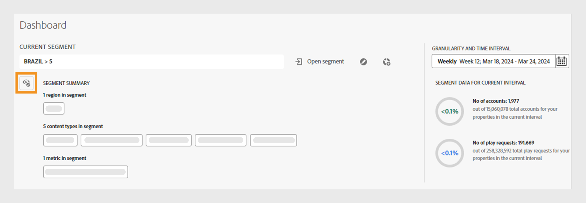

# Segments and time interval {#segment-timeinterval}

When you log into Account IQ, the segment and time interval panel at the top of dashboard allows you to define the subscriber [segment](product-concepts.md#segmet-def). Segment and time interval panel helps to filter results and display reports on subscriber sharing behavior and patterns. A segment named **ALL ACCOUNTS IN YOUR PROPERTIES** is currently selected by default where you can view the following options:

{align="left"}

 *Segment and time interval panel with collapsed segment summary*
 
**A.** Currently selected segment name **B.** Open segment list option **C.** Edit segment option **D.** Create new segment option **E.** Granularity and time interval selector **F.** Option to expand segment summary **G.** Collapsed segment summary **H.** Segment data of subscriber accounts in the segment for a selected time interval

>[!NOTE]
>
> The collapsed segment summary represented with **G** in previous image shows the [Video categories](product-concepts.md#video-category-def) used in the TV Everywhere version of Account IQ. If you're logged in as a D2C service, the labels will display your company's specific video categories.

Read more about how to [create](work-with-segments.md#create-new-segment) and [manage](work-with-segments.md#manage-segment) segments from the **Segments** tab in the left panel.

## Segment selection {#segment-selection}

To select a specific segment, follow these steps:

1. Navigate to the **[!UICONTROL Open segment]** option.
1. Select **Segment Name** for which you want to view account sharing reports.

   {align="left"}

   *Select Segment Name*

   >[!NOTE]
   >
   > The video categories shown in the previous image, such as **MVPDs**, **Programmers**, and **Channels** represent the labels used in the TV Everywhere version of Account IQ. If you're logged in as a D2C service, the labels will display your company's specific video categories.

1. Select **[!UICONTROL Open segment]**.

## Granularity and Time Interval selection {#granularity-timeinterval}

The **Granularity and Time Interval** selector lets you specify the dates and duration aggregated on a weekly/monthly basis for observing subscriber sharing behavior. The default selection is the current week. 

{align="left"}

*Granularity and time interval dialog box*

**A.** Granularity and time interval selector **B.** Right arrow to go to next month/week **C.** Option to choose granularity by week/month **D.** Currently selected time interval **E.** Left arrow to go to previous month/week

You can modify the duration using the following steps:

1. Select the **[!UICONTROL Granularity and Time Interval]** from the date picker.

1. Select either **[!UICONTROL Week]** or **[!UICONTROL Month]** from **[!UICONTROL Aggregate By]** option to set granularity for your evaluation.

1. Once you have selected granularity, you can use forward or backward arrows to navigate through the time range.

1. Select a specific time period for evaluation.

1. Select **[!UICONTROL Apply]** to make sure your selection takes effect.

This allows you to define your problem statement as "Subscribers of MVPD A who watched channels X, Y, and Z during the choosen week of December".

## Segment summary {#segment-summary}

The Segment Summary is similar for D2C services and TV Everywhere. The video categories will be different for each respective version of Account IQ.

+++ D2C services

Use  icon to view the detailed segment summary. It also presents information on the number of subscriber accounts and their playback requests within the chosen time period.

{align="left"}

*Segment Summary for D2C services*

>[!NOTE]
>
>The video categories shown in the previous image, such as **regions** and **content types** are just examples. When you log in to Account IQ, the labels will display your company's specific video categories.

The **Segment Summary** includes the following conditions that define a segment:

**[Regions and content types](product-concepts.md#video-category-def) in segment** refer to the metadata labels associated with the video streams watched by shared accounts represented in account sharing reports. 

**[Metrics](product-concepts.md#metric) in segment** refer to attributes or criteria that subscribers must have fulfilled to be identified in account sharing reports.

+++

+++ TV Everywhere

Use  icon to view the detailed segment summary. It also presents information on the number of subscriber accounts and their playback requests within the chosen time period.

{align="left"}

*Segment Summary for programmers/MVPDs*

The **Segment Summary** includes the following conditions that define a segment:

**[Programmers](product-concepts.md#programmer-def) in segment**  refer to content providers whose video streams were watched by shared accounts represented in account sharing reports.

**[Channels](product-concepts.md#channel-def) in segment** refer to channels whose video streams were watched by shared accounts represented in account sharing reports.

**[MVPDs](product-concepts.md#mvpd-def) in segment** refer to MVPDs to which the subscribers are associated in order to be identified in account sharing reports.

**[Metrics](product-concepts.md#metric) in segment** refer to attributes or criteria that subscribers must have fulfilled to be identified in account sharing reports.

+++
