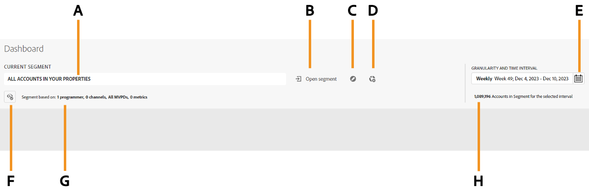
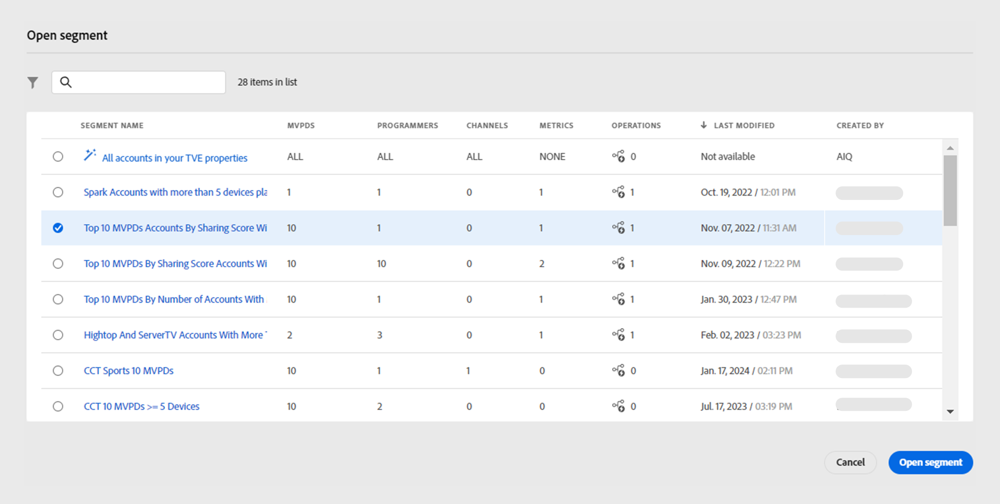
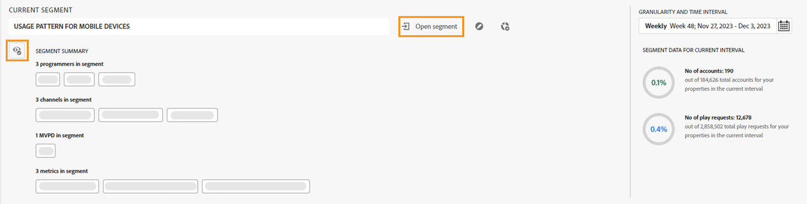

# Segments and time interval {#segment-timeinterval}

When you log into Account IQ, the segment and time interval panel at the top of dashboard allows you to specify the subscriber [segment](product-concepts.md#segmet-def). This helps in filtering results when viewing reports on subscriber sharing behavior and patterns. A segment named **ALL ACCOUNTS IN YOUR PROPERTIES** is currently selected by default and you can view the following options in segment and time interval panel:

{align="left"}

 *Figure: Segment and time interval panel with collapsed segment summary*
 
**A.** Currently selected segment name **B.** Open segment list option **C.** Edit segment option **D.** Create new segment option **E.** Granularity and time interval selector **F.** Option to expand segment summary **G.** Segment summary collapsed **H.** Segment data of subscriber accounts in the segment for a selected time interval

You can also [create](work-with-segments.md#create-new-segment) and [edit](work-with-segments.md#edit-segment) a segment from the **Segments** tab under **Actions**.

## Segment selection {#segment-selection}

### Segment selection for programmers/MVPDs

1. Navigate to the **[!UICONTROL Open segment]** option.
1. Select **Segment Name** for which you want to view account sharing reports.

   {align="left"}

   *Figure: Select Segment Name*

1. Select **[!UICONTROL Open segment]**.

## Granularity and Time Interval selection {#granularity-timeinterval}

  The **Granularity and Time Interval** selector lets you specify the dates and duration aggregated on a weekly/monthly basis for observing subscriber sharing behavior. The default selection is the current week. 
  
  You can modify the duration using the following steps:

  {align="left"}

  *Figure: Granularity and time interval dialog box*

   **A.** Granularity and time interval selector **B.** Right arrow to move forward in time **C.** Option to choose granularity by week/month **D.** Curently selected time interval **E.** Left arrow to move backward in time

  1. Select the **[!UICONTROL Granularity and Time Interval]** from the date picker.

  1. Select either **[!UICONTROL Week]** or **[!UICONTROL Month]** from **[!UICONTROL Aggregate By]** option to set granularity for your evaluation.

   1. Once you have selected granularity, you can use forward or backward arrows to navigate through time.

   1. Select a specific time period for evaluation.

   1. Select **[!UICONTROL Apply]** to make sure your selection takes effect.

This allows you to define your problem statement as "Subscribers of MVPD A who watched channels X, Y, and Z during the choosen week of December".

## Segment summary {#segment-summary}

Use  icon to view the detailed segment summary. It also presents information on the number of subscriber accounts and their playback requests within the chosen time period.

{align="left"}

*Figure: Segment Summary for programmers/MVPDs*

The **Segment Summary** is used to define the following components:

**[Programmers](product-concepts.md#programmer-def) in segment** are the number of content providers within a segment whose subscriber account sharing reports you intend to access.

**[Channels](product-concepts.md#channel-def) in segment** indicate the number of channels aligned with the chosen MVPDs in a segment for observing their account sharing analytics. 

**[MVPDs](product-concepts.md#mvpd-def) in segment** represent the number of specific individual or group of MVPDs within a segment, for which you aim to access the subscriber account sharing reports.

**[Metrics](product-concepts.md#metric) in segment** refer to the number of chosen attributes or criteria for a segment to access a subscriber's account sharing report.

