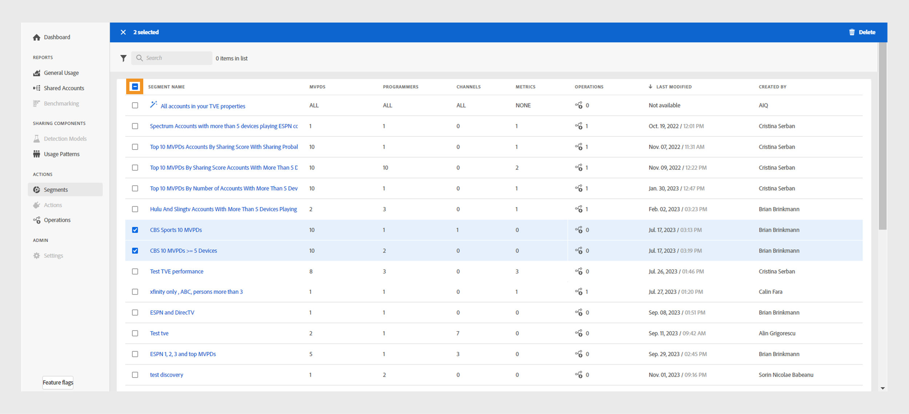

# Segments {#segment-list}

In the **Segments** tab under Actions, you have a list of all the created and saved segments. The Segments page allows you to quickly assess key details about each segment in a tabular format. For example, you can see the following:

* Segment Name 
* Number of MVPDs 
* Number of Programmers 
* Number of Channels 
* Number of Metrics  
* Number of Operations that are running using the current segment
* Last modified date and time
* Segment creator's name

You can also [manage the segments](#manage-segments) in the list. Select the segment and choose to edit, duplicate, or delete it. Select more than one segment to delete multiple segments.

*Figure: List of segments*

## Create new segment {#create-segment}

To build a segment and analyze your subscriber sharing behavior, select **[!UICONTROL Create new segment]** on the **Segments** list page. 

*Figure: create new segment*

The **New segment** page has the following components:

* **[Segment components](#segment-components)** refers to the list of Programmers and channels, MVPDs, Metrics, and Calculated Metrics used to define your segment.
* **[Segment builder panel](#segment-building-panel)** serves as a canvas where you can drag and drop the various segment components for building your segment. 
* **[Segment summary](#segment-summary)** gives a brief to the segment you created.

### Segment components {#segment-components}

* **Programmers and channels**: includes the complete list of Programmers and channels associated with them.
* **MVPDs**: a list of the MVPDs you are integrated with.
* **Metrics**: characteristics of the accounts of interest.
* **Calculated metrics**: additional characteristics of the accounts of interest, including usage patterns and sharing probability.

>[!NOTE]
>
>Use the Show all option to expand the list of segment components.

### Segment builder panel {#segment-building-panel}

* **Segment name**: provides a name for your segment, which will be visible in the segments list page.
* **Segment description**: gives a detailed description of your segment.
* **Segment definition**: serves as a canvas to craft your segments for studying subscriber behavior based on:
    * **Programmers/channels panel**: drag and drop the desired programmers or individual channels selected from the segment components panel in the upper-left.
    * **MVPDs panel**: is used to drag and drop the desired MVPDs selected from the segment components panel in middle-left.
    * **Metrics panel**: is used to drag and drop one or more metrics from the segment components panel in the lower-left to build segments for reporting.

    >[!NOTE]
    >
    >All the metrics you drop in the segment builder panel are accompanied by appropriate operators to constrain/assign values to respective metrics.  
    * **Calculated metrics panel**: is used to drop one or more calculated metrics from the segment components panel in the lower-left to build segments for reporting.

    >[!NOTE]
    >
    >All the calculated metrics you drop in the segment builder panel are accompanied by appropriate operators to constrain/assign values to respective calculated metrics.   

### Segment summary {#segment-summary}

The **Segment summary** analyzes the number of subscriber accounts in the selected segment.  

* **Evaluation period** estimates summary values from the last week or month. 
* **[!UICONTROL Update estimation]** allows you to update the number of estimated qualified accounts in the current segment out of the total number of subscriber accounts based on the selected evaluation period.  

You can read through the details about the created segment to take a call on the changes you want to make to your segment. 

## Manage segments {#manage-segments}

You can select a segment from the segments list and can perform either of the following operations on them:

* [!UICONTROL Edit a segment]
* [!UICONTROL Duplicate a segment]
* [!UICONTROL Delete a segment]

*Figure: select a segment to edit, duplicate, or delete*

When you select more than one segment, then you can delete multiple segments.

*Figure: Select more than one segment to delete*

Use the minus button to select all the segments at once.
