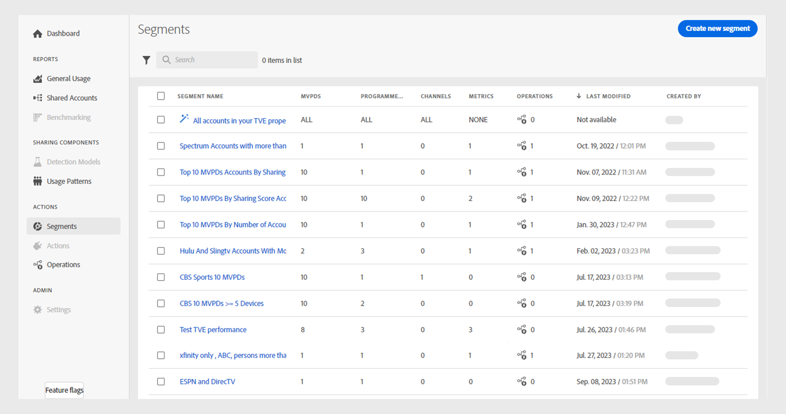

# Segments {#segment-list}

In **Segments** tab under Actions, you have a list of all created and saved segments. The Segments page allows you to quickly assess key details about each segment in a tabular format as following:

* Segment Name 
* Number of MVPDs 
* Number of Programmers 
* Number of Channels 
* Number of Metrics  
* Number of Operations that are running using the current segment
* Last Modified date and time
* Segment creator's name

You can also [manage segments](#manage-segments) in the list. Select a segment and choose to edit, duplicate, or delete it. Select multiple segments to delete more than one segment.

*Figure: List of segments*

## Create new segment {#create-segment}

>[!NOTE]
>
>A segment can be created by both Programmer and MVPD users.

To build a segment and analyze subscriber's sharing behavior, select **[!UICONTROL Create new segment]** on the segments list page. 

The **New segment** page has the following components:

* **[Segment components](#segment-components)** refers to the list of programmers and channels, MVPDs, metrics, and calculated metrics used to define a segment.
* **[Segment builder panel](#segment-building-panel)** serves as a canvas where you can drag and drop the various segment components for building a segment. 
* **[Segment summary](#segment-summary)** estimates the qualified accounts based on the evaluation period and gives a brief about the current segment.

*Figure: Create new segment*

Use **Programmers/channels, MVPDs, Metrics, Calculated Metrics** panels to drag and drop segment components to create a new segment.

### Segment components {#segment-components}

* **Programmers and channels** includes a list of programmers and channels associated with them.
* **MVPDs** includes a list of integrated MVPDs.
* **Metrics** are a set of attributes of the relevant accounts.
* **Calculated metrics** are the additional attributes of the relevant accounts, such as usage patterns and sharing probability.

>[!NOTE]
>
>Use the **[!UICONTROL Show all]** option to expand the list of segment components.

### Segment builder panel {#segment-building-panel}

* **Segment name** refers to the segment name , which will be visible in the segments list page.
* **Segment description** includes a detailed description of the segment.
* **Segment definition** serves as a canvas to craft your segments for studying subscriber behavior based on:
    * **Programmers/channels panel** is used to drag and drop specific programmers or channels from the upper-left segment components panel.
    * **MVPDs panel** is used to drag and drop the MVPDs from the middle-left segment components panel.
    * **Metrics panel** is used to drag and drop one or more metrics from the lower-left segment components panel.

    >[!NOTE]
    >
    >All the metrics you drop under the segment builder panel are accompanied by appropriate operators to constrain/assign values to respective metrics.  

    * **Calculated metrics panel** is used to drag and drop one or more calculated metrics from the lower-left segment components panel.

    >[!NOTE]
    >
    >All the calculated metrics you drop under the segment builder panel are accompanied by appropriate operators to constrain/assign values to respective calculated metrics.   

### Segment summary {#segment-summary}

* **Evaluation period** estimates summary values from the last week or month. 
* **[!UICONTROL Update estimation]** allows you to calculate the number of estimated qualified accounts in the current segment based on the evaluation period.

>[!NOTE]
>
>You can only **Update estimation** when you are editing a segment. The results will be based on the current items in the segment and selected evaluation period.

You can review the segment details to decide on the changes you wish to implement across the entire segment.

## Manage segments {#manage-segments}

You can select a segment from the segments list and can perform either of the following operations on them:

* [!UICONTROL Edit a segment]
* [!UICONTROL Duplicate a segment]
* [!UICONTROL Delete a segment]

*Figure: Select a segment to edit, duplicate, or delete*

>[!NOTE]
>
>You cannot edit, duplicate, or delete the default segment named **All accounts in your TVE properties**.

You can select multiple segments to delete more than one segment.

>[!NOTE]
>
>You cannot delete a segment if it's used by one or more operations.

*Figure: Select multiple segments to delete more than one segment*

Use the checkbox at the left of the segment name to select and delete all segments simultaneously.

>[!NOTE]
>
> This is only possible If none of the segments are used by operations.
