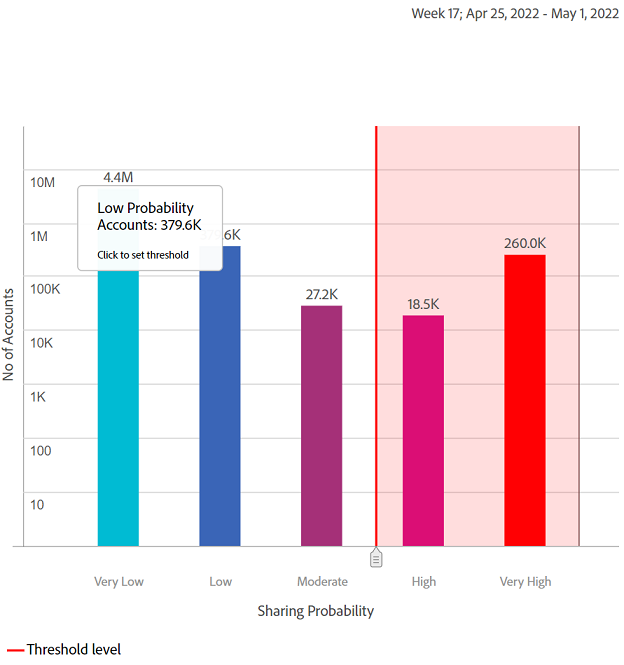

# Shared Accounts Reports {#shared-accounts-reports}

The Shared Accounts Reports provides another group of graphs and charts that reflect the sharing behavior and consumption for the current segment. For example, **[!UICONTROL Over Moderate Probability]** and **[!UICONTROL Over Low Probability]** for the current segment.

## Accounts Sharing Probability {#accounts-sharing-probability}

This donut and bar charts shows the percentages (and absolute numbers) of the subscriber accounts that fall into specific ranges of sharing probability. These ranges are defined as:

* Very high (80%-100%)
* High (60%-80%)
* Moderate (40%-60%)
* Low (20%-40%)
* Very low (0%-20%)

The red line marks the threshold range selected in the [Accounts over threshold in current segment](#threshold-selector) panel and the light red area contains the total of all accounts above that threshold.

The bar chart plots number of accounts that fall into each range on y-axis for each of the ranges (plotted on x-axis).

Here again, the red line marks current threshold, and the light red area contains the total of all accounts above that threshold.

>[!NOTE]
>
> The y-Axis of the bar chart logarithmic.

### Accounts over threshold in current segment{#threshold-selector}

This panel lets you select the threshold range for the donut and bar graphs above. The four options are:

* Accounts **over very low** sharing **probability**

* Accounts **over low** sharing **probability**

* Accounts **over moderate** sharing **probability**

* Accounts **over high** sharing **probability**

Once you select the threshold, the panel shows the percentage (and number) of accounts out of all the subscriber accounts in the selected segment.

## Segment - Play requests out of total {#play-request-out-total}

The donut chart shows the percentage (and number) of play requests made by subscribers in the segment; and lets you compare the play requests made by subscribers not in the defined segment.

When you move cursor over the donut chart, it also shows subscriber percentages and numbers from various probability ranges.

<!---->

## Segment-Average Number of Devices Per Account{#avg-devices-account}

The bar chart shows the average number of devices of each type that are currently in use by subscribers in the current segment and of those not in the current segment.

## Segment - Zip codes per Period per Account {#zip-codes-period-account}

This graph informs you about the number of subscribers in the current segment that are consuming content from different locations (as measured by zip code) for the given time interval.

>[!NOTE]
>
>You can zoom into the bars that represent more than one set of zip codes, represented with a **+** (plus) sign (e.g., 10+), by double-clicking them.

## Segment - Geographical Span / Period / Account {#geo-span-period-account}

This bar graph plots number of subscriber accounts that consume content from locations that fall into different geographical ranges in miles. The range is based on the maximum distance between the locations from which a subscriber has streamed during the time interval.

>[!NOTE]
>
> You can zoom into the bars that represent more than one set of geographical distances, represented with a **+** (plus) sign (e.g., 1000+), by double-clicking them.

>[!MORELIKETHIS]
>
>* Learn how to export reports for top 1000 subscribers in the selected segment using filters in Shared Accounts Reports using [Export top 1000 accounts](/help/accountiq/export-acc-information.md) option.
