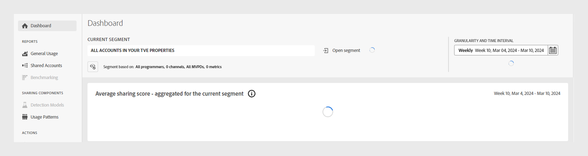

# Troubleshoot issues in Account IQ {#troubleshoot}

If you're experiencing delays in loading data and charts, difficulties exporting reports, or any other issues related to metrics or graphs, continue reading for prompt troubleshooting assistance.

* If a page or individual panels take too long to load, then try refreshing the page. For the current release, depending on the current segment, a page can take up to a minute to load.

  

* If you are not able to see any data or graph even after refreshing, then log out of Account IQ and then log in again.

* If none of the above troubleshooting methods help, or if you have other questions related to data or inability to export statistics, then contact Adobe Support by sending email to <tve-support@adobe.com>.
