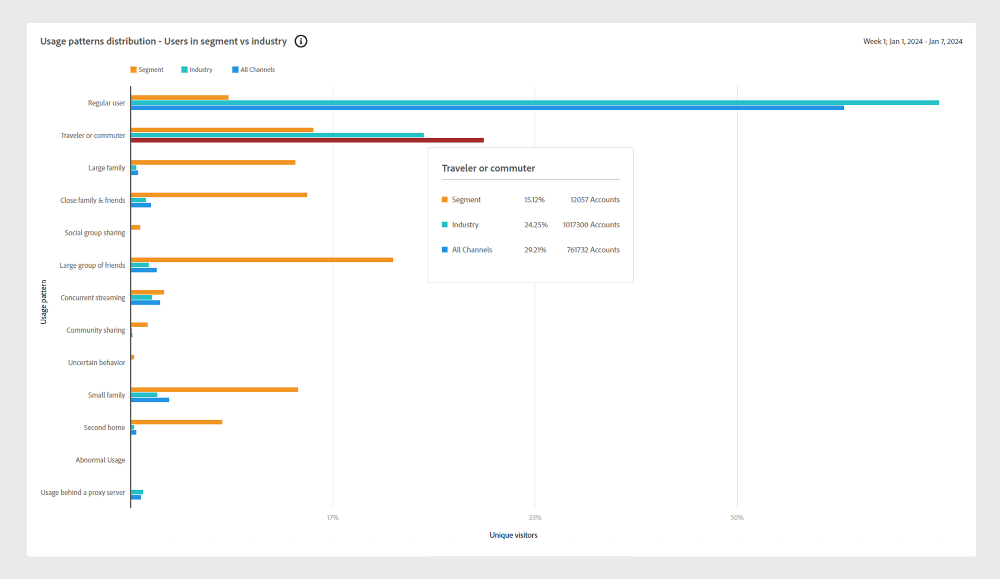
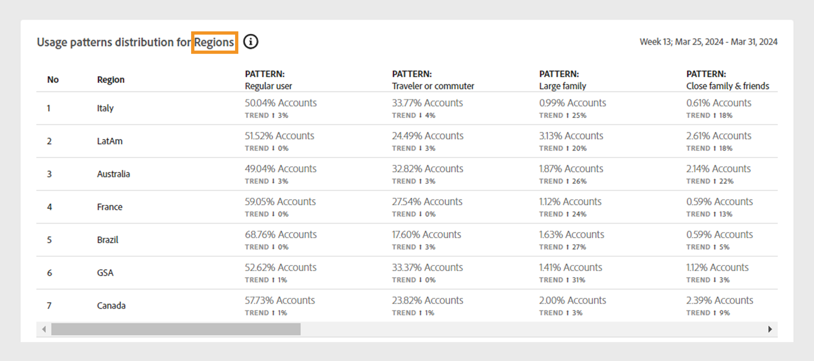
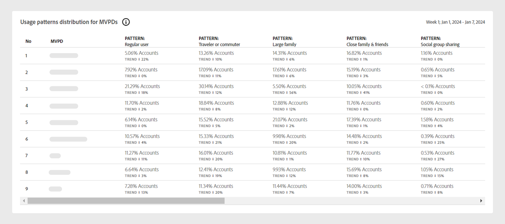

# Usage Patterns {#usage-patterns}

Account IQ classifies users of subscriber accounts into various categories in terms of their social behavior, such as traveler or commuter, Large family, and Community sharing. The **Usage Patterns** page shows several different analytics and reports for these user typologies. For example, **Usage patterns distribution** reports compare the usage behavior for the current segment versus all of your accounts.

Like the other pages in the app, the analytics and reports here are based on the current segment defined in the [segment panel](/help/accountiq/segments-timeinterval.md).

## Usage patterns distribution {#usage-pattern-dis}

The cluster bar graph in depicts the number and percentages of subscribers for each social behavior, or usage pattern. 

+++D2C services: Usage patterns distribution - Users in segment

The cluster bar graph below compares the usage pattern distribution of the current segment to a segment containing all of your accounts.

*Usage patterns distribution- Users in segment*

+++

+++TV Everywhere: Usage patterns distribution - Users in segment vs Industry

In addition to comparing each usage pattern in the current segment to the entire industry, it also compares them to a segment containing all of your accounts.

*Usage patterns distribution- Users in segment vs Industry* 

+++

## Usage pattern distribution in segment {#usage-pattern-dis-segment}

The **[!UICONTROL Usage patterns distribution in segment]** panel tabulates the following information for each user pattern:

* Sharing probability range that the individual accounts fall into.
* Number and percentage of accounts in that pattern.
* Overall and perctage of usage by subscribers in that category in terms of play requests.

*Usage patterns distribution in segment* 

For example, in the above visualization:

* A regular user (one to a few people with a limited number of devices in only one location) in the defined segment has the account sharing probability between 5 to 13%.

* 70.2% (376,615) of the total subscriber accounts (536,640) are regular users.

* 44.5% (2,896,346) of the total play requests (6,512,593) are made by regular users.

## Usage pattern distribution for video categories {#usage-pattern-dis-video-categories}

+++D2C services: Usage pattern distribution for Regions

The **[!UICONTROL Usage pattern distribution]** table provides a comparison of usage patterns across [video categories](product-concepts.md##video-category-def) in the current segment.

*Usage patterns distribution for Regions* 

>[!NOTE]
>
>The video categories shown in the previous image, such as **Regions** is just an example. When you log in to Account IQ, the labels will display your company's specific video categories.

+++

+++Programmer: Usage pattern distribution for MVPDs 

The **[!UICONTROL Usage pattern distribution]** table provides a comparison of usage pattern distribution for the MVPDs in the current segment.

*Usage patterns distribution for programmer user* 

+++

+++MVPD: Usage pattern distribution for Programmers 

The **[!UICONTROL Usage pattern distribution]** table provides a comparison of usage pattern distribution for the programmers or channels in the current segment.

*Usage patterns distribution for MVPD user* 

+++
