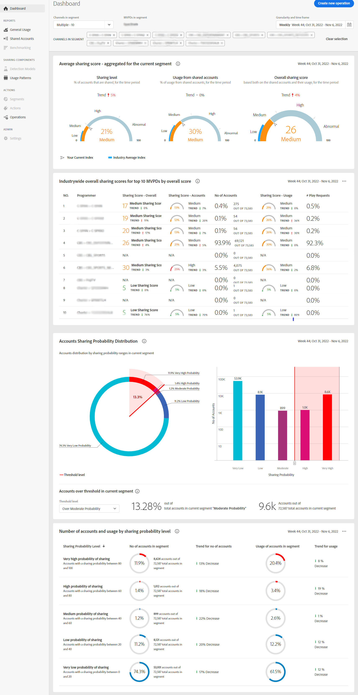

# View account sharing reports for multiple programmers and channels {#viewreport-multiple-programmer-channel}

Account IQ being a robust and scalable analytics tool enables you to view, analyze, and compare subscriber accounts sharing statistics not only for one, two, or three but for more programmers at a given time.

>[!NOTE]
>
>However, as of now you can select at most 10 individual channels (or programmers) from the segment and time frame panel to view subscriber sharing statistics.

To view subscriber account sharing statistics for multiple channels:

1. Define a desired segment following the steps in [How to define segment and select timeframe](/help/accountiq/howto-select-segment-timeframe.md) for evaluation from [segment and timeframe panel](/help/accountiq/segments-timeframe.md).

1. Select a desired reports page from the left navigation:

* [Dashboard](/help/accountiq/dashboard.md) (dashboard gives a glimpse of the selected graphs from different reports pages).

  

  *Figure: Dashboard report for multiple programmers*

* [General Usage](/help/accountiq/general-usage-reports.md)

* [Shared Accounts](/help/accountiq/shared-acc-reports.md)

* [Usage Patterns](/help/accountiq/usage-patterns.md)

Each of these pages will reflect the activity of selected segment.
