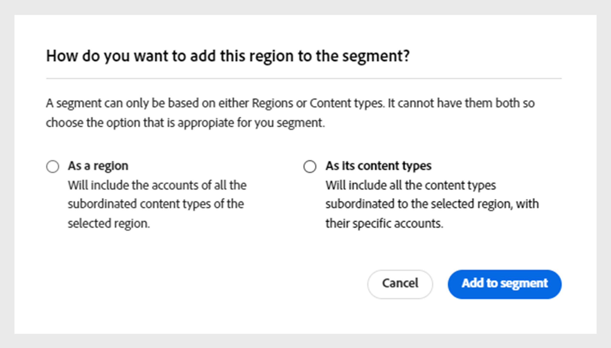

# Work with segments {#work-with-segments}

[Segments](product-concepts.md#segmet-def) are a collection of subscriber accounts that allow you to analyze credential sharing under user-defined conditions. You can use segments to examine different sets of subscriber accounts and generate corresponding data reports in tables and graphs. There are two types of segments in Account IQ: 

1. **Default segment**: **All accounts in your properties** is an out-of-the-box segment in the system that includes all active subscriber accounts without specific conditions applied.

   >[!NOTE]
   >
   >Using the default segment may prevent the display of certain tables like [Video categories in segment](data-panels.md#video-categories-segment), [Sharing score by channels and MVPDs](data-panels.md#sharin-score-by-channels-and-mvpds), and [Usage pattern distribution for MVPDs and Programmers](usage-patterns.md#usage-pattern-dis-mvpds-programmers). These tables can only accommodate and display data for up to 20 rows at a time. The remaining tables, graphs, and reports are the same for default and custom segments.

1. **Custom segments**: These are tailored segments that enable you to group subscriber accounts from specific categories, such as D2C content types, programmers, channels, and MVPDs for analyzing credential sharing under user-defined conditions. Learn more about how to [create a custom segment](#create-new-segment).

   >[!IMPORTANT]
   >
   >All procedures described in this guide are based on custom segments. However, the concepts remain the same for default and custom segments.

When you go to the **Actions** and select the **[!UICONTROL Segments]** tab in the left panel, a list of segments available in the system is displayed. The segments page lets you quickly assess key details about each segment in a tabular format. The details include the segment name, the number of [video categories](product-concepts.md##video-category-def), metrics, [operations](product-concepts.md#operation-def) using the current segment, last modified date and time, as well as the name of the segment creator. 

You can perform the following functions with segments:

* [Create new segment](#create-new-segment)
* [Manage segments](#manage-segments)

## Create new segment {#create-new-segment}

The process of creating a new segment are similar for D2C and TV Everywhere. The video categories will be different for each respective persona.

+++D2C Services

To build a segment and analyze subscriber's sharing behavior, select **[!UICONTROL Create new segment]** at the upper-right.

   >[!NOTE]
   >
   >The video categories shown in the image, such as **Regions** and **Content Types** are just examples. When you log in to Account IQ, the labels will display your company's specific video categories.

   

   *Create new segment* <!--paramount img-->

It opens a **New segment** page, which includes the following elements:

   

   *New segment page*

**A.** Segment components **B.** Segment definition **C.** Segment summary

* **Segment components**: An inventory of [video categories](product-concepts.md##video-category-def), and calculated metrics used to define a segment.

   >[!NOTE]
   >
   >Use **[!UICONTROL Show all]** to expand the list of segment components. To find a component quickly, search its name in **search segment components** rather than scrolling through the entire list.

* **Segment definition**: A canvas where you can drag and drop various segment components to build a segment. 

* **Segment summary**: A summary that estimates the qualified accounts based on the components in the segment definition and provides a brief overview of the segment during the evaluation period.

Perform the following steps to create a segment:

1. Add a name of your segment in **Segment name** that will be visible in the list of segments and during segment selection.
1. Add a detailed description of your segment in **Segment description**.
1. For example, drag **Regions and content types** from the segment components on the left panel and drop them into the **Regions/Content types** section within the **Segment definition**.

   >[!NOTE]
   >
   >You can create a segment based on either regions or content types. View the associated content types of a region from a dropdown menu.
   
   If you start by adding a **content type** in the **Regions/Content types** section, you can only add content types as subsequent components.

   If you start by adding a **Region** in the **Regions/Content types** section, a decision dialog box is displayed.

    {width="550" align="left"}
    
    *Add segment component as a region or its content types dialog* 

   Decide whether you want to compare specific regions or a segment based on the content types associated with a region.

   Select **[!UICONTROL As a region]** to add regions to the **Regions/Content types** section.

   Select **[!UICONTROL As its content types]** to add content types of a region.

1. Drag **Metrics** from the segment components on the left panel and drop them into the **Metrics** section within the **Segment definition**.

   
   
   *Select an operator and assign a value for the added metric*

    After adding metrics in the segment definition, choose an operator from **[!UICONTROL Select an operator]** dropdown menu and assign a value using **[!UICONTROL Select an option]**. 
    
    Adjust values for certain metrics by using the upward arrow to increase and the downward arrow to decrease. 

1. Drag **Calculated Metrics** from the segment components on the left panel and drop them into the **Calculated Metrics** section within the **Segment definition**.

   
   
   *Select an operator and assign a value for the added calculated metric*
   
   After adding calculated metrics in the segment definition, **[!UICONTROL Select an operator]** from the dropdown menu and assign a value using **[!UICONTROL Select an option]**.

    >[!NOTE]
    >
    >All the metrics and calculated metrics you drop under the segment definition are accompanied by appropriate operators to assign values to the respective metrics and calculated metrics. 

1. Review the segment details in the **Segment summary** to decide the changes you want to implement across the segment.
1. Select **[!UICONTROL Last week]** or **[!UICONTROL Last month]** from the **Evaluation period** dropdown menu to estimate summary values for the past week or month. 
1. Select **[!UICONTROL Update estimation]** to calculate the number of estimated qualified accounts in the current segment based on the selected evaluation period.
1. Select **[!UICONTROL Save segment]**.

The segment you've created is now available in the segment list.

+++

+++TV Everywhere

To build a segment and analyze subscriber's sharing behavior, select **[!UICONTROL Create new segment]** at the upper-right.

   

   *Create new segment*

It opens a **New segment** page, which includes the following elements:

   

   *New segment page*

**A.** Segment components **B.** Segment definition **C.** Segment summary

* **Segment components**: An inventory of programmers and channels, MVPDs, metrics, and calculated metrics used to define a segment.

   >[!NOTE]
   >
   >Use **[!UICONTROL Show all]** to expand the list of segment components. To find a component quickly, search its name in **search segment components** rather than scrolling through the entire list.

* **Segment definition**: A canvas where you can drag and drop various segment components to build a segment. 

* **Segment summary**: A summary that estimates the qualified accounts based on the components in the segment definition and provides a brief overview of the segment during the evaluation period.

Perform the following steps to create a segment:

1. Add a name of your segment in **Segment name** that will be visible in the list of segments and during segment selection.
1. Add a detailed description of your segment in **Segment description**.
1. Drag **Programmers and Channels** from the segment components on the left panel and drop them into the **Programmers/Channels** section within the **Segment definition**.

   >[!NOTE]
   >
   >You can create a segment based on either programmers or channels. View the associated channels with a programmer from a dropdown menu.
   
   If you start by adding a **Channel** in the **Programmers/Channels** section, you can only add channels as subsequent components.

   If you start by adding a **Programmer** in the **Programmers/Channels** section, a decision dialog box is displayed.

    {width="550" align="left"}
    
    
    *Add segment component as a programmer or its channels dialog* 

   Decide whether you want to compare specific programmers or a segment based on the channels associated with a programmer.

   Select **[!UICONTROL As a programmer]** to add programmers to the **Programmers/Channels** section.

   Select **[!UICONTROL As its channels]** to add all channels of a programmer.

1. Drag **MVPDs** from the segment components on the left panel and drop them into the **MVPDs** section within the **Segment definition**.

   >[!NOTE]
   >
   >When you log in as a programmer, an MVPD named **xfinity** appears as a standalone option in the **MVPDs** section. You cannot combine it with any other MVPD.

1. Drag **Metrics** from the segment components on the left panel and drop them into the **Metrics** section within the **Segment definition**.

   
   
   *Select an operator and assign a value for the added metric*

    After adding metrics in the segment definition, choose an operator from **[!UICONTROL Select an operator]** dropdown menu and assign a value using **[!UICONTROL Select an option]**. 
    
    Adjust values for certain metrics by using the upward arrow to increase and the downward arrow to decrease. 

1. Drag **Calculated Metrics** from the segment components on the left panel and drop them into the **Calculated Metrics** section within the **Segment definition**.

   
   
   *Select an operator and assign a value for the added calculated metric*
   
   After adding calculated metrics in the segment definition, **[!UICONTROL Select an operator]** from the dropdown menu and assign a value using **[!UICONTROL Select an option]**.

    >[!NOTE]
    >
    >All the metrics and calculated metrics you drop under the segment definition are accompanied by appropriate operators to assign values to the respective metrics and calculated metrics. 

1. Review the segment details in the **Segment summary** to decide the changes you want to implement across the segment.
1. Select **[!UICONTROL Last week]** or **[!UICONTROL Last month]** from the **Evaluation period** dropdown menu to estimate summary values for the past week or month. 
1. Select **[!UICONTROL Update estimation]** to calculate the number of estimated qualified accounts in the current segment based on the selected evaluation period.
1. Select **[!UICONTROL Save segment]**.

The segment you've created is now available in the segment list.
+++

## Manage segments {#manage-segments}

You can select a segment from the segments list and then perform the following actions:

* [Edit a segment](#edit-segment)
* [Duplicate a segment](#duplicate-segment)
* [Delete a segment](#delete-segment)

>[!NOTE]
>
>The video categories shown in this section, such as **MVPDs**, **Programmers**, and **Channels** represent the labels used in the TV Everywhere version of Account IQ. If you're logged in as a D2C service, the labels will display your company's specific video categories.

*Select a segment to edit, duplicate, or delete*

   >[!NOTE]
   >
   >You cannot edit, duplicate, or delete the default segment named **All accounts in your properties**.

### Edit a segment {#edit-segment}

1. Navigate to the **[!UICONTROL Segments]** tab under **Actions** in the left panel to view a list of segments.
1. Select a segment you want to edit.
1. Select **[!UICONTROL Edit]**.
1. Modify segment details, such as the segment name, description, or components in the **Segment definition**.

   >[!TIP]
   >
   >Use **[!UICONTROL Clear all]** to remove all segment components within each section under segment definition at once. Alternatively, select the cross button to remove individual items.

   
   
   *Select Clear all to remove all segment components at once*

1. Select either **[!UICONTROL Update segment]** to update the existing segment or **[!UICONTROL Save as new segment]** to create a new segment with the changes.

   >[!NOTE]
   >
   >Updating segments that are currently undergoing operations is not allowed. Saving changes as a new segment is the only option for segments with ongoing operations.

### Duplicate a segment {#duplicate-segment}

1. Navigate to the **[!UICONTROL Segments]** tab under **Actions** in the left panel to view a list of segments. 
1. Select a segment you want to duplicate.
1. Select **[!UICONTROL Duplicate]**. 

A copy of the selected segment is generated and placed at the end of the segment list. You can edit the necessary details in the duplicated segment and then either update the duplicate segment or save it as a new segment.

### Delete a segment {#delete-segment}

1. Navigate to the **[!UICONTROL Segments]** tab under **Actions** in the left panel to view a list of segments. 
1. Select a segment you want to remove.

   Select multiple segments to delete them in a single operation. You can also select a checkbox at the left of the **Segment Name** to delete all segments at once.

   >[!NOTE]
   >
   > You can only delete more than one segment or all segments if none of the segments are used by operations. Moreover, deleting the default segment named **All accounts in your properties** is not allowed. It will remain unselected when you attempt to delete all segments at once.

   

   *Select multiple segments to delete more than one segment*

1. Select **[!UICONTROL Delete]**.
1. Confirm to **[!UICONTROL Delete]** in the dialog to remove the segment permanently.

   >[!NOTE]
   >
   >The segment is permanently deleted from the system, and you cannot undo this action.

  