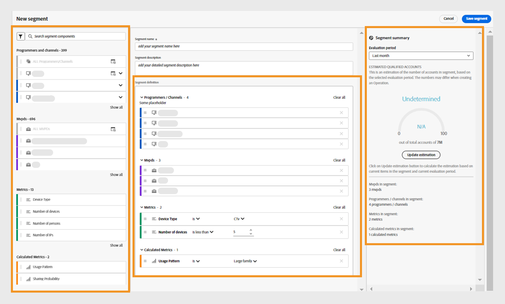
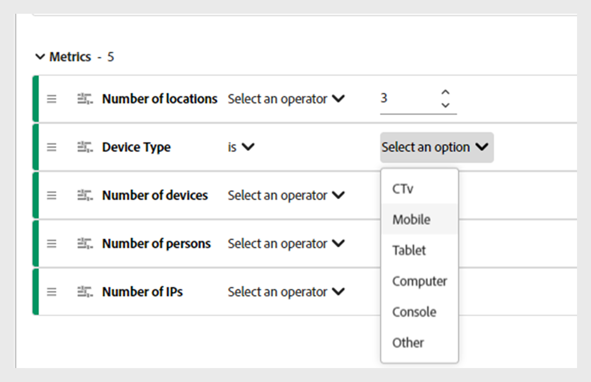
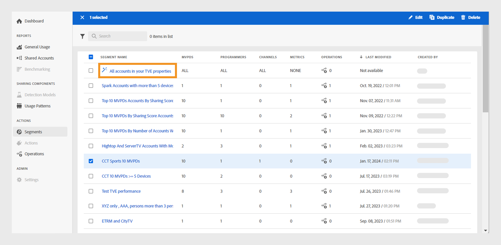

# Work with segments {#work-with-segments}

On the [!UICONTROL Segments] tab in the left panel, you have a list of all created and saved [segments](product-concepts.md#segmet-def). The segments page lets you quickly assess key details about each segment in a tabular format. The details include the segment name, the number of MVPDs and programmers, associated channels, metrics, ongoing operations using the current segment, last modified date and time, as well as the name of the segment creator.

As a programmer and MVPD user, you can perform various operations with segments.

* [Create new segment](#create-new-segment)
* [Manage segments](#manage-segments)

## Create new segment {#create-new-segment}

To build a segment and analyze subscriber's sharing behavior, select **[!UICONTROL Create new segment]** at the upper-right.

   

   *Figure: Create new segment*

It leads to **New segment** page, which includes the following elements:

* **Segment components**: An inventory of programmers and channels, MVPDs, metrics, and calculated metrics used to describe a segment.

   >[!NOTE]
   >
   >Use **[!UICONTROL Show all]** to expand the list of segment components.

* **Segment definition**: A canvas where you can drag and drop various segment components to build a segment. 
* **Segment summary**: A summary that estimates the qualified accounts based on the evaluation period and provides a brief overview of the current segment.

   

   *Figure: New segment dialog*

Perform the following steps to create a segment:

1. Add a name of your segment in **Segment name** that will be visible in the list of segments and during segment selection.
1. Add a detailed description of your segment in **Segment description**.
1. Drag **Programmers and Channels** from the segment components on the upper-left and drop them into the **Programmers/Channels** section within the **Segment definition**.

   >[!NOTE]
   >
   >You can create a segment based on either programmers or channels. View the associated channels with a programmer from a dropdown menu.
   
   If you start by adding a **Channel** in the **Programmers/Channels** section, you can only add channels as subsequent components.

   If you start by adding a **Programmer** in the **Programmers/Channels** section, a decision dialog box will appear.

    
    
    *Figure: Add segment component as a programmer or its channels Dialog* 

   Decide whether you want to compare specific programmers or a segment based on the channels associated with a programmer.

   Select **[!UICONTROL As a programmer]** to add programmers to the **Programmers/Channels** section.

   Select **[!UICONTROL As its channels]** to add all channels of a programmer.

1. Drag **MVPDs** from the segment components on the upper-left and drop them into the **MVPDs** section within the **Segment definition**.

   >[!NOTE]
   >
   >MVPD named **xfinity** appears as a standalone option in **MVPDs** section. You cannot combine it with any other MVPD.

1. Drag **Metrics** from the segment components on the upper-left and drop them into the **Metrics** section within the **Segment definition**.

    After adding metrics in the segment definition, **Select an operator** from the dropdown menu and assign a value using **Select an option**. 
    
    Adjust values for certain metrics by using the upward arrow to increase and the downward arrow to decrease. 

   
   
   *Figure: Select an operator and assign a value for the added metric*

1. Drag **Calculated Metrics** from the segment components on the upper-left and drop them into the **Calculated Metrics** section within the **Segment definition**.
   
   After adding calculated metrics in the segment definition, **Select an operator** from the dropdown menu and assign a value using **Select an option**.

    >[!NOTE]
    >
    >All the metrics and calculated metrics you drop under the segment definition are accompanied by appropriate operators to assign values to respective metrics and calculated metrics. 

1. Review the segment details in the **Segment summary** to decide the changes you want to implement across the segment.
1. Select **Last week** or **Last month** from the **Evaluation period** dropdown menu to estimate summary values for the past week or month. 
1. Select **[!UICONTROL Update estimation]** to calculate the number of estimated qualified accounts in the current segment based on the selected evaluation period.
1. Select **Save segment**.

The segment you've created is now visible in the segment list.

## Manage segments {#manage-segments}

You can select a segment from the segments list and then perform the following operations:

* [Edit a segment](#edit-segment)
* [Duplicate a segment](#duplicate-segment)
* [Delete a segment](#delete-segment)

*Figure: Select a segment to edit, duplicate, or delete*

   >[!NOTE]
   >
   >You cannot edit, duplicate, or delete the default segment named **All accounts in your TVE properties**.

### Edit a segment {#edit-segment}

1. Go to the **Segments** tab and select a segment you want to edit.
1. Navigate to **Edit**.
1. Modify segment details, such as the segment name, description, or components in the **Segment definition**.

   >[!NOTE]
   >
   >Use **[!UICONTROL clear all]** to clear the entire list of segment components in the segment definition. Alternatively, select the cross button to remove individual items.

1. Select either **Update segment** to update the existing segment or select **Save as new segment** to create a new segment with the changes.

   >[!NOTE]
   >
   >You cannot update segments that are used by operations. Saving changes as a new segment is the only option for segments with ongoing operations.

### Duplicate a segment {#duplicate-segment}

1. Navigate to the **Segments** tab and select a segment you want to duplicate.
1. Select **Duplicate**. A copy of the duplicated segment will be generated and placed at the end of the list.

You can edit the necessary details in the duplicated segment and then either update the duplicate segment or save it as a new segment.

### Delete a segment {#delete-segment}

1. Locate to the **Segments** tab and select a segment you require to remove.

   >[!NOTE]
   >
   >You cannot delete a segment if it's used by one or more operations.

1. Select **Delete**.
1. Confirm to **Delete** in the dialog to remove the segment permanently.

   >[!NOTE]
   >
   >The segment is permanently deleted from the system, and you cannot undo this action.

   You can select multiple segments to delete more than one segment. Also, select the checkbox at the left of the segment name to delete all segments at once.

   >[!NOTE]
   >
   > This is only possible if none of the segments are used by operations.

   

   *Figure: Select multiple segments to delete more than one segment*

