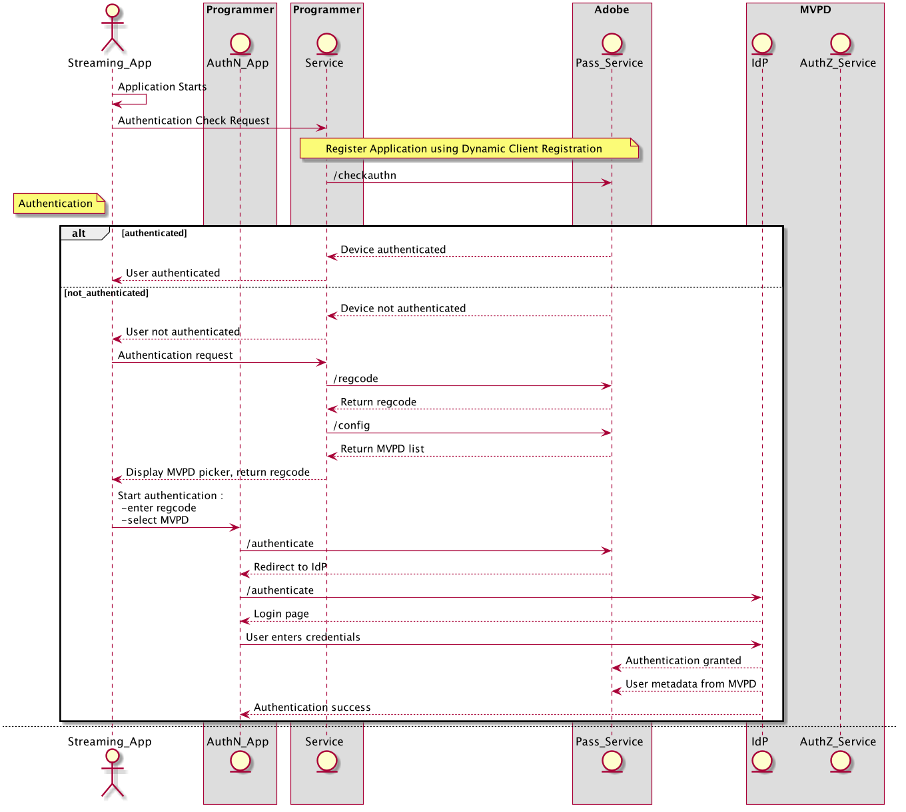

# Authentication using the OAuth 2.0 Protocol

>[!NOTE]
>
>The content on this page is provided for information purposes only. Usage of this API requires a current license from Adobe. No unauthorized use is permitted. 

## Overview {#overview}

Although SAML is still the main protocol used for authentication by US MVPDs and enterprises in general, there is a clear trend towards moving to OAuth 2.0 as the primary authentication protocol. The OAuth 2.0 protocol (https://tools.ietf.org/html/rfc6749) was mainly developed for consumer sites and was quickly adopted by Internet giants like Facebook, Google & Twitter.

OAuth 2.0 is hugely successful and this has prompted enterprises to slowly upgrade their infrastructures to support it. 

 

## Advantages of Moving to OAuth 2.0 {#adv-oauth2}

At a high level, the OAuth 2.0 protocol offers the same functionality as the SAML protocol but there are some important distinctions.

One of these is the fact that the refresh token flow can be used as a way to refresh authentication behind the scenes. This allows the IdP (the MVPDs in this case) to maintain control while still allowing a good user experience as the user is no longer required to log in often due to security concerns. 

The protocol also offers more flexibility in terms of the data exposed as a service provider can now use the tokens to access other APIs to get extra info. This in turn results in a "chattier" protocol for TVE use cases but it allows the flexibility needed for complex workflows.

 

 

## Requirements for Switching to OAuth 2.0 {#oauth-req}

To support authentication with OAuth 2.0, an MVPD needs to meet the following prerequisites:

First and foremost, the MVPD must make sure that it supports the [Authorization Code Grant](https://oauthlib.readthedocs.io/en/latest/oauth2/grants/authcode.html) flow. 

After confirming that it supports the flow, the MVPD must provide us with the following information:

* the authentication end-point
    * the end-point will provide the authorization code which will later be used in exchange for the refresh and access token
* the /token end-point 
    * this will provide the refresh token and access token
    * the refresh token needs to be stable (it must not change each time we request a new access token
    * the MVPD needs to allow several active access tokens for each refresh token
    * this end-point will also exchange a refresh token for an access token
* we need an **end-point for user-profile**
    * this end-point will provide the userID, which needs to be unique for an account and shouldn't contain any Personally Identifiable Information
* the **/logout** end-point (optional) 
    * Adobe Pass Authentication will redirect to this end-point, provide the MVPD a redirect back URI; on this end-point, the MVPD can clear the cookies on the client machine or apply any desired logic for logout
* it is highly recommended to have support for authorized clients (client apps that don't trigger a user authorization page) 
* we'll also need:
    * **clientID** and **client secret** for the integration configurations
    * **time to live** (TTL) values for the refresh token and access token
    * We can provide the MVPD with an Authorization callback and logout callback URI. Also, if needed, we can provide MVPDs with a list of IPs to be whitelisted in your firewall settings.
 

## Authentication flow {#authn-flow}

In the authentication flow, Adobe Pass Authentication will communicate with the MVPD on the protocol selected in the configuration. The OAuth 2.0 flow is depicted in the picture below:

 

**Figure 1: OAuth 2.0 authentication flow**

 

## Authentication Request and Response {#authn-req-response}

In a nutshell, the authentication flow for MVPDs supporting the OAuth 2.0 protocol follows these steps:

1. The end-user navigates to the Programmer's site and selects to log in with his MVPD credentials
1. The AccessEnabler installed on the Programmer's side with send an Authentication request in the form of an HTTP request to the Adobe Pass Authentication endpoint, which the Adobe Pass Authentication endpoint redirects to the MVPD authorization endpoint.
1. The MVPD authorization endpoint sends an authorization code to the Adobe Pass Authentication endpoint
1. Adobe Pass Authentication uses the received authorization code to request a refresh token and an access token from the MVPD's token endpoint
1. A call to fetch user info & metadata can be sent to the user profile endpoint in case the user information is not included in the token
1. The authentication token is passed to the end-user who can now successfully browse the Programmer site

     >[!NOTE]
     >
     >The refresh token is used to get a new access token after the current access token becomes invalid or expires.  
 

>[!IMPORTANT]
>
>The refresh token must not change when it is exchanged for an access token. 

This limitation stems from the client flows which don't allow the server to update the AuthNToken which, for the OAuth 2.0 protocol, also contains the refresh token.

A typical authorization flow performs an exchange of the refresh token saved in the AuthNToken for an access token which is subsequently used to perform the authorization call in the name of the user who was authenticated in the first place. If the Authorization Server (the MVPD) were to change the refresh token and invalidate the old one, we will not be able to update the valid AuthNToken. For this reason, MVPDs need to support stable refresh tokens in order to be able to set up OAuth 2.0 integrations for them.
 

## Migrating from SAML to OAuth 2.0 {#saml-auth2-migr}

Migrating integrations from SAML to OAuth 2.0 will be performed by Adobe and the MVPD. There is no need for any technical change on the programmer side, although the programmer might want to check/test the co-branding on the MVPD login page. From the MVPD's point of view, the endpoints and other information requested in Oauth 2.0 requirements are required.

In order to **preserve SSO**, the users that already have an authentication token obtained via SAML will still be considered authenticated and their requests will be routed through the old SAML integration.

From a technical perspective:

1. Adobe will enable an OAuth 2.0 integration between the programmer and the MVPD, WITHOUT deleting the SAML integration.
1. After the enablement, all new users will use OAuth 2.0 flows.
1. Users already authenticated, that already have a local AuthN token that contains the SAML subject-id, will be automatically routed by Adobe through the SAML integration.
1. For the users in step number 3, once their SAML generated AuthN token expires, Adobe will treat them as new users and behave like the users in step number 2.
1. Adobe will review usage patterns in order to determine the moment when the SAML integration can be safely deactivated.
