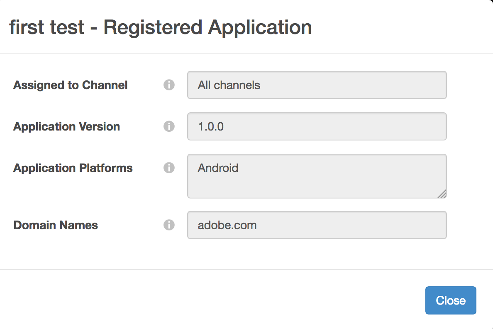

# Dynamic Client Registration Management {#dynamic-client-registration-management}

>[!NOTE]
>
>The content on this page is provided for information purposes only. Usage of this API requires a current license from Adobe. No unauthorized use is permitted.

## Overview {#overview}

With the widespread adoption of [Android Chrome Custom Tabs](https://developer.chrome.com/multidevice/android/customtabs){target_blanck} and [Apple Safari View Controller](https://developer.apple.com/documentation/safariservices/sfsafariviewcontroller){target_blanck} in our customers' applications, we are updating the user authentication flow in Adobe Primetime Authentication. More specifically, we can no longer achieve the goal of maintaining the state so that the user agent flow of authenticating an MVPD subscriber can be tracked between redirects. This was previously done using HTTP cookies. This limitation is the driver for starting to migrate all the APIs to OAuth 2.0 [RFC6749](https://tools.ietf.org/html/rfc6749){target_blanck}.

With this update, Adobe Authentication Clients become OAuth 2.0 clients and a custom OAuth 2.0 authorization server is deployed to address the needs of Adobe Primetime Authentication Service.

In order for the Client applications to utilize the OAuth 2.0 authorization, the server must dynamically register to obtain specific information (client credentials) to be able to interact with it. As part of the registration process, the client must present a set of built-in metadata to the client registration endpoint.

This metadata is communicated as a software statement, which contains a "software_id" to allow our authorization server to correlate different instances of an application using the same software statement.

A **software statement** is a JSON Web Token (JWT) that asserts metadata values about the client software as a bundle. When presented to the authorization server as part of a client registration request, the software statement must be digitally signed or MACed using JSON Web Signature (JWS).

You can find a more detailed explanation on what software statements are and how they work in the official documentation [RFC7591](https://tools.ietf.org/html/rfc7591).

The software statement should be deployed with the application on the user's device.

Prior to this update, we had two mechanisms for allowing applications to perform calls to Adobe Primetime authentication:

* browser-based clients are registered via allowed [domain listing](/help/authentication/programmer-overview.md#reg-and-init)
* native application clients, such as iOS and Android applications are  registered through **signed requestor** mechanism  

With the Client Registration authorization mechanism, you must add your applications to the TVE dashboard.

For a customer to start implementing the new Android SDK, and the upcoming iOS SDK, they need a software statement. A software statement identifies an application created in the TVE Dashboard.

Follow the steps in the sections below to create a Registered Application in the TVE Dashboard.

## Create a Registered Application {#create_app}

There are two ways you can create a Registered Application in TVE Dashboard:

* [Programmer level](#prog-level) - allows you to create a Registered Application and link it to any or all Programmer channels.

* [Channel level](#channel-level) - allows you to create a Registered Application that is permanently linked to this Channel alone.

### Create a Registered Application at Programmer Level {#prog-level}

Go to **Programmers** > **Registered Applications** tab.

In the Registered Applications tab, click **Add New Application**. Fill in the required fields in the new window.

As seen in the image below, the fields you should fill in are:

*   **Application Name** - the name of the application

*   **Assigned to Channel** - the name of your channel, to which this application is linked to. The default setting in the dropdown mask is **All Channels.** The interface allows you to select either one channel or all channels.

*   **Application Version** - by default, this is set to "1.0.0" but we highly encourage you to modify it with your own application version. As a best practice, if you decide to change the version of your application, reflect it by creating a new registered application for it.

*   **Application Platforms** - the platforms for the application to be linked with. You have the option to select them all or multiple values.

*   **Domain Names** - the domains for the application to be linked with. The domains in the dropdown list are a unified selection of all domains from all your channels. You have the option to select  multiple domains from the list. The meaning of the domains is redirect URLs [RFC6749](https://tools.ietf.org/html/rfc6749). In the client registration process, the client application can request to be permitted to use a redirect URL for the finalization of the authentication flow. When a client application requests a specific redirect URL, it is validated against the domains whitelisted in this Registered Application associated to the software statement.

After filling the fields with appropriate values you must click on "Done" in order for the application to be saved in the configuration.

Please be aware that there is **no option to modify an already created application**. In case it is discovered that something created no longer meets the requirements , a new registered application will need to be created and used with the client application whose requirements it fulfills.

### Register a new Application at Channel Level {#channel-level}

In order to create a registered application at channel level navigate to the "Channels" menu and choose the one for which you would like to create an application. Then , after Navigating to the "Registered Applications" tab, click on the "Add New Application" button.

As shown below, what is slightly different here ,compared to the same action performed at the Programmer level, is the "Assigned Channels" dropdown which is not enabled so there is no option to bind the registered application to other than the current channel.

## List applications {#list-reg-app}

After creating the registered application there is the possibility to get a software statement to present the authorization server as part of a request.

This can be done by navigating either to the Programmer or Channel for which the registered applications were created, where they are listed. 

As ilustrated below , every entry in the list will be identified by a name, version and symbols for platforms to whom it was binded.

For each of them you can :

* [View](#view)
* [Download a software statement](#download-statement)

### View a Registered Application {#view}

In the list of applications, choosing one of them and clicking on the "View" button will show the details used when it was created. As mentioned before, there is no option to modify anything.

### Download Software Statement {#download-statement}

Clicking the "Download" button on the list entry for which a software statement is needed will generate a text file. This file will contain something similar to the below sample output.

The name of the file is uniquely identified by prefixing it with "software_statement" and adding the current timestamp.

Please note that, for the same registered application, different software statements will be received each time the download button will be clicked but this does not invalidate the previously obtained software statements for this application. This happens because they are generated on the spot, per action request.

There is one **limitation** regarding the download action. If a software statement is asked for by clicking the "Download" button shortly after creating the registered application and this was not yet saved and the configuration json was not synchronized ,the following error message will appear on the bottom of the page. 

This wraps a HTTP 404 Not Found error code recieved from core as the id of the registered application was not yet propagated and the core has no knowledge of it.

The solution is, after creating the registered application, to wait for at most 2 minutes for the configuration to be synchronized. After this happens the error message won't be received anymore and the text file with the software statement will be available for downloading.

For details on how the end to end process works, or to gain some insight into how the requests are performed and which responses to expect, see the link in Related Information below, alongside other useful links.

<!--
## Related Information {#related}

* [Dynamic Client Registration API](/help/authentication/dynamic-client-registration-api.md)
* [TVE Dashboard User Guide](/help/authentication/tve-dashboard-user-guide.md)
-->

## Feature demo {#tutorial}

Please watch [this webinar](https://my.adobeconnect.com/pzkp8ujrigg1/) which gives more context of the features and contains a demo on how to manage the software statements using the TVE Dashboard and how to test the generated ones using a demo application provided by Adobe as part of Android SDK.
