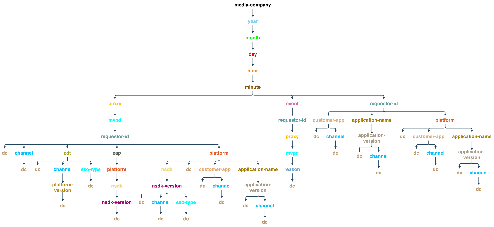

# Entitlement Service Monitoring API {#entitlement-service-monitoring-api}

>[!IMPORTANT]
>
>The content on this page is provided for information purposes only. Usage of this API requires a current license from Adobe. No unauthorized use is permitted.

>[!IMPORTANT]
>
> Before using the Degradation API, ensure the following prerequisites are met:
>
> * Obtain the client credentials as described in the [Retrieve client credentials](../../rest-apis/rest-api-dcr/apis/dynamic-client-registration-apis-retrieve-client-credentials.md) API documentation.
> * Obtain the access token as described in the [Retrieve access token](../../rest-apis/rest-api-dcr/apis/dynamic-client-registration-apis-retrieve-access-token.md) API documentation.
>
> Refer to the [Dynamic Client Registration Overview](../../rest-apis/rest-api-dcr/dynamic-client-registration-overview.md) documentation for more information about how to create a registered application and download the software statement.

## API Overview {#api-overview}

Entitlement Service Monitoring (ESM) is implemented as a WOLAP (Web-based [Online Analytical Processing](https://en.wikipedia.org/wiki/Online_analytical_processing){target=_blank}) project. ESM is a generic business-reporting Web API backed by a data warehouse. It acts as an HTTP query language that enables typical OLAP operations to be performed RESTfully.

>[!NOTE]
>
>The ESM API is not generally available. Contact your Adobe representative for availability questions.

The ESM API provides a hierarchical view of the underlying OLAP cubes. Each resource ([dimension](#esm_dimensions) in the dimension hierarchy, mapped as a URL path segment) generates reports with (aggregated) [metrics](#esm_metrics) for the current selection. Each resource points to its parent resource (for roll-up) and its sub-resources (for drill-down). Slicing and dicing are achieved via query string parameters pinning dimensions to specific values or ranges.

The REST API provides the available data within a time interval specified in the request (falling back to default values if none provided), according to the dimension path, provided filters, and selected metrics. The time range will not be applied for reports that do not contain time dimensions (year, month, day, hour, minute, second).

The endpoint URL root path will return the overall aggregated metrics within a single record, along with the links to the available drill-down options. The API version is mapped as the trailing segment of the endpoint URI path. For example, `https://mgmt.auth.adobe.com/esm/v3` means that the clients will access WOLAP version 3.

The available URL paths are discoverable via links contained in the response. Valid URL paths are held to map a path within the underlying drill-down tree that holds (pre-) aggregated metrics. A path in the form `/dimension1/dimension2/dimension3` will reflect a pre-aggregation of those three dimensions (the equivalent of an SQL `clause GROUP` BY `dimension1`, `dimension2`, `dimension3`). If such a pre-aggregation does not exist and the system cannot compute it on the fly, the API will return a 404 Not Found response.

## Drill-down Tree {#drill-down-tree}

The following drill-down trees illustrate the dimensions (resources) available in ESM 3.0 for [Programmers](#progr-dimensions) and [MVPDs](#mvpd-dimensions).


### Dimensions available to Programmers {#progr-dimensions}

#### Day


#### Hour


#### Minute



### Dimensions available to MVPDs {#mvpd-dimensions}


A GET to the `https://mgmt.auth.adobe.com/esm/v3` API endpoint will return a representation containing:

*   Links to the available root drill-down paths:

    *   `<link rel="drill-down" href="/v3/dimensionA"/>`

    *   `<link rel="drill-down" href="/v3/dimensionB"/>`

*   A summary (aggregated values) for all the metrics (in the default
    interval, since no query string parameters are provided, see below).


Following a drill-down path (step by step):
`/dimensionA/year/month/day/dimensionX` retrieves the following
response:

*   Links to the "`dimensionY`" and "`dimensionZ`" drill-down options

*   A report containing daily aggregates for each value of `dimensionX`


### Filters

Except for the date/time dimensions, any dimension available for the current projection (dimension path) can be filtered by using its name as a query string parameter.

The following filtering options are available:

*   **Equals** filters are provided by setting the dimension name to a particular value in the query string.

*   **IN** filters can be specified by adding the same dimension-name parameter multiple times with different values: dimension=value1\&dimension=value2

* **Not equals** filters must use the '\!' symbol after the dimension name resulting in the '\!=' "operator": dimension\!=value

* **NOT IN** filters require the '\!=' operator to be used multiple times, once for each value in the set: dimension\!=value1\&dimension\!=value2&...

There is also a special usage for the dimension names in the query string: If the dimension name is used as a query string parameter with no value, this will instruct the API to return a projection that includes that dimension in the report.

### Example ESM Queries

| *URL* | *SQL Equivalent*|
|---|---|
| /dimension1/dimension2/dimension3?dimension1=value1 | SELECT * from projection WHERE dimension1 = 'value1' </br> GROUP BY dimension1, dimension2, dimension3 |
|/dimension1/dimension2/dimension3?dimension1=value1&dimension1=value2 |SELECT * from projection WHERE dimension1 IN ('value1', 'value2') </br> GROUP BY dimension1, dimension2, dimension3 | 
| /dimension1/dimension2/dimension3?dimension1!=value1 | SELECT * from projection WHERE dimension1 <> 'value1' | </br> GROUP BY dimension1, dimension2, dimension3 | 
| /dimension1/dimension2/dimension3?dimension1!=value1&dimension2!=value2  | SELECT * from projection WHERE dimension1 NOT IN ('value1', 'value2') | </br> GROUP BY dimension1, dimension2, dimension3 | 
| Assuming there is no direct path: /dimension1/dimension3 </br> but there is a path: /dimension1/dimension2/dimension3 </br> </br> /dimension1?dimension3 |  SELECT * from projection GROUP BY dimension1, dimension3 | 

>[!NOTE] 
>
>None of these filtering techniques will work for `date/time` dimensions. The only way to filter `date/time` dimensions is to set the `start` and `end` query string parameters (described below) to the required values.

The following query string parameters have reserved meanings for the API (and therefore they cannot be used as dimension names, or else no filtering would be possible for such a dimension).

### ESM API Reserved Query String Parameters

| Parameter | Optional  | Description                                                                                                                                                                                                                                                                                         | Default value  |Example |
| --- | ---- |-----------------------------------------------------------------------------------------------------------------------------------------------------------------------------------------------------------------------------------------------------------------------------------------------------| ---- | --- |
|access_token | Yes | The DCR token can be passed as a standard Authorization Bearer token.                                                                                                                                                                                         | None | access_token=XXXXXX |
| dimension-name | Yes | Any dimension name – either contained in the current URL path or in any valid subpath; the value will be treated as an equals filter. If no value is provided, this will force the specified dimension to be included in the output even if it is not included or adjacent to the current path      | None | someDimension=someValue&someOtherDimension | 
| end | Yes | End time for the report in millis                                                                                                                                                                                                                                                                   | Current time of the server | end=2024-07-30 | 
| format | Yes | Used for content negotiation (with the same effect but lower precedence than the path "extension" – see bellow).                                                                                                                                                                                    | None: the content negotiation will try the other strategies | format=json | 
| limit | Yes | Maximum number of rows to be returned                                                                                                                                                                                                                                                               | Default value reported by the server in the self link if no limit is specified in the request | limit=1500 |
| metrics | Yes | Comma-separated list of metric names to be returned; this should be used for both filtering a subset of the available metrics (to reduce the payload size) and also for enforcing the API to return a projection which contains the requested metrics (rather than the default optimal projection). | All the metrics available for the current projection will be returned in case this parameter is not provided. | metrics=m1,m2 |
| start | Yes | Start time for the report as ISO8601; the server will fill in the remaining part if only a prefix is provided: e.g., start=2024 will result in start=2024-01-01:00:00:00                                                                                                                            | Reported by the server in the self link; the server tries to provide reasonable defaults based on the selected time granularity | start=2024-07-15 | 

The only available HTTP method currently is GET.

## ESM API Status Codes {#esm-api-status-codes}

| Status Code | Reason Phrase | Description | 
|---|---|---|
| 200 | OK |  The response will contain "roll-up" and "drill-down" links (if applicable). The report will be rendered as an attribute of the resource: a nested "report" element/property. | 
| 400 | Bad Request | The response body will contain a text message explaining what's wrong with the request. </br> </br> A 400 Bad Request status is accompanied by an explaining text in the response body (plain/text media type) which provides useful information regarding the client error. Besides the trivial scenarios such as invalid date formats or filters applied to non-existing dimensions, the system will also refuse to respond to queries that require a massive volume of data to be returned or aggregated on the fly. | 
| 401 |  Unauthorized | Caused by a request that does not contain the proper OAuth headers in order to authenticate the user |
| 403 |  Forbidden | Indicates that the request is not allowed in the current security context; this occurs when the user is authenticated but not allowed to access the requested information |
| 404 |  Not Found | Occurs in case an invalid URL path is provided with the request. This should never occur if the client follows the "drill-down"/"roll-up" links provided with 200 responses |
| 405 |  Method Not Allowed | Signals that an unsupported method was used in the request. Although currently only the GET method is supported, future versions may allow HEAD or OPTIONS |
| 406 |   Not Acceptable | Signals that an unsupported media type was requested by the client |
| 500 |  Internal Server Error |  "This should never happen" | 
| 503 |  Service Unavailable |  Signals an error within the application or its dependencies |

## Data Formats {#data-formats}

The data is available in the following formats:

* JSON (default)
* XML
* CSV
* HTML (for demo purposes)

The following content negotiation strategies can be used by clients (the precedence is given by the position in the list – first things first):

1.  A "file extension" appended to the last segment of the URL path: e.g., `/esm/v3/media-company/year/month/day.xml`. If the URL contains a query string, the extension must come before the question mark: `/esm/v3/media-company/year/month/day.csv?mvpd= SomeMVPD`
1.  A format query string parameter: e.g., `/esm/report?format=json`
1.  The standard HTTP Accept header: e.g., `Accept: application/xml`

Both the "extension" and the query parameter support the following values:

* xml
* json
* csv
* html

If no media type is specified by any of the strategies, the API will produce JSON content by default.

## Hypertext Application Language {#hypertext-application-language}

For JSON and XML, the payload will be encoded as HAL, as described here:  <http://stateless.co/hal_specification.html>.

The actual report (a nested tag/property called "report") will consist of the actual list of records containing all the selected/applicable dimensions and metrics with their values, encoded as follows:

### JSON

```JSON
 "report": [
  {
    "dimension1": "d1",
    ...
    "metric1": "m1",
    ...
  }, {
    ...
  }
]
```

### XML

```XML
 <report>
  <record dimension1="d1" ... metric1="m1" ... />
  ...
</report
```

For XML and JSON formats, the order of the fields (dimensions and metrics) within a record is unspecified -- but consistent (the order will be the same in all records). However, clients should not rely on any particular order of the fields within a record.

The resource link (the "self" rel in JSON and the "href" resource attribute in XML) contains the current path and the query string used for the inline report. The query string will reveal all of the implicit and explicit parameters, so that the payload will explicitly point out the time interval used, the implicit filters (if any), and so on. The rest of the links within the resource will contain all of the available segments that can be followed in order to drill down in the current data. A link for roll-up will also be provided, and it will point to the parent path (if any). The `href` value for the drill-down/roll-up links only contains the URL path (it does not include the query string, so this needs to be appended by the client if needed). Note that not all of the query string parameters used (or implied) by the current resource will be applicable for "roll-up" or "drill-down" links (for example, the filters may not apply to sub- or super- resources).

Example (assuming we have a single metric called `clients` and there is a pre-aggregation for `year/month/day/...`):

* https://mgmt.auth.adobe.com/esm/v3/year/month.xml
    
```XML
   <resource href="/esm/v3/year/month?start=2024-07-20T00:00:00&end=2024-08-20T14:35:21">
   <links>
   <link rel="roll-up" href="/esm/v3/year"/>
   <link rel="drill-down" href="/esm/v3/year/month/day"/>
   </links>
   <report>
   <record month="6" year="2024" clients="205"/>
   <record month="7" year="2024" clients="466"/>
   </report>
   </resource>
```

* https://mgmt.auth.adobe.com/esm/v3/year/month.json 
    
    ```JSON
        {
          "_links" : {
            "self" : {
              "href" : "/esm/v3/year/month?start=2024-07-20T00:00:00&end=2024-08-20T14:35:21"
            },
            "roll-up" : {
              "href" : "/esm/v3/year"
            },
            "drill-down" : {
              "href" : "/esm/v3/year/month/day"
            }
          },
          "report" : [ {
            "month" : "6",
            "year" : "2024",
            "clients" : "205"
          }, {
            "month" : "7",
            "year" : "2024",
            "clients" : "466"
          } ]
        }
    ```

### CSV

In the CSV data format, no links or other metadata (except for the header row) will be provided inline; instead, the selection metadata will be provided in the file name, which will follow this pattern:

```CSV
    esm__<start-date>_<end-date>_<filter-values,...>.csv
```

The CSV will contain a header row and then the report data as subsequent rows. The header row will contain all the dimensions followed by all of the metrics. The sort order of the report data will be reflected in the order of the dimensions. Therefore, if data is sorted by `D1` and then by `D2`, the CSV header will look like: `D1, D2, ...metrics...`.

The order of the fields in the header row will reflect the sort-order of the table data.


Example: https://mgmt.auth.adobe.com/esm/v3/year/month.csv will produce a file named `report__2024-07-20_2024-08-20_1000.csv` with the following content:


| Year | Month | Clients |
| ---- | :---: | ------- |
| 2024 |   6   | 580     |
| 2024 |   7   | 231     |

## Data Freshness {#data-freshness}

The successful HTTP responses contain a `Last-Modified` header which indicates the time when the report in the body was last updated. The lack of a Last-Modified header indicates that the report data is computed in real-time.

Usually, coarse-grained data will be updated less frequently than fine-grained data (e.g., by-the-minute values, or hourly values, may be more up-to-date than the daily values, especially for metrics that cannot be computed based on smaller granularities, like unique counts).

## GZIP Compression {#gzip-compression}

Adobe strongly recommends that you enable gzip support in clients that fetch ESM reports. Doing this will greatly reduce the size of the response which in turn reduces your response time. (The compression ratio for ESM data is in the 20-30 range.)

To enable gzip compression in your client, set the `Accept-Encoding:` header as follows:

* Accept-Encoding: gzip, deflate


<!--
## Related Information {#related-information}

- [ESM Overview](/help/authentication/entitlement-service-monitoring-overview.md)
- [Degradation API Overview](/help/authentication/degradation-api-overview.md)
- [Understanding Server-side Metrics](/help/authentication/understanding-serverside-metrics.md)
-->
