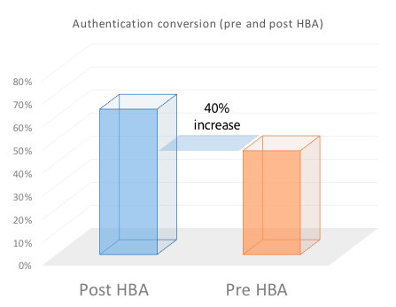

# Home Based Authentication for TV Everywhere

>[!NOTE]
>
>The content on this page is provided for information purposes only. Usage of this API requires a current license from Adobe. No unauthorized use is permitted. 

## What is Home Based Authentication? {#whatis-home-based-authn}

Home Based Authentication (HBA) is a TV Everywhere feature that enables pay-TV subscribers to view TV content online without entering MVPD credentials when they are home, thus significantly improving the user experience of the authentication flow.

Home Based Authentication definition by the Open Authentication Technology Committee (OATC): "In-home automatic authentication is the process by which an MVPD/OVD uses characteristics of the home network (or identifiers automatically accessible between devices on the home network) to authenticate which subscriber account is associated with that home network so that users do not need to manually enter credentials when establishing a TVE session for accessing TVE protected content."

 

For more information about HBA and the industry standards, read the [OATC Use Cases and Requirements](https://dzf8vqv24eqhg.cloudfront.net/userfiles/258/326/ckfinder/files/Defining%20TVE%20Home-Based%20Authentication%20(HBA)%20%20Use%20Cases%20and%20Requirements%20Recommended%20Practice%20Version%201_0%20FINAL%20DRAFT%20FOR%20BOARD%20APPROVAL.pdf){target=_blank} documentation and **OATC User Experience Guidelines for HBA**.

>[!NOTE]
>
>Some HBA flows are part of the Premium Workflow package. Please contact your Adobe Pass sales rep if interested in using this functionality.

## Why HBA is important for you {#why-hba}

HBA is important because it practically removes the sign-in barrier for your viewers that are at home and already have a cable subscription. Also, Home Based Authentication can significantly increase your viewers' engagement and offer a better user experience for your TV Everywhere content.

Presently, almost half of the attempts to sign-in are not successful. 

Once HBA was activated by one of the Top 5 MVPDs, its authentication conversion rate **increased by 40%** (from 45% to 63%)

  

Also, below you can see the sign-in conversion rate for a channel integrated with different MVPDs: those that have enabled HBA for it and those that don't have HBA. The conversion rate for those with HBA is significantly higher than those without HBA.

 

Six months after enabling HBA for most of the channels integrated with this MVPD, we noticed an 82% increase in unique users (the number of users accessing TV Everywhere channels through this MVPD almost doubled).

2w3In contrast, as you can see in the chart below, other MVPDs which had not enabled HBA only had a 26% increase in the unique users over the last 6 months. 

 

From our data, collected 6 months before and 6 months after enabling HBA, we saw a major increase in viewers' engagement for the channels that were HBA enabled. Practically users from MVPDs that have enabled HBA tend to watch on average 30% more content than users from MVPDs that don't have HBA enabled.

## Adobe Pass Authentication HBA Support {#auth-hba-support}

This section describes the HBA support provided by Adobe Pass Authentication, the behavior of Adobe Pass Authentication platforms in HBA flows and also offers technical details useful for implementing HBA. 

Adobe Pass Authentication features supporting HBA

* Ability to set different authentication TTLs for HBA versus non-HBA authentications (also requires MVPD support)
* Ability to automatically select an MVPD (skip MVPD picker) if the authentication expired. This is usefull especially when HBA TTLs are small.
* Ability to expose to the Programmers if the authentication was HBA or not (also requires MVPD support)
 
### HBA User Experience on Adobe Pass Authentication platforms {#hba-user-exp}

The following tables provide information about the user experience for the supported platforms when HBA is enabled and when HBA is not enabled:

| User flow - Platform type | swf, iOS, Android |
|---|---|
| With HBA enabled | When users are at home, they are automatically authenticated. After the HBA AuthN token expires, users are automatically re-authenticated. |
| Without HBA | Users are asked to select their MVPD and to enter their credentials, even if they are at home.After the AuthN token expires, users must enter their credentials again. |

| User flow - Platform type | js, Windows  (native) |
|---|---|
| With HBA enabled | When users are at home, they are automatically authenticated. After the HBA AuthN token expires, users must reselect their MVPD from the picker and will be automatically authenticated. |
| Without HBA | Users are asked to select their MVPD and to enter their credentials, even if they are at home. After the AuthN token expires, users must enter their credentials again. |

| User flow - Platform type | Clientless REST API (second screen authentication) |
|---|---|
| With HBA enabled | When users are at home and they are using a Clientless REST API app they are automatically authenticated on the second screen device after entering the registration code and selecting their MVPD. After the HBA AuthN token expires, users are automatically re-authenticated (on the second screen device). |
| Without HBA | Users are asked to select their MVPD and to enter their credentials, even if they are at home. After the AuthN token expires, users must enter their credentials again. |

### Technical Details of Implementing HBA {#tech-details-hba}

#### OAuth 2.0 Protocol {#oauth-2-protocol}

In the HBA flow for MVPDs integrated with the OAuth 2.0 authentication protocol, the MVPD issues a refresh token and Adobe issues an HBA authentication token:

* The refresh token has a TTL determined by the business requirements of the MVPD.
* The HBA authentication token TTL **must be less than or equal to** the refresh token TTL.
 

*Description of the HBA authentication flow for the OAuth 2.0 protocol*
 

| User actions | System actions |
|---|---|
| The user navigates to the programmer's site. When attempting to play a video, the MVPD picker is displayed. The user selects their MVPD and clicks login. | A background check is carried out. The MVPD applies their set of rules for user detection (for example, map the user's IP address with the MAC address of distributor-provisioned modems or broadband-connected set-top boxes). |
| A  screen, which persists for about 3 seconds, is displayed. An interstitial page can be displayed informing the user is informed that he/she is being automatically signed in by using their MVPD account. | <ol><li>The AccessEnabler, which is installed on the programmer's side, sends an authentication request (as an HTTP request) to the Adobe Pass Authentication endpoint.</li><li>The Adobe Pass Authentication endpoint redirects the request to the MVPD authentication endpoint.  **Note:** The request contains the `hba_flag` parameter (attempt HBA = true) which signals that the MVPD should attempt HBA authentication.</li><li>The MVPD authentication endpoint sends an authorization code to the Adobe Pass Authentication endpoint.</li><li>Adobe Pass Authentication uses the authorization code to request a refresh token and an access token from the MVPD's token endpoint.</li><li>The MVPD sends an authentication decision and the `hba_status` (true/false) parameter in the `id_token`.</li><li>A call to the MVPD user profile endpoint is sent to expose the [hba_status key in user metadata](/help/authentication/integration-guide-programmers/features-standard/entitlements/user-metadata-feature.md#obtaining).</li><li>The MVPD sets the refresh token TTL to an MVPD-agreed value and Adobe sets the AuthN token TTL to a value less or equal to the refresh token's value.</li></ol> |
| The user is authenticated and can now browse entitled TV Everywhere content. | The authentication token is passed to the user who can now successfully browse the programmer's site. | 

#### SAML Protocol {#saml-protocol} 

Description of the HBA authentication flow for the SAML authentication protocol

| User actions | System actions |
|---|---|
| The user navigates to the programmer's site. When attempting to play a video, the MVPD picker is displayed. The user selects their MVPD and clicks login. | A background check is carried out. The MVPD applies their set of rules for user detection (for example, map the user's IP address with the MAC address of distributor-provisioned modems or broadband-connected set-top boxes). |
| A  screen, which persists for about 3 seconds, is displayed. An interstitial page can be displayed informing the user is informed that he/she is being automatically signed in by using their MVPD account. | <ol><li>The AccessEnabler, which is installed on the programmer's side, sends an authentication request (as an HTTP request) to the Adobe Pass Authentication endpoint.</li><li>The Adobe Pass Authentication endpoint redirects the request to the MVPD authentication endpoint.</li><li>The MVPD should send an authentication decision in form of a SAML response that should contain the HBA flag: hba_status (true/false).</li><li>A call to the MVPD user profile endpoint is sent to expose the [hba_status key in user metadata](/help/authentication/integration-guide-programmers/features-standard/entitlements/user-metadata-feature.md#obtaining).</li></ol> |
| The user is authenticated and can now browse entitled TV Everywhere content. | The authentication token is passed to the user who can now successfully browse the programmer's site. |

 
## How to activate HBA {#how-to-activate-hba}

*   **OAuth protocol:**
    * For enabling HBA see, [Adobe Pass TVE Dashboard User Guide](/help/authentication/user-guide-tve-dashboard/tve-dashboard-overview.md)
*   **SAML protocol:** Home Based Authentication is activated on the MVPD side. No action is required by the Programmer or Adobe. 
For more information on the MVPDs that support Home Based Authentication, see [HBA status for MVPDs](/help/authentication/integration-guide-programmers/features-standard/hba-access/hba-status-mvpds.md). 

## FAQ {#faqs}
 

**Question:** Why the separation between Home Based Authentication with SAML and OAuth2 protocols?

**Answer:** The HBA flow is different for the two protocols. From a programmer's perspective, there is no need for action to assure HBA is enabled for SAML MVPDs, whereas for OAuth2 MVPDs, HBA can be toggled on or off in the Adobe Pass TVE Dashboard.

 

**Question:** Are users required to fill in a username and password the first time they authenticate when HBA is enabled?

**Answer:** No, username and password are not required.

 

**Question:** How do you enforce parental controls?

**Answer 1:** Adobe can disable HBA for integrations with channels that need parental control approval. 

**Answer 2:** Adobe is working with OATC on a UX document which recommends how to set-up the HBA experience with parental controls. 

 

**Question:** Do the providers supporting HBA have shorter TTL windows for HBA then they do for regular authentication?

**Answer:** The TTL setting is configurable. We recommend setting a shorter TTL for HBA authentication tokens in order to prevent mishandling. 
 

## Useful information {#useful-info}

* [Instant Access (HBA) Recommendations](http://www.ctamtve.com/instantaccess){target=_blank} - by CTAM
* [Sample implementation of HBA on Programmer app](https://dzf8vqv24eqhg.cloudfront.net/userfiles/258/326/ckfinder/files/HBA_Flow_Sample.pdf?dc=201604222139-1346){target=_blank} - by Adobe
<!--* [Home Based Authentication User Experience Guidelines for TV Everywhere](http://oatc.us/Standards/DownloadRecommendedPractices.aspx){target=_blank} - by OATC-->
* [Home Based Authentication Use Cases and Requirements](https://dzf8vqv24eqhg.cloudfront.net/userfiles/258/326/ckfinder/files/Defining%20TVE%20Home-Based%20Authentication%20(HBA)%20%20Use%20Cases%20and%20Requirements%20Recommended%20Practice%20Version%201_0%20FINAL%20DRAFT%20FOR%20BOARD%20APPROVAL.pdf){target=_blank} by OATC
* [Home Based Authentication Infographic](https://dzf8vqv24eqhg.cloudfront.net/userfiles/258/326/ckfinder/files/AdobeNewsletterHBA.pdf?dc=201604260953-2640){target=_blank} - by Adobe
* [Authentication using the OAuth 2.0 protocol](/help/authentication/integration-guide-mvpds/authn-oauth2-protocol.md)
* [Authentication with SAML MVPDs](/help/authentication/integration-guide-mvpds/authn-usecase.md)
* [Adobe Pass TVE Dashboard User Guide](/help/authentication/user-guide-tve-dashboard/tve-dashboard-overview.md)
* [hba_status User Metadata](/help/authentication/integration-guide-programmers/features-standard/entitlements/user-metadata-feature.md#obtaining)
