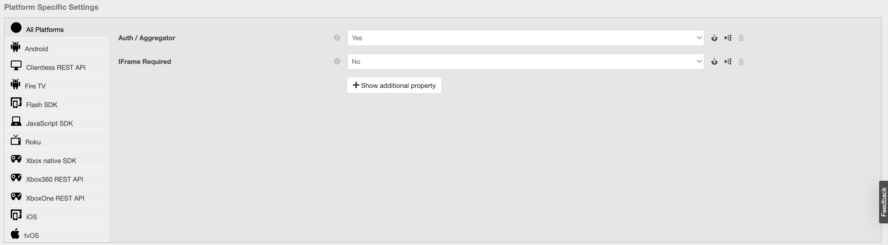

# (Legacy) Primetime TVE Dashboard user guide {#tve-db-user-guide}

>[!NOTE]
>
>The content on this page is provided for information purposes only. Usage of this API requires a current license from Adobe. No unauthorized use is permitted.

>[!IMPORTANT]
>
> Make sure you stay informed about the latest Adobe Pass Authentication product announcements and decommissioning timelines aggregated in the [Product Announcements](/help/authentication/product-announcements.md) page.

## Introduction {#tve-db-intro}

[[!DNL Adobe] TVE Dashboard (TVE Dashboard)](https://console.auth.adobe.com/) is a self-service dashboard aimed at users working for media companies (Programmers) that have a business relationship with the Adobe Pass Authentication product team.

Contact your Technical Account Manager (TAM) in order to obtain access. To gain access, you will need two new user groups to be configured in your Adobe Marketing Cloud Organization:

* TVE Dashboard Read-Write - the members of this group have full rights across all editable sections of the dashboard
* TVE Dashboard Read-Only - the members of this group only have viewing rights across the entire dashboard
 

Before deep diving into this user guide, we recommend you to go through the following resources in order to have a good understanding of the flows and features provided by Adobe Pass Authentication product team and to become familiar with the terms used in the present document:

* [TVE Technical Paper](/help/authentication/kickstart/technical-paper.md)
* [Programmer Kickstart Guide](/help/authentication/kickstart/programmer-kickstart-guide.md)
* [Entitlement Flow](/help/authentication/integration-guide-programmers/entitlement-flow.md)

Continuing to the next sections of this user guide, you will discover ways of administering different settings for your company's Channels, Programmers or the Integrations between Channels and MVPDs (Multichannel Video Program Distributors).

>[!IMPORTANT]
>TVE Dashboard offers the option of switching between a Basic and an Advanced Workspace. You can do this by toggling the icon in the upper right-hand corner. The Advanced Workspace is aimed at users with substantial technical knowledge as well as advanced knowledge of the features offered by the Adobe Pass Authentication product team. 

*Figure 1: The Adobe Primetime TVE Dashboard "Basic / Advanced Workspace" drop-down*

## Environments {#authn-environments}

Depending on the tasks a user might be required to fulfill, he/she might need to switch between Adobe Pass Authentication environments. For detailed information on the Adobe Pass Authentication environments, please consult the following document: [Understanding the Adobe Pass Authentication environments](/help/authentication/notes-technical/environments/understanding-the-adobe-environments.md).

TVE Dashboard provides two environments named Prequal (Prequalification) and Release, each one having two profiles named Staging and Production, as shown below:

* [Prequal Staging](https://console-prequal.auth-staging.adobe.com/)
* [Prequal Production](https://console-prequal.auth.adobe.com/)
* [Release Staging](https://console.auth-staging.adobe.com/)
* [Release Production](https://console.auth.adobe.com/) 

To switch between environments, the user can click on the desired environment represented by the entry from the drop-down element depicted below:

*Figure 2: The Adobe Pass TVE Dashboard environments drop-down* 

>[!IMPORTANT]
>
>It is very important to note that when making administrative changes to your Adobe Pass Authentication configuration through the TVE Dashboard, we strongly advise you to follow the sequence below in order to ensure proper functionality.

To make administrative changes to your Adobe Pass Authentication configuration through the TVE Dashboard:

* Perform the changes in [Release Staging and validate them](http://sp.auth-staging.adobe.com/apitest/api.html).
* Perform the changes in [Prequal Production and validate them](http://sp.auth-staging.adobe.com/apitest/api.html).
* Perform the changes in [Release Production and validate them](http://sp.auth-staging.adobe.com/apitest/api.html). 

>[!IMPORTANT]
>
>For the administrative changes to go live, users must navigate to the "Review and Push Changes" section by selecting the button, which will show up in the bottom-left part of the sidebar, in order to review changes, add a description for the newly created changes and confirm the configuration update by selecting the "Push Configuration".

*Figure 3: The Adobe Primetime TVE Dashboard Review and Push Changes notification*

## Sections {#sections}

Users working for media companies (Programmers) can access the following sections of the TVE Dashboard from the sidebar: 

* **Channels** - Contains settings related to content providers
* **Programmers** - Contains settings related to parent organization aggregating one or multiple **Channels**
* **Integrations** - Contains settings related to the integration between **Channels** and **MVPDs**
* **MVPDs** - Contains settings related to the available **MVPDs**
* **Reports** - Contains aggregated data for three types of reports: AuthN TTL, AuthZ TTL, SSO
* **Change Log** - Contains the latest modifications applied to the TVE Dashboard configuration
 
 

*Figure 4: The Adobe Primetime TVE Dashboard sections*

### Channels {#tve-db-channels-section}

This section allows viewing and editing settings for available Channels or creating a new one. Clicking on one of the available Channels will return a screen with the following tabs: 

* **Channel Data**
    * **Channel Id** - The Channel's unique id used in our system, also referred to as "requestor Id".
    * **Display Name** - The Channel's commercial name.
* **General Settings**
    * **Analytics Configuration** - Configure Adobe Pass Authentication events to be forwarded to Adobe Analytics. Please contact Adobe for more details on how the Report Suite ID (RSID) needs to be configured before enabling this feature.
* **Certificates**

    Contains the list of certificates used in the authentication flow alongside their issuing organization, issuing date and expiry date. These certificates serve as Private/Public Keys and are used for validation purposes. 
* **Domains**

    Contains the list of domains from which the respective Channel will communicate with Adobe Pass Authentication.  
* **Integrations**

    Contains the list of integrations with available MVPDs, alongside the status of each integration which might be enabled or not. Navigating to Integration page is available by clicking on a specific entry. 
* **Registered Applications**
    
    Contains the list of application registrations. For more details, review the document [Dynamic Client Registration Management](/help/authentication/integration-guide-programmers/rest-apis/rest-api-dcr/dynamic-client-registration-overview.md#dynamic-client-registration-management).

* **Custom Schemes**

    Contains the list of custom schemes. For more details, see [iOS/tvOS application registration](/help/authentication/integration-guide-programmers/legacy/sdks/ios-tvos-sdk/iostvos-application-registration.md) and [Dynamic Client Registration Management](/help/authentication/integration-guide-programmers/rest-apis/rest-api-dcr/dynamic-client-registration-overview.md#dynamic-client-registration-management)

#### Add / Delete domains {#add-delete-domains}

To initiate the process of adding up a new domain for the selected channel, you need to click the "Add New Domain" button below the Domains list. This will create a new domain entry where you can specify the domain name. If a more generic domain already exists in the domains list, you shouldn't add a new subdomain.

*Figure: Domains tab in channels*

#### Create a registered application at channel level {#create-registered-application-channel-level}

In order to create a registered application at a channel level navigate to the "Channels" menu and choose the one for which you would like to create an application. Then, after Navigating to the "Registered Applications" tab, click on the "Add New Application" button.

As seen in the image below, the fields you should fill in are:

*   **Application Name** - the name of the application

*   **Assigned to Channel** - As shown below, what is slightly different here, compared to the same action performed at the Programmer level, is the "Assigned Channels" dropdown which is not enabled so there is no option to bind the registered application to other than the current channel.

*   **Application Version** - by default, this is set to "1.0.0" but we highly encourage you to modify it with your own application version. As a best practice, if you decide to change the version of your application, reflect it by creating a new registered application for it.

*   **Application Platforms** - the platforms for the application to be linked with. You have the option to select them all or multiple values.

*   **Domain Names** - the domains for the application to be linked with. The domains in the dropdown list are a unified selection of all domains from all your channels. You have the option to select  multiple domains from the list. The meaning of the domains is redirect URLs [RFC6749](https://tools.ietf.org/html/rfc6749). In the client registration process, the client application can request to be permitted to use a redirect URL for the finalization of the authentication flow. When a client application requests a specific redirect URL, it is validated against the domains whitelisted in this Registered Application associated to the software statement.

After filling the fields with appropriate values you must click on "Done" in order for the application to be saved in the configuration.

Please be aware that there is **no option to modify an already created application**. In case it is discovered that something created no longer meets the requirements, a new registered application will need to be created and used with the client application whose requirements it fulfills.

##### Download a software statement {#download-software-statement-channel-level}

Clicking the "Download" button on the list entry for which a software statement is needed will generate a text file. This file will contain something similar to the below sample output.

The name of the file is uniquely identified by prefixing it with "software_statement" and adding the current timestamp.

Please note that, for the same registered application, different software statements will be received each time the download button will be clicked but this does not invalidate the previously obtained software statements for this application. This happens because they are generated on the spot, per action request.

There is one **limitation** regarding the download action. If a software statement is asked for by clicking the "Download" button shortly after creating the registered application and this was not yet saved and the configuration json was not synchronized, the following error message will appear on the bottom of the page.

This wraps an HTTP 404 Not Found error code received from core as the id of the registered application was not yet propagated and the core has no knowledge of it.

The solution is, after creating the registered application, to wait for at most 2 minutes for the configuration to be synchronized. After this happens the error message won't be received anymore and the text file with the software statement will be available for downloading.

### Programmers {#tve-db-programmers-section}

This section allows viewing and editing settings for available Programmers or creating a new one. Clicking on one of the available Programmers will return a screen with the following tabs: 

* **Programmer Data**
    * **Programmer Id** - The Programmer's unique id used in our system.
    * **Display Name** - The Programmer's commercial name.
    * **Logo Url** - The Programmer's commercial logo uniform resource locator (URL).
    * **Logo Preview** - The Programmer's commercial logo preview by downloading it from the above uniform resource locator (URL).

* **Certificates**
    
    Contains the list of certificates used in the authentication flow alongside their issuing organization, issuing date and expiry date. These certificates serve as Private/Public Keys and are used for validation purposes.

* **Channels**
    
    Contains the list of Channels belonging to this specific programmer. Navigating to Channels section is available by clicking on a specific entry.

* **Registered applications**

    Contains the list of application registrations. For more details, see [Dynamic Client Registration Management](/help/authentication/integration-guide-programmers/rest-apis/rest-api-dcr/dynamic-client-registration-overview.md#dynamic-client-registration-management).

* **Custom Schemes**

    Contains the list of custom schemes. For more details, see [iOS/tvOS application registration](/help/authentication/integration-guide-programmers/legacy/sdks/ios-tvos-sdk/iostvos-application-registration.md).

#### Create a registered application at programmer level {#create-registered-application-programmer-level}

Go to **Programmers** > **Registered Applications** tab.

In the Registered Applications tab, click **Add New Application**. Fill in the required fields in the new window.

As seen in the image below, the fields you should fill in are:

*   **Application Name** - the name of the application

*   **Assigned to Channel** - the name of your channel, to which this application is linked to. The default setting in the dropdown mask is **All Channels.** The interface allows you to select either one channel or all channels.

*   **Application Version** - by default, this is set to "1.0.0" but we highly encourage you to modify it with your own application version. As a best practice, if you decide to change the version of your application, reflect it by creating a new registered application for it.

*   **Application Platforms** - the platforms for the application to be linked with. You have the option to select them all or multiple values.

*   **Domain Names** - the domains for the application to be linked with. The domains in the dropdown list are a unified selection of all domains from all your channels. You have the option to select  multiple domains from the list. The meaning of the domains is redirect URLs [RFC6749](https://tools.ietf.org/html/rfc6749). In the client registration process, the client application can request to be permitted to use a redirect URL for the finalization of the authentication flow. When a client application requests a specific redirect URL, it is validated against the domains whitelisted in this Registered Application associated to the software statement.

After filling the fields with appropriate values you must click on "Done" in order for the application to be saved in the configuration.

Please be aware that there is **no option to modify an already created application**. In case it is discovered that something created no longer meets the requirements, a new registered application will need to be created and used with the client application whose requirements it fulfills.

##### Download a software statement {#download-software-statement-programmer-level}

Clicking the "Download" button on the list entry for which a software statement is needed will generate a text file. This file will contain something similar to the below sample output.

The name of the file is uniquely identified by prefixing it with "software_statement" and adding the current timestamp.

Please note that, for the same registered application, different software statements will be received each time the download button will be clicked but this does not invalidate the previously obtained software statements for this application. This happens because they are generated on the spot, per action request.

There is one **limitation** regarding the download action. If a software statement is asked for by clicking the "Download" button shortly after creating the registered application and this was not yet saved and the configuration json was not synchronized ,the following error message will appear on the bottom of the page.

This wraps an HTTP 404 Not Found error code received from core as the id of the registered application was not yet propagated and the core has no knowledge of it.

The solution is, after creating the registered application, to wait for at most 2 minutes for the configuration to be synchronized. After this happens the error message won't be received anymore and the text file with the software statement will be available for downloading.

### Integrations {#tve-db-integrations-sec}

This section allows viewing and editing settings for integrations between Channels and available MVPDs or creating a new one. Clicking on one of the available integrations will return a single page when using the Basic Workspace or a screen with the following tabs when using the Advanced Workspace: 

* **Integration Data**
    * **Integration Id**- The result of appending the MVPDs unique id to the Channel's unique id separated by the "_" character.
    * **Channel Display Name** - The Channel's commercial name.
    * **Channel Id** - The Channel's unique id used in our system, also referred to as "requestor Id".
    * **MVPD Display Name** - The MVPD's commercial name.
    * **MVPD Id** - The MVPD's unique id used in our system.
* **General Settings**
    * **User Metadata Keys** - Configure metadata keys available for the specific integration.
    * **Platform Specific Settings** - Configure different settings to a specific platform (for example, TTLs, SSO, and IFrames).

* **Authentication Settings**
    * Contains settings related to the Adobe Pass Authentication authentication feature.
* **Authorization Settings**
    * Contains settings related to the Adobe Pass Authentication authorization feature.
* **Logout Settings**
    * Contains settings related to the Adobe Pass Authentication logout feature.
 
#### Create integration {#create-integration}

In order to create a new integration please follow the steps below: 

* click the "Add New Integration" button
* search and select a Channel
* search and select an MVPD
* wait for TVE Dashboard to compute "Integration Id" and display the available MVPD endpoints
* select authentication, authorization and logout endpoints or use the default values
* click on "Create Integration" button
* depending on the MVPD settings a popup can appear and ask for additional properties, which should have been provided by the MVPD beforehand, otherwise a redirect to the newly created integration page will take place

 

*Figure 5. The Adobe Primetime TVE Dashboard New Integration window*

 
#### Update integration {#update-integration}

In order to update an existing integration click on the table entry for that specific integration from the Integrations section or from the Channels section, which contains an Integrations tab. 

When using the Basic Workspace mode, this section will allow seeing and editing the most commonly updated settings, such as authentication and authorization token TTLs (time-to-live), as well as iFrame settings. Please bear in mind that TTL settings can be missing for the integrations with MVPDs that support Dynamically Defined Token Persistence TTL (see entry 1.19 from [MVPD Integration Requirements](/help/authentication/integration-guide-mvpds/mvpd-integr-features.md)).

 

When using the Advanced Workspace mode, this section will allow seeing and editing less common settings.

 

In the case of both Basic and Advanced Workspace modes, these settings can be changed on a platform level (e.g. select a custom value for the authorization TTL token on Android, default on every other platform).

 

>[!IMPORTANT]
>It is important to understand the settings inheritance chain: MVPD -> MVPD Endpoint -> Integration -> Platform, where Platform has the most specific value and MVPD the most generic default. 

*Figure 6. The Adobe Primetime TVE Dashboard property inheritance chain component*

 
#### Platform Specific Settings {#platform-sp-settings}

This sub-section can be used to override the settings for specific platforms. The available platforms are:

* **All Platforms** - Set values that will be applied to all platforms regardless of the Programmer implementations in case there are no other values set for a specific platform.
* **Android** - Set values that will be applied to the Programmer implementations over Adobe Pass Authentication Android SDK.
* **Clientless REST API** - Set values that will be applied to the Programmer implementations over Adobe Pass Authentication REST API.
* **Fire TV** - Set values that will be applied to the Programmer implementations over Adobe Pass Authentication FireTV SDK.
* **Flash SDK** - This platform is deprecated. **deprecated**
* **JavaScript SDK** - Set values that will be applied to the Programmer implementations over Adobe Pass Authentication JavaScript SDK.
* **Roku** - Set values that will be applied to the Programmer implementations over Adobe Pass Authentication REST API and that are sending "Roku" as the device type. This takes precedence over the values set for the Clientless REST API platform in the case of Roku devices.
* **Xbox native SDK** - This platform is deprecated. **deprecated**
* **Xbox 360 REST API** -  Set values that will be applied to the Programmer implementations over Adobe Pass Authentication REST API and that are sending "xbox" as the device type. This takes precedence over the values set for the Clientless REST API platform in the case of Xbox 360 devices.
* **Xbox One REST API** - Set values that will be applied to the Programmer implementations over Adobe Pass Authentication REST API and that are sending "xboxOne" as the device type. This takes precedence over the values set for the Clientless REST Api platform in the case of XboxOne devices.
* **iOS** - Set values that will be applied to the Programmer implementations over Adobe Pass Authentication iOS SDK.
* **tvOS** - Set values that will be applied to the Programmer implementations over Adobe Pass Authentication tvOS SDK.
 

*Figure 7. The Adobe Primetime TVE Dashboard Platform Specific Settings*

 
#### Enable Platform Single Sign On {#enable-platform-sso}

Please follow the steps below to enable / disable Single Sign On for a specific integration and platform: 

*   make sure you are using the Advanced Workspace mode
*   navigate to the desired integration
*   navigate to the **General Settings** tab
*   select the desired platform on which you want to enable or disable Single Sign On
*   toggle the **Enable Single Sign On** flag to the desired value (Yes / No)

    >[!IMPORTANT]
    >It is important to note that the **Enable Single Sign On** flag is available only for iOS, tvOS, Roku and FireTV platforms and only for integrations with MVPDs that support Single Sign On for those platforms.  

*   toggle the **Enforce Platform Permission** flag to the desired value (Yes / No)

    >[!IMPORTANT]
    >It is important to note that the **Enforce Platform Permission** flag controls if the user's decision to Allow or Deny platform access to his/her TV Provider subscription will be enforced or not. Considering the scenario when **Enable Single Sign On** flag is set to "Yes", **Enforce Platform Permission** flag is also set to "Yes" and the user chooses to Deny platform access to his/her TV Provider subscription, then the respective application (channel) won't be able to use the Adobe Pass Authentication token obtained by another application (channel). 

 
#### Enable Home-Based Authentication {#enable-hba}

Please follow the steps below to enable / disable Home-Base Authentication for **OAuth2** based MVPDs: 

* make sure you are using the Advanced Workspace mode
* navigate to the desired integration
* navigate to **Authentication Settings** tab
* navigate to **AuthN Dynamic Rules** sub-tab
* toggle the **Attempt HBA** flag to the desired value (Yes / No)
 

>[!IMPORTANT]
>Please bear in mind that the "HBA AuthN TTL" value should never be overridden, otherwise the authorization flow could fail unexpectedly. 

Reach out to **tve-support@adobe.com** for information on enabling Home-Base Authentication for SAML based MVPDs.

### MVPDs {#tve-db-mvpds-sec}

This section allows viewing settings for available MVPDs. Clicking on one of the available MVPDs will return a screen with the following tabs: 

*   **MVPD Data**
    * **MVPD Id** - The MVPD's unique id used in our system.
    * **Display Name** -  The MVPD's commercial name which might be used in the user's picker.
    * **Logo Url** - The MVPD's commercial logo uniform resource locator (URL).
    * **Logo Preview** - The MVPD's commercial logo preview by downloading it from the above uniform resource locator (URL).
*   **General settings**
    *   **User Metadata Keys**
        * Metadata keys available for the specific MVPD.
    *   **Client Data Properties**
        * **Auth / Aggregator** - If set to "Yes", then a new authentication token is needed for each new Channel the user is trying to access.
        * **Passive AuthN Enabled** - If the Auth / Aggregator flag is set to "Yes" and if Passive AuthN Enabled is set to "Yes", then the authentication process with another Channel will happen in the background without the need for a full browser redirect and the picker being shown. 
        * **Auth/browser session** - If set to "Yes", then the user will be logged out after closing the browser. If set to "No", then the user can restart the browser and remain logged in.
        * **IFrame Required** - If set to "Yes" then it indicates that the MVPD login window requires an iFrame. The "iFrame Width" and "iFrame Height" fields represent the size needed for the iFrame loading the MVPD login page. 
*   **Authentication Settings**
    *   **Select Endpoint**
        * This field indicates the authentication endpoint(s) exposed by the MVPD. The endpoint can differ according to the authentication protocol used. 
    *   **AuthN General Settings**
        * This sub-tab displays the authentication protocol used by the MVPD and protocol related information.
    *   **AuthN Certificates**
        * This sub-tab displays the certificates the MVPD uses in the authentication flow alongside their issuer organization, issuing date and expiry date. These certificates serve as Private / Public Keys and are used for validation purposes.
    *   **AuthN Dynamic Rules**
        * This sub-tab displays the rules which apply to the authentication process. By pressing on the diagram's Request / Response / Token, you can see as highlighted the parameters applied to that part of the authentication flow.
*   **Authorization Settings**
    *   **Select Endpoint**
        * This field indicates the authorization endpoint exposed by the MVPD. The endpoint can differ depending on the authorization protocol used. The available authorization protocols are SOAP, REST (for clientless devices), SAML, XACML and OAUTH.
    *   **AuthZ General Settings**
        *   This sub-tab displays the authorization protocol used by the MVPD and protocol related information.
        *   **Preflight Configuration** 
            * It describes the number of resources which can be preauthorized by an MVPD in one single call, the PreFlight model used, as well as the timeout threshold. Occasionally, the number of resources can be different for a given integration. This can be managed by editing the "**Max Number of Preflight Resources**" property, available under the General Settings tab. This property is available only for a given integration and if set it will be used instead of the value defined in Authorization Settings -> PreFlight Configuration -> PreFlight Max Resources.
        *   **DOS Protection**
            * It describes the Denial-Of-Service protection on the MVPD authorization endpoint. For an exact description of each field, please view the tooltips by hovering over the DOS Protection fields.
        *   If the MVPD is a **TempPass**, then the **AuthZ General Settings** also contains information regarding the TempPass duration.
        *   If the MVPD is a **FlexibleTempPass**, then the **AuthZ General Settings** also contains information regarding the TempPass duration, maximum number of resources and identifying field (see the image below). 
    *   **AuthZ Certificates**
        * This sub-tab displays the certificates the MVPD uses in the authorization flow alongside their issuer organization, issuing date and expiry date. These certificates serve as Private / Public Keys and are used for validation purposes.
    *   **AuthZ Dynamic Rules**
        * This sub-tab displays the rules which apply to the authorization process. By pressing on the diagram's **Request / Response / Token**, you can see as highlighted the parameters applied to that part of the authorization flow.
*   **Logout Settings**
    *   **Select Endpoint**
        *   This field indicates the logout endpoint exposed by the MVPD. The provided protocols can be either SAML or OAuth2.
        *   **Logout General Settings**
            * This sub-tab displays the logout protocol used by the MVPD and protocol related information.
            * **Require Logout Response Signed** - If set to "Yes", then the response must be signed by a trusted certificate. 
        *   **Logout Certificates**
            * This sub-tab displays the certificates the MVPD uses in the logout flow alongside their issuer organization, issuing date and expiry date. These certificates serve as Private / Public Keys and are used for validation purposes.
        *   **Logout Dynamic Rules**
            * This sub-tab displays the rules which apply to the logout process. By pressing on the diagram's **Request / Response / Token**, you can see as highlighted the parameters applied to that part of the logout flow.

### Reports {#tve-db-reports-sec}

In order to navigate to this section, please click "Reports" in the "[Dashboard Sections](#sections)" menu. This will navigate to a screen with 3 tabs, which will be presented in detail in the following sub-sections: [AuthN TTL Reports](#authn-ttl-reports), [AuthZ TTL Reports](#authz-ttl-reports), [SSO Reports](#sso-reports). 

This section allows viewing and exporting aggregated data for several types of reports for your Channel/s integration/s with various MVPDs across all platforms. 

#### Platforms {#report-platforms} 

All reports aggregate values across the following platforms: 

**BROWSERS**
Displays values that will be applied to the Programmer implementations over Adobe Pass Authentication JavaScript SDK.

**MOBILE: IOS**
Displays values that will be applied to the Programmer implementations over Adobe Pass Authentication iOS SDK.

**MOBILE: ANDROID**
Displays values that will be applied to the Programmer implementations over Adobe Pass Authentication Android SDK.

**MOBILE: OTHERS**
Displays values that will be applied to the Programmer implementations over Adobe Pass Authentication REST API developed for mobile devices.

**TVCD: ROKU**
Displays values that will be applied to the Programmer implementations over Adobe Pass Authentication REST API and that are sending "Roku" as the device type.

**TVCD: FIRETV**
Displays values that will be applied to the Programmer implementations over Adobe Pass Authentication FireTV SDK.

**TVCD: APPLETV**
Displays values that will be applied to the Programmer implementations over Adobe Pass Authentication tvOS SDK.

**TVCD: OTHERS**
Displays values that will be applied to the Programmer implementations over Adobe Pass Authentication REST API developed for TV connected devices.

**PLATFORM: UKNOWN**
Displays values that will be applied to the Programmer implementations for which Adobe Pass Authentication services detect an unknown device type. 

Review the mechanism of [passing client information](/help/authentication/integration-guide-programmers/legacy/client-information/passing-client-information-device-connection-and-application.md) to Adobe Pass Authentication REST APIs or SDKs for more details on how to send the desired device type (for example,"Roku"). 

All reports aggregate values computed based on the configuration which is specific for each Adobe Pass Authentication environment. Therefore, you can expect different reporting data when switching between different TVE Dashboard environments.
 
Please review the [Environments](#authn-environments) section for more details related to the Adobe Pass Authentication available environments.
 

##### Selecting specific Channels/ MVPDs {#selecting-specific-channels-mvpds} 

All reports allow using filters by selecting specific Channels or selecting specific MVPDs to be included in the resulting reports. 

In order to select one or multiple Channel/s please use the **dropdown list** placed after the "Channels selected for report" label. Please see Figure 8./9./10. images from below. 

In order to select one or multiple MVPD/s please use the **dropdown list** placed after the "MVPDs selected for report" label. Please see Figure 8./9./10. images from below. 

By default, the data is aggregated across all your company's Channels ("All Channels") and the MVPDs with which they are integrated ("All MVPDs"). 

In case you choose to deselect "All Channels" or "All MVPDs" without choosing specific options, the UI will show up a "No data available" placeholder.
 

##### Export Report {#export-report} 

All reports allow exporting data in a Comma-separated Values (CSV) format file. 

In order to export data, please use the "Export Report" button placed in the up-right corner of the window. Please see Figure 8./9./10. images from below. 

A file named **Report.csv** will be downloaded automatically to your computer. Therefore, please make sure that your browser's settings allow files to be downloaded. 

The "Exporting Data" loading icon will be present on screen while the Report.csv file is computed, which can take up **to a couple of minutes** depending on the size of data you want to export.
 
#### AuthN TTL reports (#authn-ttl-reports)

This report displays the Time-To-Live (TTL) of the authentication token configured for your Channel/s integration/s with various MVPDs across all platforms. 

The authentication token Time-To-Live, which is also referred to as **AuthN TTL**, is displayed in human readable values such as: **days, hours, minutes, seconds**. 

In terms of user experience, the AuthN TTL reports allow you to visually inspect the amount of time a user will be authenticated considering a specific MVPD and a specific platform. 

In order to navigate to this type of report please click the "AuthN TTL Reports" tab from the "Reports" section.

*Figure 8: The Adobe Primetime TVE Dashboard AuthN TTL Report tab* 

The AuthN TTL Reports table contains pages and is horizontally and vertically scrollable depending on your screen size. 

In case you consider making a change to an AuthN TTL value, please review the [Integrations](#tve-db-integrations-sec) section. 

>[!IMPORTANT]
>The "**Set by MVPD**" placeholder is used in cases when the MVPD will be the one enforcing the AuthN TTL value and not the Adobe Pass Authentication configuration.

 
#### AuthZ TTL reports {#authz-ttl-reports}

This report displays the Time-To-Live (TTL) of the authorization token configured for your Channel/s integration/s with various MVPDs across all platforms. 

The authorization token Time-To-Live, which is also referred to as **AuthZ TTL**, is displayed in human readable values such as: **days, hours, minutes, seconds**. 

In terms of user experience, the AuthZ TTL reports allow you to visually inspect the amount of time a user will be authorized considering a specific MVPD and a specific platform. 

To navigate to this type of report please click the "AuthZ TTL Reports" tab from the "Reports" section. 

*Figure 9. The Adobe Primetime TVE Dashboard AuthZ TTL Report tab*

The AuthZ TTL Reports table contains pages and is horizontally and vertically scrollable depending on your screen size. 

If you consider making a change to an AuthZ TTL value, see the [Integrations](#tve-db-integrations-sec) section. 

>[!IMPORTANT]
>The "**Set by MVPD**" placeholder is used in cases when the MVPD will be the one enforcing the AuthZ TTL value and not the Adobe Pass Authentication configuration.

 
#### SSO Reports {#sso-reports}

This report displays the Single Sign-On (SSO) status configured for your Channel/s integration/s with various MVPDs across all platforms. 

The Single Sign-On status, which is also referred to as **SSO status**, is displayed as a tri-state with the following possible values: **SSO Disabled, SSO Enabled, SSO Uncertain**. 

In terms of user experience, the SSO reports allow you to visually inspect the expected user authentication SSO experience considering a specific MVPD and a specific platform. 

In order to navigate to this type of report please click the "**SSO Reports**" tab from the "**Reports**" section.

 

*Figure 10: The Adobe Primetime TVE Dashboard SSO Reports tab*

The SSO Reports table contains pages and is horizontally and vertically scrollable depending on your screen size.
 
In case you consider making a change to an SSO status, please review the [Integrations](#tve-db-integrations-sec) section.

 >[!IMPORTANT]
 >"**SSO Uncertain**" placeholder is used in cases where SSO is enabled and possible, but user platform settings / user decisions (for example, user browser option to block 3rd party cookies, user choosing to deny platform access to his/her TV Provider subscription) or MVPD settings (for example, MVPD requesting authentication taking place for each Channel) might prevent SSO from taking place.

### Change log {#tve-db-changelog-sec}

This section displays a list of all the modifications pushed through the TVE Dashboard to the Adobe Pass Authentication environment and configuration. 

There are columns which indicate the push date, the user who operated the modification and the status of the push. 

This section also allows the comparison of two table entries in order to narrow down the specific modifications you want to inspect and even share the comparison as a mail item.

### Feedback {#tve-db-feedback-sec}

This section allows users to send feedback. Follow the steps to provide feedback to the Adobe Pass Authentication product team: 

* click the "Feedback" button on the right-hand side of the screen
* enter the Subject
* enter the Message
* if needed upload a screenshot to the message by clicking "Upload Screenshot" button
* click "Submit" button

*Figure 11: The Adobe Primetime TVE Dashboard Feedback section*

For instructions on how to capture screenshots, view the links below:

*   [How to capture screenshots on Windows](https://support.microsoft.com/en-us/windows/use-snipping-tool-to-capture-screenshots-00246869-1843-655f-f220-97299b865f6b#1TC=windows-7)

*   [How to capture screenshots on Mac](https://support.apple.com/en-us/HT201361)

## Troubleshooting {#tve-db-troubleshoot}

### Maintenance mode {#maintenance-mode}

*Figure: TVE App in Maintenance mode*

In case the TVE Dashboard is in "maintenance mode", then users will not be able to view or make new changes. 

If this occurs, then you will have to wait for the Adobe Pass Authentication engineering team to finish maintenance work on the TVE Dashboard. 

### Degraded state {#degraded-state}

*Figure: TVE App in degraded state*

In case the TVE Dashboard is in "degraded state", then users will lack search and sorting capabilities, but users will be able to view or make new changes. 

If this occurs, then you will have to wait for the Adobe Pass Authentication engineering team to finish maintenance work on the TVE Dashboard.
