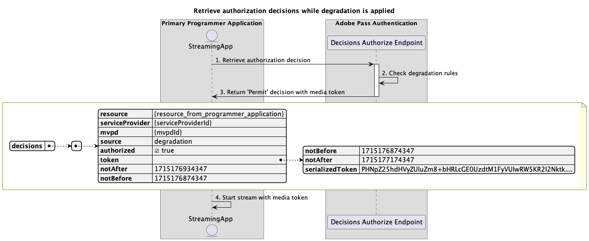

# Degraded access flows {#degraded-access-flows}

>[!IMPORTANT]
>
> The content on this page is provided for information purposes only. Usage of this API requires a current license from Adobe. No unauthorized use is permitted.

>[!IMPORTANT]
>
> REST API V2 implementation is bounded by the [Throttling mechanism](/help/authentication/throttling-mechanism.md) documentation.

Degradation provides the temporary bypassing of specific MVPD authentication and authorization endpoints. Usually, the Programmer initiates this action, but regardless of who triggers a degradation event, the action depends on prior arrangements made with the affected MVPDs.

For more details about Degradation feature, refer to the [Degradation](../../../degradation-api-overview.md) documentation.

Degraded access flows allow you to query for the following scenarios:

* [Perform authentication while degradation is applied](#perform-authentication-while-degradation-is-applied)
* [Retrieve authorization decisions while degradation is applied](#retrieve-authorization-decisions-while-degradation-is-applied)
* [Retrieve preauthorization decisions while degradation is applied](#retrieve-preauthorization-decisions-while-degradation-is-applied)
* [Retrieve profile while degradation is applied](#retrieve-profile-while-degradation-is-applied)

## Perform authentication while degradation is applied {#perform-authentication-while-degradation-is-applied}

### Prerequisites {#prerequisites-perform-authentication-while-degradation-is-applied}

Before performing the authentication flow while degradation is applied, ensure the following prerequisites are met:

* The streaming application must initiate an authentication session when it needs to sign in with the MVPD.

>[!IMPORTANT]
> 
> Assumptions
> 
>  
> 
> * The streaming application does not have a valid profile for that specific MVPD saved in Adobe Pass backend.
> * There is an AuthNAll degradation rule applied to the integration between the provided `serviceProvider` and `mvpd`.

### Workflow {#workflow-perform-authentication-while-degradation-is-applied}

Follow the given steps to implement the authentication flow while degradation is applied as shown in the following diagram.

*Perform authentication while degradation is applied*

1. **Create authentication session:** The streaming application gathers all the necessary data to initiate an authentication session by calling the Sessions endpoint.

   >[!IMPORTANT]
   >
   > Refer to the [Create authentication session](../../apis/sessions-apis/rest-api-v2-sessions-apis-create-authentication-session.md) API documentation for details on:
   > 
   > * All the _required_ parameters, like `serviceProvider`, `mvpd`, `domainName`, and `redirectUrl`
   > * All the _required_ headers, like `Authorization` and `AP-Device-Identifier`
   > * All the _optional_ parameters and headers

1. **Check degradation rules:** The Adobe Pass server verifies if there is an AuthNAll degradation rule applied to the integration between the provided `serviceProvider` and `mvpd`.

1. **Indicate the next action:** The Sessions endpoint response contains the necessary data to guide the streaming application regarding the next action:
   * The `actionName` attribute is set to "authorize".
   * The `actionType` attribute is set to "direct".

   >[!IMPORTANT]
   >
   > Refer to the [Create authentication session](../../apis/sessions-apis/rest-api-v2-sessions-apis-create-authentication-session.md) API documentation for details on the information provided in a session response.
   > 
   >  
   > 
   > The Sessions endpoint validates the request data to ensure that basic conditions are met:
   >
   > * The _required_ parameters and headers must be valid.
   > * The integration between the provided `serviceProvider` and `mvpd` must be active.
   >
   >  
   > 
   > If basic validation fails, an error response will be generated, providing additional information that adheres to the [Enhanced Error Codes](../../../enhanced-error-codes.md) documentation.
   >
   >  
   > 
   > The Sessions endpoint uses the request data to check if degraded access conditions are met:
   >
   > * The integration between the provided `serviceProvider` and `mvpd` must have an AuthNAll degradation rule applied.
   >
   >  
   > 
   > If degraded access validation fails, the response will default to the basic authentication flow.

1. **Proceed with decisions flows:** The streaming application can continue with subsequent decisions flows.

## Retrieve authorization decisions while degradation is applied {#retrieve-authorization-decisions-while-degradation-is-applied}

### Prerequisites {#prerequisites-retrieve-authorization-decisions-while-degradation-is-applied}

Before retrieving authorization decisions while degradation is applied, ensure the following prerequisites are met:

* The streaming application must retrieve an authorization decision before playing a user selected resource.

>[!IMPORTANT]
>
> Assumptions
> 
>  
> 
> * The streaming application does not have a valid profile for that specific MVPD.
> * There is an AuthZAll or AuthNAll degradation rule applied to the integration between the provided `serviceProvider` and `mvpd`.

### Workflow {#workflow-retrieve-authorization-decisions-while-degradation-is-applied}

Follow the given steps to implement the authorization flow while degradation is applied as shown in the following diagram.

*Retrieve authorization decisions while degradation is applied*

1. **Retrieve authorization decision:** The streaming application gathers all the necessary data to obtain an authorization decision for a specific resource by calling the Decisions Authorize endpoint.

   >[!IMPORTANT]
   > 
   > Refer to the [Retrieve authorization decisions using specific mvpd](../../apis/decisions-apis/rest-api-v2-decisions-apis-retrieve-authorization-decisions-using-specific-mvpd.md) API documentation for details on:
   >
   > * All the _required_ parameters, like `serviceProvider`, `mvpd`, and `resources`
   > * All the _required_ headers, like `Authorization` and `AP-Device-Identifier`
   > * All the _optional_ parameters and headers

1. **Check degradation rules:** The Adobe Pass server verifies if there is an AuthZAll or AuthNAll degradation rule applied to the integration between the provided `serviceProvider` and `mvpd`.

1. **Return `Permit` decision with media token:** The Decisions Authorize endpoint response contains a `Permit` decision and a media token.

   >[!IMPORTANT]
   >
   > Refer to the [Retrieve authorization decisions using specific mvpd](../../apis/decisions-apis/rest-api-v2-decisions-apis-retrieve-authorization-decisions-using-specific-mvpd.md) API documentation for details on the information provided in a decision response.
   >
   >  
   > 
   > The Decisions Authorize endpoint validates the request data to ensure that basic conditions are met:
   >
   > * The _required_ parameters and headers must be valid.
   > * The integration between the provided `serviceProvider` and `mvpd` must be active.
   >
   >  
   > 
   > If basic validation fails, an error response will be generated, providing additional information that adheres to the [Enhanced Error Codes](../../../enhanced-error-codes.md) documentation.
   >
   >  
   >
   > The Decisions Authorize endpoint uses the request data to check if degraded access conditions are met:
   >
   > * The integration between the provided `serviceProvider` and `mvpd` must have an AuthZAll or AuthNAll degradation rule applied.
   >
   >  
   > 
   > If degraded access validation fails, the response will default to the basic authorization flow.

1. **Start stream with media token:** The streaming application uses the media token to play the content.

## Retrieve preauthorization decisions while degradation is applied {#retrieve-preauthorization-decisions-while-degradation-is-applied}

### Prerequisites {#prerequisites-retrieve-preauthorization-decisions-while-degradation-is-applied}

Before retrieving preauthorization decisions while degradation is applied, ensure the following prerequisites are met:

* The streaming application wants to retrieve preauthorization decisions to display a list of resources along with their associated statuses.

>[!IMPORTANT]
>
> Assumptions
>
>  
> 
> * The streaming application does not have a valid profile for that specific MVPD.
> * There is an AuthZAll or AuthNAll degradation rule applied to the integration between the provided `serviceProvider` and `mvpd`.

### Workflow {#workflow-retrieve-preauthorization-decisions-while-degradation-is-applied}

Follow the given steps to implement the preauthorization flow while degradation is applied as shown in the following diagram.

*Retrieve preauthorization decisions while degradation is applied*

1. **Retrieve preauthorization decisions:** The streaming application gathers all the necessary data to obtain preauthorization decisions for a list of resources by calling the Decisions Preauthorize endpoint.

   >[!IMPORTANT]
   >
   > Refer to the [Retrieve preauthorization decisions using specific mvpd](../../apis/decisions-apis/rest-api-v2-decisions-apis-retrieve-preauthorization-decisions-using-specific-mvpd.md) API documentation for details on:
   >
   > * All the _required_ parameters, like `serviceProvider`, `mvpd`, and `resources`
   > * All the _required_ headers, like `Authorization` and `AP-Device-Identifier`
   > * All the _optional_ parameters and headers

1. **Check degradation rules:** The Adobe Pass server verifies if there is an AuthZAll or AuthNAll degradation rule applied to the integration between the provided `serviceProvider` and `mvpd`.

1. **Return preauthorization decisions:** The Decisions Preauthorize endpoint response contains a `Permit` decision for each resource.

   >[!IMPORTANT]
   >
   > Refer to the [Retrieve preauthorization decisions using specific mvpd](../../apis/decisions-apis/rest-api-v2-decisions-apis-retrieve-preauthorization-decisions-using-specific-mvpd.md) API documentation for details on the information provided in a decision response.
   >
   >  
   >
   > The Decisions Preauthorize endpoint validates the request data to ensure that basic conditions are met:
   >
   > * The _required_ parameters and headers must be valid.
   > * The integration between the provided `serviceProvider` and `mvpd` must be active.
   >
   >  
   > 
   > If basic validation fails, an error response will be generated, providing additional information that adheres to the [Enhanced Error Codes](../../../enhanced-error-codes.md) documentation.
   >
   >  
   >
   > The Decisions Preauthorize endpoint uses the request data to check if degraded access conditions are met:
   >
   > * The integration between the provided `serviceProvider` and `mvpd` must have an AuthZAll or AuthNAll degradation rule applied.
   >
   >  
   > 
   > If degraded access validation fails, the response will default to the basic preauthorization flow.

1. **Handle preauthorization decisions:** The streaming application processes the response and can use it to optionally display the appropriate status for each resource on the user interface.

## Retrieve profile while degradation is applied {#retrieve-profile-while-degradation-is-applied}

>[!IMPORTANT]
>
> The Profiles endpoint query is optional while degradation is applied.
>
>  
> 
> The Sessions endpoint response instructs the application to proceed with decisions flows while degradation is applied. For more details, refer to the [Perform authentication while degradation is applied](#perform-authentication-while-degradation-is-applied) section.

### Prerequisites {#prerequisites-retrieve-profile-while-degradation-is-applied}

Before retrieving the profile for a specific MVPD while degradation is applied, ensure the following prerequisites are met:

* The streaming application, which has a selected or cached `mvpd` identifier, wants to retrieve the profile for a specific MVPD.

>[!IMPORTANT]
>
> Assumptions
>
>  
> 
> * The streaming application does not have a valid profile for that specific MVPD.
> * There is an AuthNAll degradation rule applied to the integration between the provided `serviceProvider` and `mvpd`.

### Workflow {#workflow-retrieve-profile-while-degradation-is-applied}

Follow the given steps to implement the profile retrieval flow for a specific MVPD while degradation is applied as shown in the following diagram.

*Retrieve profile while degradation is applied*

1. **Retrieve profile for specific mvpd:** The streaming application gathers all necessary data to retrieve profile information for that specific MVPD by sending a request to the Profiles endpoint.

   >[!IMPORTANT]
   >
   > Refer to the [Retrieve profile for specific mvpd](../../apis/profiles-apis/rest-api-v2-profiles-apis-retrieve-profile-for-specific-mvpd.md) API documentation for details on:
   >
   > * All the _required_ parameters, like `serviceProvider`, and `mvpd`
   > * All the _required_ headers, like `Authorization` and `AP-Device-Identifier`
   > * All the _optional_ parameters and headers

1. **Check degradation rules:** The Adobe Pass server verifies if there is an AuthNAll degradation rule applied to the integration between the provided `serviceProvider` and `mvpd`.

1. **Return information about degraded profile:** The Profiles endpoint response contains information about the degraded profile, including the attribute `type` set to "degraded".

   >[!IMPORTANT]
   >
   > Refer to the [Retrieve profile for specific mvpd](../../apis/profiles-apis/rest-api-v2-profiles-apis-retrieve-profile-for-specific-mvpd.md) API documentation for details on the information provided in a profile response.
   >
   >  
   >
   > The Profiles endpoint validates the request data to ensure that basic conditions are met:
   >
   > * The _required_ parameters and headers must be valid.
   > * The integration between the provided `serviceProvider` and `mvpd` must be active.
   >
   >  
   > 
   > If basic validation fails, an error response will be generated, providing additional information that adheres to the [Enhanced Error Codes](../../../enhanced-error-codes.md) documentation.
   >
   >  
   > 
   > The Profiles endpoint uses the request data to check if degraded access conditions are met:
   >
   > * The integration between the provided `serviceProvider` and `mvpd` must have an AuthNAll degradation rule applied.
   >
   >  
   > 
   > If degraded access validation fails, the response will default to the basic profile retrieval flow.

1. **Proceed with decisions flows:** If the Profiles endpoint response contains a profile, the streaming application uses the degraded profile information to continue with subsequent decisions flows.

1. **Indicate new basic authentication flow:** If the Profiles endpoint response does not contain a profile, the streaming application indicates the user to initiate a new basic authentication flow.

>[!NOTE]
>
> The steps for the profile retrieval flow for a specific authentication code are the same as above, except that the endpoint used is the one described in the [Retrieve profile for specific code](../../apis/profiles-apis/rest-api-v2-profiles-apis-retrieve-profile-for-specific-code.md) documentation.
