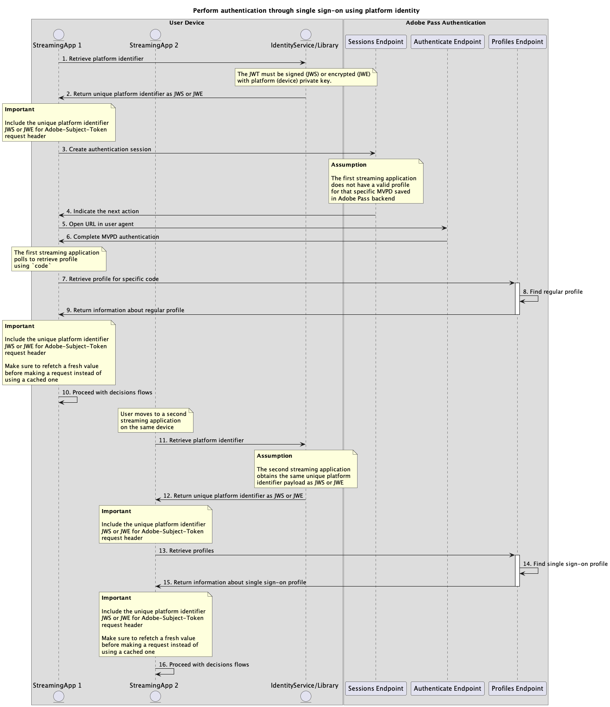

# Single sign-on using platform identity flows {#single-sign-on-platform-identity-full-flows}

The Platform Identity method enables multiple applications to use a unique platform identifier to achieve single sign-on (SSO) at the device or platform level when using Adobe Pass services.

The applications are responsible for retrieving the unique platform identifier payload using device specific identity services or libraries outside of Adobe Pass systems. 

The applications are responsible for including this unique platform identifier payload as part of the `Adobe-Subject-Token` header for all requests that specify it.

For more details about `Adobe-Subject-Token` header, refer to the [Adobe-Subject-Token](../../appendix/headers/rest-api-v2-appendix-headers-adobe-subject-token.md) documentation.

## Perform authentication through single sign-on using platform identity {#perform-authentication-through-single-sign-on-using-platform-identity}

### Prerequisites {#prerequisites-perform-authentication-through-single-sign-on-using-platform-identity}

Before performing the authentication flow through single sign-on using a platform identity, ensure the following prerequisites are met:

* The platform must provide an identity service or library that returns consistent information as `JWS` or `JWE` payload across all applications on the same device or platform.
* The first streaming application must retrieve the unique platform identifier and include the `JWS` or `JWE` payload as part of the [Adobe-Subject-Token](../../appendix/headers/rest-api-v2-appendix-headers-adobe-subject-token.md) header for all requests that specify it.
* The first streaming application must select an MVPD.
* The first streaming application must initiate an authentication session to sign in with the selected MVPD.
* The first streaming application must authenticate with the selected MVPD in a user agent.
* The second streaming application must retrieve the unique platform identifier and include the `JWS` or `JWE` payload as part of the [Adobe-Subject-Token](../../appendix/headers/rest-api-v2-appendix-headers-adobe-subject-token.md) header for all requests that specify it.

>[!IMPORTANT]
>
> Assumptions
>
>  
> 
> * The first streaming application supports user interaction to select an MVPD.
> * The first streaming application supports user interaction to authenticate with the selected MVPD in a user agent.

### Workflow {#workflow-perform-authentication-through-single-sign-on-using-platform-identity}

Perform the given steps to implement the authentication flow through single sign-on using a platform identity as shown in the following diagram.

*Perform authentication through single sign-on using platform identity*

1. **Retrieve platform identifier:** The first streaming application calls the identity service or library, outside of Adobe Pass systems, to obtain the `JWS` or `JWE` payload associated with the unique platform identifier.

1. **Return unique platform identifier as JWS or JWE:** The first streaming application validates the response data to ensure that basic security conditions are met:
   * Payload is not expired.
   * Payload is signed or encrypted.

1. **Create authentication session:** The first streaming application gathers all the necessary data to initiate an authentication session by calling the Sessions endpoint.

   Refer to the [Create authentication session](../../apis/sessions-apis/rest-api-v2-sessions-apis-create-authentication-session.md) API documentation for details on:
   * All the _required_ parameters, like `serviceProvider`, `mvpd`, `domainName`, and `redirectUrl`
   * All the _required_ headers, like `Authorization`, `AP-Device-Identifier`
   * All the _optional_ parameters and headers

   >[!IMPORTANT]
   >
   > The streaming application must ensure it includes a valid value for the unique platform identifier before making a request.
   >
   >  
   > 
   > For more details about `Adobe-Subject-Token` header, refer to the [Adobe-Subject-Token](../../appendix/headers/rest-api-v2-appendix-headers-adobe-subject-token.md) documentation.

1. **Indicate the next action:** The Sessions endpoint response contains the necessary data to guide the first streaming application regarding the next action.

   Refer to the [Create authentication session](../../apis/sessions-apis/rest-api-v2-sessions-apis-create-authentication-session.md) API documentation for details on the information provided in a session response.

   >[!IMPORTANT]
   >
   > The Sessions endpoint validates the request data to ensure that basic conditions are met:
   >
   > * The _required_ parameters and headers must be valid.
   > * The integration between the provided `serviceProvider` and `mvpd` must be active.
   >
   >  
   > 
   > If validation fails, an error response will be generated, providing additional information that adheres to the [Enhanced Error Codes](../../../enhanced-error-codes.md) documentation.

1. **Open URL in user agent:** The Sessions endpoint response contains the following data:
   * The `url` which can be used to initiate the interactive authentication within the MVPD login page.
   * The `actionName` attribute is set to "authenticate".
   * The `actionType` attribute is set to "interactive".

   If the Adobe Pass backend does not identify a valid profile, the first streaming application opens a user agent to load the provided `url`, making a request to the Authenticate endpoint. This flow may include several redirects, ultimately leading the user to the MVPD login page and provide valid credentials.

1. **Complete MVPD authentication:** If the authentication flow is successful, the user agent interaction saves a regular profile in the Adobe Pass backend and reaches the provided `redirectUrl`.

1. **Retrieve profile for specific code:** The first streaming application gathers all the necessary data to retrieve profile information by sending a request to the Profiles endpoint.

   Refer to the [Retrieve profile for specific code](../../apis/profiles-apis/rest-api-v2-profiles-apis-retrieve-profiles-for-specific-code.md) API documentation for details on:
   * All the _required_ parameters, like `serviceProvider`, `code`
   * All the _required_ headers, like `Authorization`, `AP-Device-Identifier`
   * All the _optional_ parameters and headers

   >[!NOTE]
   >
   > Suggestion: The streaming application can wait for the user agent to reach the provided `redirectUrl` to check if the regular profile was successfully generated and saved.

1. **Find regular profile:** The Adobe Pass server identifies a valid profile based on the received parameters and headers.

1. **Return information about regular profile:** The Profiles endpoint response contains information about the found profile associated with the received parameters and headers.

   Refer to the [Retrieve profile for specific code](../../apis/profiles-apis/rest-api-v2-profiles-apis-retrieve-profiles-for-specific-code.md) API documentation for details on the information provided in a profile response.

   >[!IMPORTANT]
   >
   > The Profiles endpoint validates the request data to ensure that basic conditions are met:
   >
   > * The _required_ parameters and headers must be valid.
   >
   >  
   > 
   > If validation fails, an error response will be generated, providing additional information that adheres to the [Enhanced Error Codes](../../../enhanced-error-codes.md) documentation.

1. **Proceed with decisions flows:** The first streaming application can continue with subsequent decisions flows.

   >[!IMPORTANT]
   >
   > The streaming application must ensure it includes a valid value for the unique platform identifier before making a request.
   >
   >  
   > 
   > For more details about `Adobe-Subject-Token` header, refer to the [Adobe-Subject-Token](../../appendix/headers/rest-api-v2-appendix-headers-adobe-subject-token.md) documentation.

1. **Retrieve platform identifier:** The second streaming application calls the identity service or library, outside of Adobe Pass systems, to obtain the `JWS` or `JWE` payload associated with the unique platform identifier.

1. **Return unique platform identifier as JWS or JWE:** The second streaming application validates the response data to ensure that basic security conditions are met:
   * Payload is not expired.
   * Payload is signed or encrypted.

1. **Retrieve profiles:** The second streaming application gathers all the necessary data to retrieve all profiles information by sending a request to the Profiles endpoint.

   Refer to the [Retrieve profiles](../../apis/profiles-apis/rest-api-v2-profiles-apis-retrieve-profiles.md) API documentation for details on:
   * All the _required_ parameters, like `serviceProvider`
   * All the _required_ headers, like `Authorization`, `AP-Device-Identifier`
   * All the _optional_ parameters and headers

   >[!IMPORTANT]
   >
   > The streaming application must ensure it includes a valid value for the unique platform identifier before making a request.
   >
   >  
   > 
   > For more details about `Adobe-Subject-Token` header, refer to the [Adobe-Subject-Token](../../appendix/headers/rest-api-v2-appendix-headers-adobe-subject-token.md) documentation.

1. **Find single sign-on profile:** The Adobe Pass server identifies a valid single sign-on profile based on the received parameters and headers.

1. **Return information about single sign-on profile:** The Profiles endpoint response contains information about the found profile associated with the received parameters and headers.

   Refer to the [Retrieve profiles](../../apis/profiles-apis/rest-api-v2-profiles-apis-retrieve-profiles.md) API documentation for details on the information provided in a profile response.

   >[!IMPORTANT]
   >
   > The Profiles endpoint validates the request data to ensure that basic conditions are met:
   >
   > * The _required_ parameters and headers must be valid.
   >
   >  
   > 
   > If validation fails, an error response will be generated, providing additional information that adheres to the [Enhanced Error Codes](../../../enhanced-error-codes.md) documentation.

1. **Proceed with decisions flows:** The second streaming application can continue with subsequent decisions flows.

   >[!IMPORTANT]
   >
   > The streaming application must ensure it includes a valid value for the unique platform identifier before making a request.
   >
   >  
   > 
   > For more details about `Adobe-Subject-Token` header, refer to the [Adobe-Subject-Token](../../appendix/headers/rest-api-v2-appendix-headers-adobe-subject-token.md) documentation.

## Retrieve authorization decisions through single sign-on using platform identity{#performing-authorization-flow-using-platform-identity-single-sign-on-method}

### Prerequisites {#prerequisites-scenario-performing-authorization-flow-using-platform-identity-single-sign-on-method}

Before performing the authorization flow through single sign-on using a platform identity, ensure the following prerequisites are met:

* The platform must provide an identity service or library that returns consistent information as `JWS` or `JWE` payload across all applications on the same device or platform.
* The second streaming application must retrieve the unique platform identifier and include the `JWS` or `JWE` payload as part of the [Adobe-Subject-Token](../../appendix/headers/rest-api-v2-appendix-headers-adobe-subject-token.md) header for all requests that specify it.
* The second streaming application must retrieve an authorization decision before playing a user selected resource.

>[!IMPORTANT]
>
> Assumptions
> 
>  
> 
> * The first streaming application has performed authentication and has included a valid value for [Adobe-Subject-Token](../../appendix/headers/rest-api-v2-appendix-headers-adobe-subject-token.md) request header.

### Workflow {#workflow-scenario-performing-authorization-flow-using-platform-identity-single-sign-on-method}

Perform the given steps to implement the authorization flow through single sign-on using a platform identity as shown in the following diagram.

*Retrieve authorization decisions through single sign-on using platform identity*

1. **Retrieve platform identifier:** The second streaming application calls the identity service or library, outside of Adobe Pass systems, to obtain the `JWS` or `JWE` payload associated with the unique platform identifier.

1. **Return unique platform identifier as JWS or JWE:** The second streaming application validates the response data to ensure that basic security conditions are met:
   * Payload is not expired.
   * Payload is signed or encrypted.

1. **Retrieve authorization decision:** The second streaming application gathers all the necessary data to obtain an authorization decision for a specific resource by calling the Decisions Authorize endpoint.

   Refer to the [Retrieve authorization decisions using specific mvpd](../../apis/decisions-apis/rest-api-v2-decisions-apis-retrieve-authorization-decisions-using-specific-mvpd.md) API documentation for details on:
   * All the _required_ parameters, like `serviceProvider`, `mvpd`, and `resources`
   * All the _required_ headers, like `Authorization` and `AP-Device-Identifier`
   * All the _optional_ parameters and headers

   >[!IMPORTANT]
   >
   > The streaming application must ensure it includes a valid value for the unique platform identifier before making a request.
   >
   >  
   > 
   > For more details about `Adobe-Subject-Token` header, refer to the [Adobe-Subject-Token](../../appendix/headers/rest-api-v2-appendix-headers-adobe-subject-token.md) documentation.

1. **Find single sign-on profile:** The Adobe Pass server identifies a valid single sign-on profile based on the received parameters and headers.

1. **Retrieve MVPD decision for requested resource:** The Adobe Pass server calls the MVPD authorization endpoint to obtain a `Permit` or `Deny` decision for the specific resource received from the streaming application.

1. **Return `Permit` decision with media token:** The Decisions Authorize endpoint response contains a `Permit` decision and a media token.

   Refer to the [Retrieve authorization decisions using specific mvpd](../../apis/decisions-apis/rest-api-v2-decisions-apis-retrieve-authorization-decisions-using-specific-mvpd.md) API documentation for details on the information provided in a decision response.

   >[!IMPORTANT]
   >
   > The Decisions Authorize endpoint validates the request data to ensure that basic conditions are met:
   >
   > * The _required_ parameters and headers must be valid.
   > * The integration between the provided `serviceProvider` and `mvpd` must be active.
   >
   >  
   > 
   > If validation fails, an error response will be generated, providing additional information that adheres to the [Enhanced Error Codes](../../../enhanced-error-codes.md) documentation.

1. **Start stream with media token:** The second streaming application uses the media token to play the content.

1. **Return `Deny` decision with details:** The Decisions Authorize endpoint response contains a `Deny` decision and an error payload which adheres to the [Enhanced Error Codes](../../../enhanced-error-codes.md) documentation.

   Refer to the [Retrieve authorization decisions using specific mvpd](../../apis/decisions-apis/rest-api-v2-decisions-apis-retrieve-authorization-decisions-using-specific-mvpd.md) API documentation for details on the information provided in a decision response.

   >[!IMPORTANT]
   >
   > The Decisions Authorize endpoint validates the request data to ensure that basic conditions are met:
   >
   > * The _required_ parameters and headers must be valid.
   > * The integration between the provided `serviceProvider` and `mvpd` must be active.
   >
   >  
   > 
   > If validation fails, an error response will be generated, providing additional information that adheres to the [Enhanced Error Codes](../../../enhanced-error-codes.md) documentation.

1. **Handle `Deny` decision details:** The second streaming application processes the error information from the response and can use it to optionally display a specific message on the user interface.

>[!NOTE]
>
> The steps for the preauthorization flow are the same as those for the authorization flow, except that the endpoint used is the one described in the [Retrieve preauthorization decisions using specific mvpd](../../apis/decisions-apis/rest-api-v2-decisions-apis-retrieve-preauthorization-decisions-using-specific-mvpd.md) documentation.
