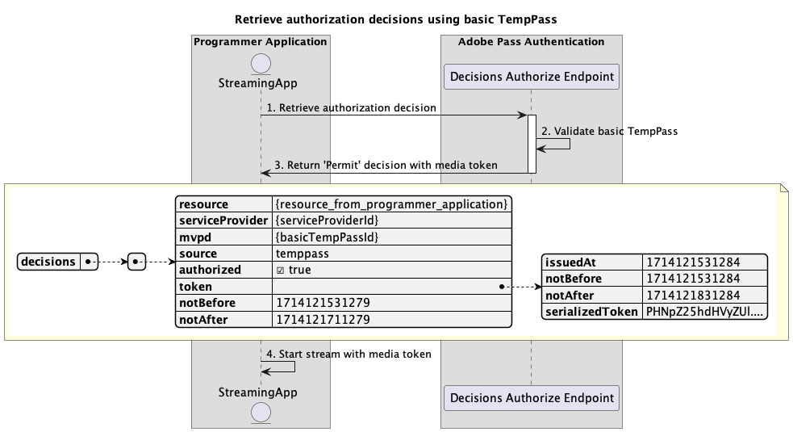

# Temporary access flows {#temporary-access-flows}

>[!IMPORTANT]
>
> The content on this page is provided for information purposes only. Usage of this API requires a current license from Adobe. No unauthorized use is permitted.

>[!IMPORTANT]
>
> REST API V2 implementation is bounded by the [Throttling mechanism](/help/authentication/throttling-mechanism.md) documentation.
 
TempPass allows Programmers to provide temporary access to their protected content without asking users to authenticate with a valid MVPD account.

For more details about TempPass feature, refer to the [TempPass](../../../temp-pass.md) documentation.

Temporary access flows allow you to query for the following scenarios:

* [Retrieve authorization decisions using basic TempPass](#retrieve-authorization-decisions-using-basic-temppass)
* [Retrieve authorization decisions using promotional TempPass](#retrieve-authorization-decisions-using-promotional-temppass)
* [Consume maximum number of resources using promotional TempPass](#consume-maximum-number-of-resources-using-promotional-temppass)
* [Retrieve authorization decisions when basic or promotional TempPass expires](#retrieve-authorization-decisions-when-basic-or-promotional-temppass-expires)
* [Retrieve profile for basic TempPass](#retrieve-profile-for-basic-temppass)
* [Retrieve profile for promotional TempPass](#retrieve-profile-for-promotional-temppass)

## Retrieve authorization decisions using basic TempPass {#retrieve-authorization-decisions-using-basic-temppass}

### Prerequisites {#prerequisites-retrieve-authorization-decisions-using-basic-temppass}

Before retrieving authorization decisions using basic TempPass, ensure the following prerequisites are met:

* The streaming application wants to provide temporary access to play content without asking the user to authenticate.
* The streaming application must retrieve an authorization decision before playing a user selected resource.

>[!IMPORTANT]
>
> Assumptions
> 
>  
> 
> * There must be a valid configuration setup of basic TempPass applied to the integration between the provided `serviceProvider` and `mvpd`.
> * The Time-To-Live (TTL) configured for the basic TempPass has not expired.

### Workflow {#workflow-retrieve-authorization-decisions-using-basic-temppass}

Follow the given steps to implement the authorization flow using basic TempPass as shown in the following diagram.

*Retrieve authorization decisions using basic TempPass*

1. **Retrieve authorization decision:** The streaming application gathers all the necessary data to obtain an authorization decision for a specific resource by calling the Decisions Authorize endpoint.

   >[!IMPORTANT]
   >
   > Refer to the [Retrieve authorization decisions using specific mvpd](../../apis/decisions-apis/rest-api-v2-decisions-apis-retrieve-authorization-decisions-using-specific-mvpd.md) API documentation for details on:
   > 
   > * All the _required_ parameters, like `serviceProvider`, `mvpd`, and `resources`
   > * All the _required_ headers, like `Authorization` and `AP-Device-Identifier`
   > * All the _optional_ parameters and headers

1. **Validate basic TempPass:** The Adobe Pass server verifies if there is a valid configuration setup of basic TempPass applied to the integration between the provided `serviceProvider` and `mvpd`.

1. **Return `Permit` decision with media token:** The Decisions Authorize endpoint response contains a `Permit` decision and a media token.

   >[!IMPORTANT]
   >
   > Refer to the [Retrieve authorization decisions using specific mvpd](../../apis/decisions-apis/rest-api-v2-decisions-apis-retrieve-authorization-decisions-using-specific-mvpd.md) API documentation for details on the information provided in a decision response.
   >
   >  
   > 
   > The Decisions Authorize endpoint validates the request data to ensure that basic conditions are met:
   >
   > * The _required_ parameters and headers must be valid.
   > * The integration between the provided `serviceProvider` and `mvpd` must be active.
   >
   >  
   > 
   > If basic validation fails, an error response will be generated, providing additional information that adheres to the [Enhanced Error Codes](../../../enhanced-error-codes.md) documentation.
   >
   >  
   > 
   > The Decisions Authorize endpoint uses the request data to check if temporary access conditions are met:
   >
   > * The Time-To-Live (TTL) configured for the basic TempPass must not be expired.
   >
   >  
   > 
   > If temporary access validation fails, an error response will be generated, providing additional information that adheres to the [Enhanced Error Codes](../../../enhanced-error-codes.md) documentation.

1. **Start stream with media token:** The streaming application uses the media token to play the content.

## Retrieve authorization decisions using promotional TempPass {#retrieve-authorization-decisions-using-promotional-temppass}

### Prerequisites {#prerequisites-retrieve-authorization-decisions-using-promotional-temppass}

Before retrieving authorization decisions using promotional TempPass, ensure the following prerequisites are met:

* The streaming application wants to provide temporary access to play a maximum number of resources without asking the user to authenticate.
* The streaming application must include unique information about the identity of the user when retrieving an authorization decision.
* The streaming application must retrieve an authorization decision before playing a user selected resource.

>[!IMPORTANT]
>
> Assumptions
>
>  
> 
> * There must be a valid configuration setup of promotional TempPass applied to the integration between the provided `serviceProvider` and `mvpd`.
> * The Time-To-Live (TTL) configured for the promotional TempPass has not expired.
> * The maximum number of resources configured for the promotional TempPass has not been consumed. 

### Workflow {#workflow-retrieve-authorization-decisions-using-promotional-temppass}

Follow the given steps to implement the authorization flow using promotional TempPass as shown in the following diagram.

*Retrieve authorization decisions using promotional TempPass*

1. **Retrieve authorization decision:** The streaming application gathers all the necessary data to obtain an authorization decision for a specific resource by calling the Decisions Authorize endpoint.

   >[!IMPORTANT]
   >
   > Refer to the [Retrieve authorization decisions using specific mvpd](../../apis/decisions-apis/rest-api-v2-decisions-apis-retrieve-authorization-decisions-using-specific-mvpd.md) API documentation for details on:
   >
   > * All the _required_ parameters, like `serviceProvider`, `mvpd`, and `resources`
   > * All the _required_ headers, like `Authorization` and `AP-Device-Identifier`
   > * All the _optional_ parameters and headers
   >
   >  
   >
   > The Decisions Authorize endpoint requires the presence of `AP-TempPass-Identity` header when using promotional TempPass. The header includes unique information about the identity of the user accessing the content.
   > 
   >  
   > 
   > For more details about `AP-TempPass-Identity` header, refer to the [AP-TempPass-Identity](../../appendix/headers/rest-api-v2-appendix-headers-ap-temppass-identity.md) documentation.

1. **Validate promotional TempPass:** The Adobe Pass server verifies if there is a valid configuration setup of promotional TempPass applied to the integration between the provided `serviceProvider` and `mvpd`.

1. **Return `Permit` decision with media token:** The Decisions Authorize endpoint response contains a `Permit` decision and a media token.

   >[!IMPORTANT]
   >
   > Refer to the [Retrieve authorization decisions using specific mvpd](../../apis/decisions-apis/rest-api-v2-decisions-apis-retrieve-authorization-decisions-using-specific-mvpd.md) API documentation for details on the information provided in a decision response.
   > 
   >  
   > 
   > The Decisions Authorize endpoint validates the request data to ensure that basic conditions are met:
   >
   > * The _required_ parameters and headers must be valid.
   > * The integration between the provided `serviceProvider` and `mvpd` must be active.
   >
   >  
   > 
   > If basic validation fails, an error response will be generated, providing additional information that adheres to the [Enhanced Error Codes](../../../enhanced-error-codes.md) documentation.
   >
   >  
   > 
   > The Decisions Authorize endpoint uses the request data to check if temporary access conditions are met:
   >
   > * The Time-To-Live (TTL) configured for the promotional TempPass must not be expired.
   > * The maximum number of resources configured for the promotional TempPass must not be consumed.
   >
   >  
   > 
   > If temporary access validation fails, an error response will be generated, providing additional information that adheres to the [Enhanced Error Codes](../../../enhanced-error-codes.md) documentation.

1. **Start stream with media token:** The streaming application uses the media token to play the content.

## Consume maximum number of resources using promotional TempPass {#consume-maximum-number-of-resources-using-promotional-temppass}

### Prerequisites {#prerequisites-consume-maximum-number-of-resources-using-promotional-temppass}

Before consuming a maximum number of resources using promotional TempPass, ensure the following prerequisites are met:

* The streaming application wants to provide temporary access to play a maximum number of resources without asking the user to authenticate.
* The streaming application must include unique information about the identity of the user when retrieving an authorization decision.
* The streaming application must retrieve an authorization decision before playing a user selected resource.

>[!IMPORTANT]
>
> Assumptions
>
>  
> 
> * There must be a valid configuration setup of promotional TempPass applied to the integration between the provided `serviceProvider` and `mvpd`.
> * The Time-To-Live (TTL) configured for the promotional TempPass has not expired.
> * The maximum number of resources configured for the promotional TempPass is 1.

### Workflow {#workflow-consume-maximum-number-of-resources-using-promotional-temppass}

Follow the given steps to implement the authorization flow when consuming a maximum number of resources using promotional TempPass as shown in the following diagram.

*Consume maximum number of resources using promotional TempPass*

1. **Retrieve profile for promotional TempPass:** The streaming application gathers all the necessary data to retrieve profile information for promotional TempPass by sending a request to the Profiles endpoint.

   >[!IMPORTANT]
   >
   > Refer to the [Retrieve profile for specific mvpd](../../apis/profiles-apis/rest-api-v2-profiles-apis-retrieve-profile-for-specific-mvpd.md) API documentation for details on:
   >
   > * All the _required_ parameters, like `serviceProvider`, and `mvpd`
   > * All the _required_ headers, like `Authorization` and `AP-Device-Identifier`
   > * All the _optional_ parameters and headers
   >
   >  
   > 
   > The Profiles endpoint query is optional and can be used to determine how many resources can still be played using the promotional TempPass.

1. **Validate promotional TempPass:** The Adobe Pass server verifies if there is a valid configuration setup of promotional TempPass applied to the integration between the provided `serviceProvider` and `mvpd`.

1. **Return information about temporary profile:** The Profiles endpoint response contains information about the temporary profile, including the attribute `type` set to "temporary".

   >[!IMPORTANT]
   >
   > Refer to the [Retrieve profile for specific mvpd](../../apis/profiles-apis/rest-api-v2-profiles-apis-retrieve-profile-for-specific-mvpd.md) API documentation for details on the information provided in a profile response.
   > 
   >  
   > 
   > The Profiles endpoint validates the request data to ensure that basic conditions are met:
   >
   > * The _required_ parameters and headers must be valid.
   > * The integration between the provided `serviceProvider` and `mvpd` must be active.
   > 
   >  
   >
   > If basic validation fails, an error response will be generated, providing additional information that adheres to the [Enhanced Error Codes](../../../enhanced-error-codes.md) documentation.
   >
   >  
   > 
   > The Profiles endpoint uses the request data to check if temporary access conditions are met:
   >
   > * The Time-To-Live (TTL) configured for the promotional TempPass must not be expired.
   > * The maximum number of resources configured for the promotional TempPass must not be consumed.
   >
   >  
   > 
   > If temporary access validation fails, an error response will be generated, providing additional information that adheres to the [Enhanced Error Codes](../../../enhanced-error-codes.md) documentation.

1. **Proceed with decisions flows:** If the Profiles endpoint response contains a profile, the streaming application uses the temporary profile information to continue with subsequent decisions flows.

1. **Retrieve authorization decision:** The streaming application gathers all the necessary data to obtain an authorization decision for a specific resource by calling the Decisions Authorize endpoint.

   >[!IMPORTANT]
   > 
   > Refer to the [Retrieve authorization decisions using specific mvpd](../../apis/decisions-apis/rest-api-v2-decisions-apis-retrieve-authorization-decisions-using-specific-mvpd.md) API documentation for details on:
   >
   > * All the _required_ parameters, like `serviceProvider`, `mvpd`, and `resources`
   > * All the _required_ headers, like `Authorization` and `AP-Device-Identifier`
   > * All the _optional_ parameters and headers
   >
   >  
   > 
   > The Decisions Authorize endpoint requires the presence of `AP-TempPass-Identity` header when using promotional TempPass. The header includes unique information about the identity of the user accessing the content.
   > 
   >  
   > 
   > For more details about `AP-TempPass-Identity` header, refer to the [AP-TempPass-Identity](../../appendix/headers/rest-api-v2-appendix-headers-ap-temppass-identity.md) documentation.

1. **Validate promotional TempPass:** The Adobe Pass server verifies if there is a valid configuration setup of promotional TempPass applied to the integration between the provided `serviceProvider` and `mvpd`.

1. **Return `Permit` decision with media token:** The Decisions Authorize endpoint response contains a `Permit` decision and a media token.

   >[!IMPORTANT]
   >
   > Refer to the [Retrieve authorization decisions using specific mvpd](../../apis/decisions-apis/rest-api-v2-decisions-apis-retrieve-authorization-decisions-using-specific-mvpd.md) API documentation for details on the information provided in a decision response.
   > 
   >  
   > 
   > The Decisions Authorize endpoint validates the request data to ensure that basic conditions are met:
   >
   > * The _required_ parameters and headers must be valid.
   > * The integration between the provided `serviceProvider` and `mvpd` must be active.
   >
   >  
   > 
   > If basic validation fails, an error response will be generated, providing additional information that adheres to the [Enhanced Error Codes](../../../enhanced-error-codes.md) documentation.
   > 
   >  
   > 
   > The Decisions Authorize endpoint uses the request data to check if temporary access conditions are met:
   >
   > * The Time-To-Live (TTL) configured for the promotional TempPass must not be expired.
   > * The maximum number of resources configured for the promotional TempPass must not be consumed.
   >
   >  
   > 
   > If temporary access validation fails, an error response will be generated, providing additional information that adheres to the [Enhanced Error Codes](../../../enhanced-error-codes.md) documentation.

1. **Retrieve authorization decision:** The streaming application gathers all the necessary data to obtain an authorization decision for a specific resource by calling the Decisions Authorize endpoint.

   >[!IMPORTANT]
   >
   > Refer to the [Retrieve authorization decisions using specific mvpd](../../apis/decisions-apis/rest-api-v2-decisions-apis-retrieve-authorization-decisions-using-specific-mvpd.md) API documentation for details on:
   >
   > * All the _required_ parameters, like `serviceProvider`, `mvpd`, and `resources`
   > * All the _required_ headers, like `Authorization` and `AP-Device-Identifier`
   > * All the _optional_ parameters and headers
   >
   >  
   > 
   > The Decisions Authorize endpoint requires the presence of `AP-TempPass-Identity` header when using promotional TempPass. The header includes unique information about the identity of the user accessing the content.
   >
   >  
   > 
   > For more details about `AP-TempPass-Identity` header, refer to the [AP-TempPass-Identity](../../appendix/headers/rest-api-v2-appendix-headers-ap-temppass-identity.md) documentation.

1. **Validate promotional TempPass:** The Adobe Pass server verifies if there is a valid configuration setup of promotional TempPass applied to the integration between the provided `serviceProvider` and `mvpd`.

1. **Return `Deny` decision with details:** The Decisions Authorize endpoint response contains a `Deny` decision and an error payload which adheres to the [Enhanced Error Codes](../../../enhanced-error-codes.md) documentation.

   >[!IMPORTANT]
   >
   > Refer to the [Retrieve authorization decisions using specific mvpd](../../apis/decisions-apis/rest-api-v2-decisions-apis-retrieve-authorization-decisions-using-specific-mvpd.md) API documentation for details on the information provided in a decision response.
   > 
   >  
   > 
   > The Decisions Authorize endpoint validates the request data to ensure that basic conditions are met:
   >
   > * The _required_ parameters and headers must be valid.
   > * The integration between the provided `serviceProvider` and `mvpd` must be active.
   >
   >  
   > 
   > If basic validation fails, an error response will be generated, providing additional information that adheres to the [Enhanced Error Codes](../../../enhanced-error-codes.md) documentation.
   >
   >  
   > 
   > The Decisions Authorize endpoint uses the request data to check if temporary access conditions are met:
   >
   > * The Time-To-Live (TTL) configured for the promotional TempPass must not be expired.
   > * The maximum number of resources configured for the promotional TempPass must not be consumed.
   >
   >  
   > 
   > If temporary access validation fails, an error response will be generated, providing additional information that adheres to the [Enhanced Error Codes](../../../enhanced-error-codes.md) documentation.

1. **Handle `Deny` decision details:** The streaming application processes the error information from the response and can use it to optionally display a specific message on the user interface.

   >[!NOTE]
   >
   > Suggestion: The streaming application can inform users that the maximum number of resources was exceeded and advise them to initiate a basic authentication flow using a regular MVPD to continue watching.

## Retrieve authorization decisions when basic or promotional TempPass expires {#retrieve-authorization-decisions-when-basic-or-promotional-temppass-expires}

### Prerequisites {#prerequisites-retrieve-authorization-decisions-when-basic-or-promotional-temppass-expires}

Before retrieving authorization decisions when basic or promotional TempPass expires, ensure the following prerequisites are met:

* [Prerequisites before retrieving authorization decisions using basic TempPass](#prerequisites-retrieve-authorization-decisions-using-basic-temppass).
* [Prerequisites before retrieving authorization decisions using promotional TempPass](#prerequisites-retrieve-authorization-decisions-using-promotional-temppass).

>[!IMPORTANT]
>
> Assumptions
> 
>  
> 
> * There must be a valid configuration setup of basic or promotional TempPass applied to the integration between the provided `serviceProvider` and `mvpd`.
> * The Time-To-Live (TTL) configured for the basic or promotional The temporary access duration limit has been exceeded.

### Workflow {#workflow-retrieve-authorization-decisions-when-basic-or-promotional-temppass-expires}

Follow the given steps to implement the authorization flow when basic or promotional TempPass expires as shown in the following diagram.

*Retrieve authorization decisions when basic or promotional TempPass expires*

1. **Retrieve authorization decision:** The streaming application gathers all the necessary data to obtain an authorization decision for a specific resource by calling the Decisions Authorize endpoint.

   >[!IMPORTANT]
   >
   > Refer to the [Retrieve authorization decisions using specific mvpd](../../apis/decisions-apis/rest-api-v2-decisions-apis-retrieve-authorization-decisions-using-specific-mvpd.md) API documentation for details on:
   > 
   > * All the _required_ parameters, like `serviceProvider`, `mvpd`, and `resources`
   > * All the _required_ headers, like `Authorization` and `AP-Device-Identifier`
   > * All the _optional_ parameters and headers
   >
   >  
   > 
   > The Decisions Authorize endpoint requires the presence of `AP-TempPass-Identity` header when using promotional TempPass. The header includes unique information about the identity of the user accessing the content.
   > 
   >  
   > 
   > For more details about `AP-TempPass-Identity` header, refer to the [AP-TempPass-Identity](../../appendix/headers/rest-api-v2-appendix-headers-ap-temppass-identity.md) documentation.

1. **Validate basic or promotional TempPass:** The Adobe Pass server verifies if there is a valid configuration setup of basic or promotional TempPass applied to the integration between the provided `serviceProvider` and `mvpd`.

1. **Return `Deny` decision with details:** The Decisions Authorize endpoint response contains a `Deny` decision and an error payload which adheres to the [Enhanced Error Codes](../../../enhanced-error-codes.md) documentation.

   >[!IMPORTANT]
   >
   > Refer to the [Retrieve authorization decisions using specific mvpd](../../apis/decisions-apis/rest-api-v2-decisions-apis-retrieve-authorization-decisions-using-specific-mvpd.md) API documentation for details on the information provided in a decision response.
   > 
   >  
   > 
   > The Decisions Authorize endpoint validates the request data to ensure that basic conditions are met:
   >
   > * The _required_ parameters and headers must be valid.
   > * The integration between the provided `serviceProvider` and `mvpd` must be active.
   >
   >  
   > 
   > If basic validation fails, an error response will be generated, providing additional information that adheres to the [Enhanced Error Codes](../../../enhanced-error-codes.md) documentation.
   >
   >  
   > 
   > The Decisions Authorize endpoint uses the request data to check if temporary access conditions are met:
   >
   > * The Time-To-Live (TTL) configured for the basic or promotional TempPass must not be expired.
   > * The maximum number of resources configured for the promotional TempPass must not be consumed.
   >
   >  
   > 
   > If temporary access validation fails, an error response will be generated, providing additional information that adheres to the [Enhanced Error Codes](../../../enhanced-error-codes.md) documentation.

1. **Handle `Deny` decision details:** The streaming application processes the error information from the response and can use it to optionally display a specific message on the user interface.

   >[!NOTE]
   >
   > Suggestion: The streaming application can inform users that the temporary access has expired and advise them to initiate a basic authentication flow using a regular MVPD to continue watching.

## Retrieve profile for basic TempPass {#retrieve-profile-for-basic-temppass}

>[!IMPORTANT]
>
> The Profiles endpoint query is optional for basic TempPass.

### Prerequisites {#prerequisites-retrieve-profile-for-basic-temppass}

Before retrieving the profile for basic TempPass, ensure the following prerequisites are met:

* The streaming application wants to retrieve the temporary profile to ensure that the temporary access has not expired.

>[!IMPORTANT]
>
> Assumptions
> 
>  
> 
> * There must be a valid configuration setup of basic TempPass applied to the integration between the provided `serviceProvider` and `mvpd`.
> * The Time-To-Live (TTL) configured for the basic TempPass must not be expired.

### Workflow {#workflow-retrieve-profile-information-for-basic-temppass}

Follow the given steps to implement the profile retrieval flow for basic TempPass as shown in the following diagram.

*Retrieve profile for basic TempPass*

1. **Retrieve profile for basic TempPass:** The streaming application gathers all the necessary data to retrieve profile information for basic TempPass by sending a request to the Profiles endpoint.

   >[!IMPORTANT]
   >
   > Refer to the [Retrieve profile for specific mvpd](../../apis/profiles-apis/rest-api-v2-profiles-apis-retrieve-profile-for-specific-mvpd.md) API documentation for details on:
   > 
   > * All the _required_ parameters, like `serviceProvider`, and `mvpd`
   > * All the _required_ headers, like `Authorization` and `AP-Device-Identifier`
   > * All the _optional_ parameters and headers

1. **Validate basic TempPass:** The Adobe Pass server verifies if there is a valid configuration setup of basic TempPass applied to the integration between the provided `serviceProvider` and `mvpd`.

1. **Return information about temporary profile:** The Profiles endpoint response contains information about the temporary profile, including the attribute `type` set to "temporary".

   >[!IMPORTANT]
   >
   > Refer to the [Retrieve profile for specific mvpd](../../apis/profiles-apis/rest-api-v2-profiles-apis-retrieve-profile-for-specific-mvpd.md) API documentation for details on the information provided in a profile response.
   > 
   >  
   > 
   > The Profiles endpoint validates the request data to ensure that basic conditions are met:
   >
   > * The _required_ parameters and headers must be valid.
   > * The integration between the provided `serviceProvider` and `mvpd` must be active.
   >
   >  
   > 
   > If basic validation fails, an error response will be generated, providing additional information that adheres to the [Enhanced Error Codes](../../../enhanced-error-codes.md) documentation.
   >
   >  
   > 
   > The Profiles endpoint uses the request data to check if temporary access conditions are met:
   >
   > * The Time-To-Live (TTL) configured for the basic TempPass must not be expired.
   >
   >  
   > 
   > If temporary access validation fails, an error response will be generated, providing additional information that adheres to the [Enhanced Error Codes](../../../enhanced-error-codes.md) documentation.

1. **Proceed with decisions flows:** If the Profiles endpoint response contains a profile, the streaming application uses the temporary profile information to continue with subsequent decisions flows.

## Retrieve profile for promotional TempPass {#retrieve-profile-for-promotional-temppass}

>[!IMPORTANT]
>
> The Profiles endpoint query is optional for promotional TempPass.

### Prerequisites {#prerequisites-retrieve-profile-for-promotional-temppass}

Before retrieving the profile for promotional TempPass, ensure the following prerequisites are met:

* The streaming application wants to retrieve the temporary profile to ensure that the temporary access has not expired or to determine how many resources can still be played.

>[!IMPORTANT]
>
> Assumptions
>
>  
> 
> * There must be a valid configuration setup of promotional TempPass applied to the integration between the provided `serviceProvider` and `mvpd`.
> * The Time-To-Live (TTL) configured for the promotional TempPass has not expired.
> * The maximum number of resources configured for the promotional TempPass has not been consumed.

### Workflow {#workflow-retrieve-profile-information-for-promotional-temppass}

Follow the given steps to implement the profile retrieval flow for promotional TempPass as shown in the following diagram.

*Retrieve profile for promotional TempPass*

1. **Retrieve profile for promotional TempPass:** The streaming application gathers all the necessary data to retrieve profile information for promotional TempPass by sending a request to the Profiles endpoint.

   >[!IMPORTANT]
   >
   > Refer to the [Retrieve profile for specific mvpd](../../apis/profiles-apis/rest-api-v2-profiles-apis-retrieve-profile-for-specific-mvpd.md) API documentation for details on:
   > 
   > * All the _required_ parameters, like `serviceProvider`, and `mvpd`
   > * All the _required_ headers, like `Authorization` and `AP-Device-Identifier`
   > * All the _optional_ parameters and headers

1. **Validate promotional TempPass:** The Adobe Pass server verifies if there is a valid configuration setup of promotional TempPass applied to the integration between the provided `serviceProvider` and `mvpd`.

1. **Return information about temporary profile:** The Profiles endpoint response contains information about the temporary profile, including the attribute `type` set to "temporary".

   >[!IMPORTANT]
   >
   > Refer to the [Retrieve profile for specific mvpd](../../apis/profiles-apis/rest-api-v2-profiles-apis-retrieve-profile-for-specific-mvpd.md) API documentation for details on the information provided in a profile response.
   > 
   >  
   > 
   > The Profiles endpoint validates the request data to ensure that basic conditions are met:
   >
   > * The _required_ parameters and headers must be valid.
   > * The integration between the provided `serviceProvider` and `mvpd` must be active.
   >
   >  
   > 
   > If basic validation fails, an error response will be generated, providing additional information that adheres to the [Enhanced Error Codes](../../../enhanced-error-codes.md) documentation.
   >
   >  
   > 
   > The Profiles endpoint uses the request data to check if temporary access conditions are met:
   >
   > * The Time-To-Live (TTL) configured for the promotional TempPass must not be expired.
   > * The maximum number of resources configured for the promotional TempPass must not be consumed.
   >
   >  
   > 
   > If temporary access validation fails, an error response will be generated, providing additional information that adheres to the [Enhanced Error Codes](../../../enhanced-error-codes.md) documentation.

1. **Proceed with decisions flows:** If the Profiles endpoint response contains a profile, the streaming application uses the temporary profile information to continue with subsequent decisions flows.
