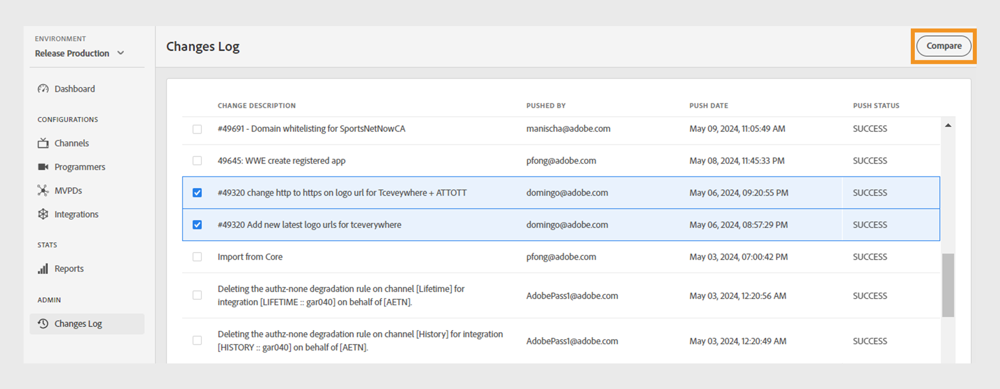
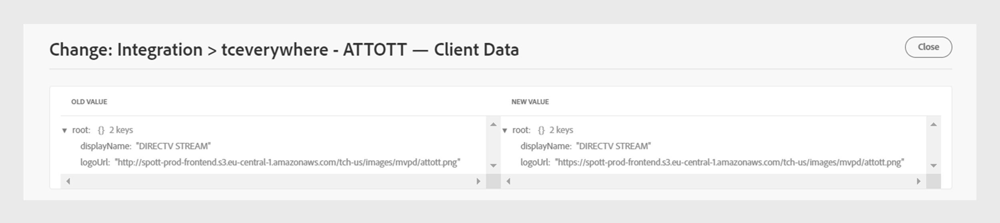

# Changes log {#changes-log}

>[!NOTE]
>
>The content on this page is provided for information purposes only. Usage of this API requires a current license from Adobe. No unauthorized use is permitted.

The **Changes Log** section of the TVE Dashboard allows you to view the configuration changes pushed to the Adobe Pass Authentication environment through the TVE Dashboard. You can also compare two different configuration changes.

The **Changes Log** tab in the left panel displays a list of all the configuration changes made through a specific account of the TVE Dashboard. This list of changes contains the following details:

* **Change description**: A short description on the scope of the configuration change.
* **Pushed by**: An email ID of the user responsible for making the change. 
* **Push date**: The date of the configuration change.
* **Push status**: Indicates whether the push operation was successful or failed.

## Compare changes {#compare-changes}

To compare changes, follow these steps:

1. Select two configuration changes from the list that you want to compare.

   

    *Compare configuration changes*

1. Select **Compare** at the upper-right of the screen.

   The **Configuration Changes** section displays the entity type, entity ID, property, and the status of the change operation for each change.

1. Hover on the configuration change you want to view.
1. Select **View** to access the changed values.

   

   *View configuration changes*

The following is an example of a change made in the selected configuration. You can view the difference between the old and new values within the change.

*Old and new value*

## Download configuration changes {#download-conf-changes}

To download a specific configuration change, follow these steps:

1. Select the **Changes log** tab in the left panel.
1. Hover on the configuration change that you want to download.
1. Select **Download** to download the configuration settings as a JSON file on your local machine.

   

   *Download configuration changes*

