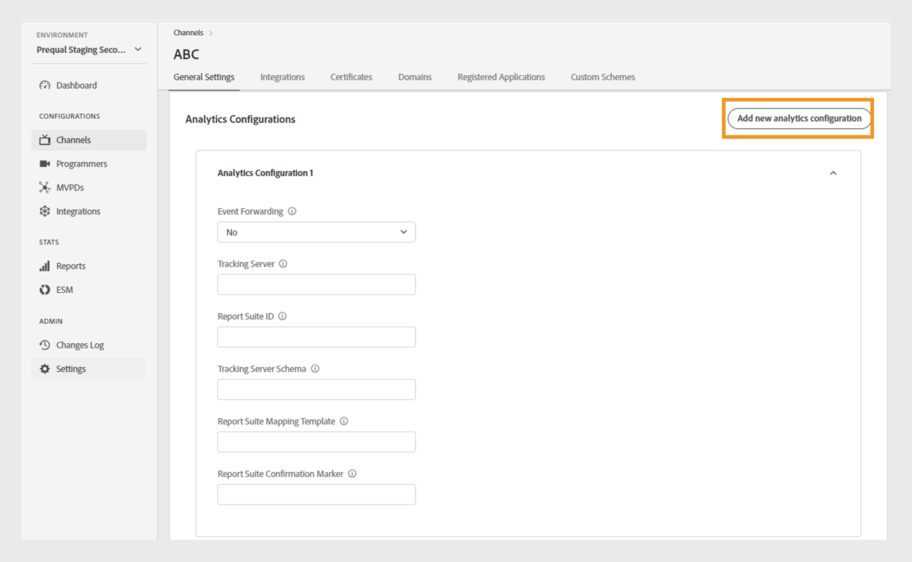
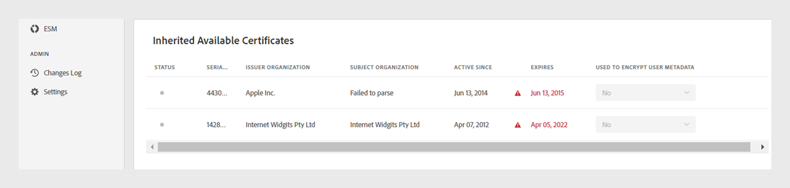

# Channels {#channels}

>[!NOTE]
>
>The content on this page is provided for information purposes only. The usage of this API requires a current license from Adobe. No unauthorized use is permitted.

The **Channels** section of the TVE Dashboard allows you to view and manage settings for the channels associated with a specific programmer. You can also [add a new channel](#add-new-channel) as per your requirement.

The **Channels** tab in the left panel displays a list of linked channels with the following details:

* **Display name**: The brand name of the channel used for commercial purposes.
* **Channel ID**: A unique identifier, also referred to as Requestor ID.
* **Integrations**: The number of connections established with [MVPDs](/help/authentication/glossary.md#mvpd).

*List of existing channels*

Type the name of the channel in the **Search** bar above the list to know more about the channel.

## Manage channel configurations {#manage-channel-conf}

Follow the steps to manage various settings of a specific channel.

1. Select the **Channels** tab in the left panel.
1. Select the channel from the available list. 
1. Select one of the following tabs to view and edit the corresponding settings of the selected channel:

   * [General Settings](#general-settings)
   * [Integrations](#integrations)
   * [Certificates](#certificates)
   * [Domains](#domains)
   * [Registered Applications](#registered-applications)
   * [Custom Schemes](#custom-schemes)

   

   *Channel settings*

>[!IMPORTANT]
>
> View [Review and push changes](/help/authentication/tve-dashboard-review-push-changes.md) for more information on activating the configuration changes. 

### General settings {#general-settings}

This tab presents **Channel Information** and **Analytics Configuration**.

#### Channel information {#channel-information}

In this section, you can edit the following details:

* **Display name**: The brand name of the channel used for commercial purposes.

* **Default redirect URL**: The backup redirect URL for authentication and logout.

* **Error reporting**: On selecting **Yes**, the Adobe Pass SDKs send error reports to Adobe Pass backend for analytics.

*Edit Channel information*

#### Analytics configuration {#analytics-configuration}

This section allows you to configure the forwarding of Adobe Pass Authentication events to Adobe Analytics.

To enable **Analytics Configuration**, contact your Technical Account Manager (TAM) for more details on setting up the Report Suite ID (RSID).

*Enable Analytics Configurations*

Select **Add new analytics configuration** to add multiple configurations.

A new configuration change is created and ready for server update. To use the new analytics configuration from the **Analytics Configuration** section, proceed with the [review and push changes](/help/authentication/tve-dashboard-review-push-changes.md) flow.

### Integrations {#integrations}

This tab displays a list of available integrations between the currently selected channel and MVPDs. The list presents each integration along with its status, indicating whether it's enabled or not. Select a specific integration from this list to access detailed information in the [Integrations](tve-dashboard-integrations.md) section.

*List of Available Integrations*

### Certificates {#certificates}

This tab displays a list of [available certificates](#available-certificates) and [inherited available certificates](#inherited-avail-certificates) used in the authentication and user metadata flows. It displays details about each certificate that includes:

* The status (whether enabled for **user metadata encryption** usage or not) 
* Serial number
* Name of the issuer organization 
* Name of the subject organization
* Issued date
* Expiry date 
* A dropdown menu to encrypt user metadata (if you select **Yes**, the certificate encrypts sensitive user information, such as zip code values).

#### Available certificates {#available-certificates}

These certificates serve as private or public keys and are used for validation purposes.
You can make the following changes under the available certificates section:

* [Add new certificate](#add-new-certificate)
* [Delete certificate](#delete-certificate)

##### Add new certificate {#add-new-certificate}

To add a new certificate, follow these steps:

1. Select **Add new certificate** at the top of the **Available Certificates** section.

   

   *Add a new certificate*

1. Paste the public key of your certificate in the **New certificate** dialog box.
1. Select **Add certificate**.

   A new configuration change is created and ready for server update. To use the new certificate listed in the **Available Certificates** section, proceed with the [review and push changes](/help/authentication/tve-dashboard-review-push-changes.md) flow.

1. Locate the new certificate in the list of **Available Certificates**.

   >[!IMPORTANT]
   >
   > Make sure that your systems are up to date and ready to use the new certificate.

1. Select **Yes** from **Used to encrypted user metadata** dropdown menu to activate a new certificate.

##### Delete certificate {#delete-certificate}

Follow these steps to delete a certificate. 

1. Hover on the certificate that you want to delete from the list of **Available certificates**.
1. Select **Remove**.

   

   *Remove the selected certificate*

1. Select **Delete** from the **Delete active certificate** dialog box.
 
A new configuration change is created and ready for server update. The certificate will be deleted from the **Available certificates** section only after [review and push changes](/help/authentication/tve-dashboard-review-push-changes.md).

#### Inherited available certificates {#inherited-avail-certificates}

Media companies define these certificates at their own level. All channels associated with the same media company can use these certificates.

   

   *Inherited available certificates*

### Domains {#domains}

This tab displays a list of available domains through which the respective channel communicates with Adobe Pass Authentication. 

You can make the following changes to domains:

* [Add a new domain](#add-domains)
* [Delete domain](#delete-domain)

>[!TIP]
>
> Avoid adding a new subdomain if a more general domain exists in the list.

#### Add new domain {#add-domains}

Follow these steps to add a domain.

1. Select **Add new domain** at the upper-right corner of the **Available Domains** section.

   

   *Add a new domain*

1. Type the name of your domain in the **New domain** dialog box. 

1. Select **Add domain** to add a new domain for the selected channel.

A new configuration change is created and ready for server update. To use the new domain listed in the **Available Domains** section, proceed with the [review and push changes](/help/authentication/tve-dashboard-review-push-changes.md) flow.

#### Delete domain {#delete-domain}

Follow these steps to delete a domain.

1. Hover on the domain that you want to delete from the list of **Available Domains**.
1. Select **Remove**.

   

   *Remove the selected domain*

1. Select **Delete** on the **Delete domain** dialog box.

A new configuration change is created and ready for server update. The domain will be deleted from the **Available Domains** section only after [review and push changes](/help/authentication/tve-dashboard-review-push-changes.md).

The selected domain is no longer available for use. As a result, the application associated with this domain loses access to the Adobe Pass Authentication services.

### Registered Applications {#registered-applications}

This tab provides a list of application registrations. View [Dynamic client registration management](/help/authentication/dynamic-client-registration-management.md) for more information.

### Custom Schemes {#custom-schemes}

This tab displays a list of custom schemes. View [iOS/tvOS application registration](/help/authentication/iostvos-application-registration.md) and [Dynamic client registration management](/help/authentication/dynamic-client-registration-management.md) for more information.

## Add new channel {#add-new-channel}

Follow these steps to add a new channel.

1. Select the **Channels** tab in the left panel.
1. Select **Add new channel** at the upper-right corner of the **Channels** section.

   

   *Add a new channel*

1. Select **Programmer ID** from the dropdown menu in the **New channel** dialog box.

1. Type a unique identifier in **Channel ID**.
1. Type the brand name of the channel used for commercial purposes in the **Display name**. 
1. Select **Add channel**.

A new configuration change is created and ready for server update. To use the new channel listed in the **Channels** section, proceed with the [review and push changes](/help/authentication/tve-dashboard-review-push-changes.md) flow.

