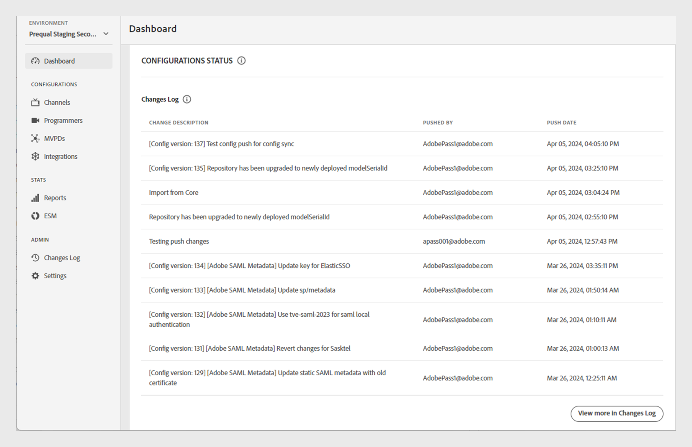

# Dashboard {#dashboard}

The Dashboard section in the left panel serves as the homepage of the Adobe Pass Authentication TVE Dashboard. 

There are two sections available on the homepage:

* Welcome screen
* Configuration Status

## Welcome screen {#welcome}

In this section you can access the public documentation directly from the welcome message and view a snapshot of your current configurations that includes:

* Active integrations: The total number of active integrations in the current environment. Select **View more in integration section** to access detailed information in the [Integrations](tve-dashboard-integrations.md) section.
* Active channels: The total number of active channels in the current environment. Select **View more in Channels section** to access detailed information in the [Channels](tve-dashboard-channels.md) section.
* Database updates: The number of configuration changes made to in the current environment. Select **View more in Changes Log section** to access detailed information in the [Changes Log](tve-dashboard-changes-log.md) section.
* ESM dashboard: Stay tuned for the upcoming ESM Dashboard, which will provide advanced metrics about property usage in the current environment. This feature will be available in future releases.

*Welcome screen*

## Configuration Status {#conf-status}

This section presents 10 most recent configuration changes listed in a tabular format that includes:

* **Change log**: A brief description of the change selected by the user.
* **Pushed by**: The account responsible for the change.
* **Push date**: The date when the change was made.

*List of changes log*

To view the complete list of changes, select **View more in Changes Log** at the lower-right to navigate to the [Changes Log](tve-dashboard-changes-log.md) section. 
