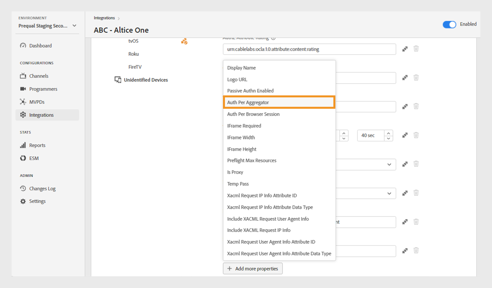

# Integrations

>[!NOTE]
>
>The content on this page is provided for information purposes only. Usage of this API requires a current license from Adobe. No unauthorized use is permitted.

The **Integrations** section of the TVE Dashboard allows you to view and manage settings for the integrations between your channels and MVPDs. You can also [create a new integration](#create-new-integration) as per your requirement.

The **Integrations** tab in the left panel displays a list of existing integrations with the following details:

* Status indicating whether the integration is currently active or inactive
* Integration linking specific channels with respective MVPDs
* Channel name with channel ID
* MVPD name with MVPD ID

*List of existing Integrations*

Type the name of the channel or MVPD in the **Search** bar above the list to know more about the integration.

## Manage integration configurations {#manage-integration-conf}

Follow these steps to manage a specific integration.

1. Select the **Integrations** tab in the left panel. 
1. Select an integration from the provided list to view and edit various settings in the following sections:

   * [Endpoint Selection](#endpoint-selection)
   * [Platform Settings](#platform-settings)
   * [User Metadata](#user-metadata)

>[!IMPORTANT]
>
> View [Review and push changes](/help/authentication/tve-dashboard-review-push-changes.md) for more information on activating the configuration changes. 

### Endpoint selection {#endpoint-selection}

This section enables you to choose the endpoints that the MVPD can use for authentication, authorization, and logout flows from the respective dropdown menus.

   

   *Endpoints for authentication, authorization, and logout flows*

>[!NOTE]
>
>MVPDs can provide one or multiple endpoints for each flow. When integrating a new channel, the MVPD must specify their preferred endpoint for each flow.
 
>[!IMPORTANT]
>
>Any change to endpoints will impact the overall behavior of an integration. These changes should only be implemented after receiving confirmation from the MVPD.

### Platform settings {#platform-settings}

This section allows you to view and edit integration settings across all [platforms](/help/authentication/tve-dashboard-reports.md#platforms). You can change these settings based on individual platforms. For example, you can adjust the Authorization TTL duration on Android while maintaining a default value for another platform.

Each property in platform settings inherit a default value set by the MVPD but can be adjusted if necessary. 

>[!IMPORTANT]
>
>An agreement with the MVPD is required to determine values set for each property in platform settings.

>[!IMPORTANT]
>
> The settings inheritance follows a chain starting from MVPD settings (which are the most general), then MVPD Endpoint, Integration, and Platform (which holds the most specific value).

**Platform Settings** is used to override settings for a specific category of platforms. The available platforms are grouped as follows: 

* **Default for All**: Set values  for properties applicable universally across all platforms if specific platform values are not defined, regardless of the Programmer's implementations.

* **Desktop Devices**: Set values for properties applicable to all desktop and laptop computers, irrespective of the programming method (JS SDK or REST API).

* **Mobile Devices**: Set values for properties applicable to all mobile devices, such as **iOS** and **Android**, regardless of the programming approach (SDK or REST API).

* **TV Connected Devices**: Set values for properties applicable to all TV connected devices, such as **tvOS**, **Roku**, and **FireTV**, irrespective of the programming method (SDK or REST API).

* **Unidentified Devices**: Set values for properties applicable to all devices where the current mechanism can't accurately identify the platform. In such cases, apply the most restrictive rules defined by the MVPD.

   

   *Category of platforms and their devices*

#### Most used business flows {#most-used-flows}

The **Platform Settings** section offers a range of properties used in different business flows. The actual properties may vary depending on the MVPDs selected in the specific integration. Following are the most used flows:

**AuthN TTL and AuthZ TTL across all platforms**

>[!IMPORTANT]
>
>Authentication (AuthN) TTL and Authorization (AuthZ) TTL values must consistently align with MVPD settings.

Follow these steps to change authentication and authorization TTL across all platforms for a specific integration.

1. Select the **Integrations** tab in the left panel.
1. Select the integration for which you want to change AuthN TTL and AuthZ TTL values.
1. Navigate to the **Platform Settings** section.

1. Select **Default for All** tab under **Platform Settings**.

   >[!NOTE]
   >
   >If you want to change the duration of **AuthN TTL** and **AuthZ TTL** for a specific platform, select the platform accordingly.

   

   *Change AuthN TTL AuthZ TTL duration across all platforms*

   **A.** AuthN TTL property **B.** AuthZ TTL property 

1. Select the upward and downward arrows to adjust the duration for the number of days, hours, minutes, and seconds in the **AuthN TTL** and **AuthZ TTL** properties.

The duration for **AuthN TTL** and **AuthZ TTL** across all platforms will be updated only after [review and push changes](/help/authentication/tve-dashboard-review-push-changes.md).

**Enable platform SSO**

>[!IMPORTANT]
>
>**Enable Single Sign On** property is exclusively supported on *iOS, tvOS, Roku, and FireTV* platforms. It's only applicable to integrations with MVPDs that support Single Sign On for these platforms.

Follow these steps to enable or disable SSO for a specific integration and platform.

1. Select the **Integrations** tab in the left panel.
1. Select the integration for which you want to enable or disable single sign on.

1. Navigate to the **Platform Settings** section.

1. Select a specific platform or category of platforms for which you want to enable single sign on under **Platform Settings**.

   

   *Enable Single Sign On for a specific platform*

    **A.** Single Sign On property **B.** Enforce Platform Permissions property

1. Select **Yes** to enable or **No** to disable from the **Enable Single Sign On** dropdown menu.

1. Select **Yes** to enable or **No** to disable from the **Enforce Platform Permission** dropdown menu.

   **Enforce Platform Permission** property controls if the user's decision to **Allow** or **Deny** platform access to their TV Provider subscription is respected. 
   
   For example, if both the **Enable Single Sign On** and **Enforce Platform Permission** are enabled, and the user opts to deny platform access to their TV Provider subscription, then the respective application (channel) will be unable to use the Adobe Pass Authentication token obtained by another application (channel).

The **Single Sign On** property for a selected platform will be enabled or disabled only after [review and push changes](/help/authentication/tve-dashboard-review-push-changes.md).

**Enable home-based authentication**

Follow these steps to enable or disable home-based authentication for OAuth2 based MVPDs.

1. Select the **Integrations** tab in the left panel.
1. Select the integration for which you want to enable or disable home-based authentication.
1. Navigate to the **Platform Settings** section.
1. Select a specific platform or category of platforms for which you want to enable home-based authentication under **Platform Settings**.

   

   *Enable home-based authentication for a specific platform*

    **A.** Attempt HBA property **B.** HBA AuthN TTL property

1. Select **Yes** to enable and **No** to disable from the **Attempt HBA** dropdown menu. 

>[!IMPORTANT]
>
>Changing the duration of **HBA AuthN TTL** property should be avoided. It could potentially result in unexpected failures in the authorization process.

The **Attempt HBA** property for a specific MVPD will be enabled or disabled only after [review and push changes](/help/authentication/tve-dashboard-review-push-changes.md).

#### Add more properties {#add-more-properties}

The **Add more properties** allows the flexibility to include additional specific properties for integrations, particularly for less common flows. 

You can add these properties:

* For all platforms, select **Default for all** tab on the left.
* For a category of platform, select **Desktop Devices**, **Mobile Devices**, or **TV Connected Devices** tab on the left.
* For a specific device, select **iOS**, **Android**, **tvOS**, **Roku**, or **FireTV** tab on the left.

Here are some examples of different flows that can be enabled by adding these properties:

**Change the number for pre-authorized resources**

Most MVPDs support a preflight authZ call using up to 5 resource IDs by default.
However, in cases where MVPDs agree to raise this limit, you can navigate to the **Add more properties** and select **Preflight Max Resources** from the options menu. 

**Preflight Max Resources** will add a new attribute where the agreed limit with the MVPD can be specified.

   

   *Add Prefix Max Resources property*

The **Preflight Max Resources** property will be added only after [review and push changes](/help/authentication/tve-dashboard-review-push-changes.md).

**Change MVPD display name or logo URL**

For programmer applications that don't want to build their MVPD picker and instead rely on provided configurations, you can navigate to the **Add more properties** and select **Display Name** or **Logo URL** to add the required display name or logo URLs for each MVPD from the options menu.

Different values for these properties can be used for the same MVPD depending on the device platform and the desired user experience.

   

   *Add Display Name or Logo URL property*

The **Display Name** or **Logo URL** property will be added only after [review and push changes](/help/authentication/tve-dashboard-review-push-changes.md).

**Request a new authentication flow upon app (channel) switching**

If you want to force a new authentication when users switch between apps. In that case, you can navigate to the **Add more properties**, select the **Auth per Aggregator** property.

Adding **Auth per Aggregator** effectively breaks single sign on for the respective channel.

   

   *Add Auth Per Aggregator property*

The **Auth per Aggregator** property will be added only after [review and push changes](/help/authentication/tve-dashboard-review-push-changes.md).

Once added, select **Yes** to enable **Auth per Aggregator** property for a selected integration.

#### Delete properties {#delete-properties}

Select  icon located to the right of each property to delete the properties that are no longer required.

>[!NOTE]
>
>Certain properties cannot be removed as they are mandatory requirements for the selected MVPD.

The property will be deleted from the **Platform settings** section only after [review and push changes](/help/authentication/tve-dashboard-review-push-changes.md).

### User metadata {#user-metadata}

This section allows you to update settings for each user metadata parameters shared by the MVPD.

>[!NOTE]
>
>Each MVPD may share different parameters. For more information on the parameters a specific MVPD can share, please reach out to your Adobe representative.

The user metadata section displays the following columns:

**Key**: Represents the actual user metadata parameters to be used in the API to extract values. 

**Description**: Provides a brief description of each user metadata parameter.

**Encrypted**: This column allows you to enable or disable **User metadata** certificate by selecting **Yes** or **No** respectively from the dropdown menu. Opting for **Yes** indicates that the parameter value will encrypted in the API. The encryption is performed using a certificate defined by a **User metadata** scope. For example, you should always encrypt **zip** parameter.

Learn more about available certificates in [Programmers](/help/authentication/tve-dashboard-programmers.md#available-certificates) and [Channels](/help/authentication/tve-dashboard-channels.md#available-certificates) sections. 

**Enabled**: This column allows you to enable or disable the parameters in the API by selecting **Yes** or **No** respectively from the dropdown menu.

   

   *Parameters available for User Metadata*

## Create new integration {#create-new-integration}

To create a new integration with a new MVPD on your current setup, follow these steps:

1. Select the **Integrations** tab in the left panel.
1. Select **Create new integration** at the upper-right of the **Integrations** section.

    

   *Create a new integration*

   The following sections are displayed:

   **Select Channel and MVPD** 

   Select a **Channel** from the **Select Channel** dropdown menu to add a new integration. Once you've selected the channel, select the required **MVPD** from the **Select MVPD** dropdown menu to be integrated with the selected channel.

     

     *Select Channel and MVPD*

   **Select endpoints** 

   After selecting the required MVPD, **Select endpoint**  section will be pre-populated with the default endpoints configured for that particular MVPD. 

   >[!IMPORTANT]
   >
   >Don't change the default endpoints in any flow unless stated specifically by the MVPD.

   

   *Select endpoints*

   **Additional information**

   This section includes various properties that need to be configured for the selected MVPD in the **Select Channel and MVPD** section. 

   >[!NOTE]
   >
   > The actual properties may differ depending on the MVPDs selected in the **Select Channel and MVPD** section.

   For example, you can edit the **AuthN TTL** or **Partner ID** (Channel ID) for co-branding purposes on the MVPD login page in the following image. 

   

   *Edit Aditional information*

   Select **Save integration** at the upper-right of the **Create new integration** section.

A new integration will be created only after [review and push changes](/help/authentication/tve-dashboard-review-push-changes.md).

## Disable integration {#disable-integratgion}

To disable an integration, follow these steps:

1. Select the **Integrations** tab in the left panel.
1. Select the integration you want to disable.
1. Disable the toggle available at the top-right of the selected integration. 

   

   *Disable integration*

The integration will be disabled only after [review and push changes](/help/authentication/tve-dashboard-review-push-changes.md).

After the integration is disabled, end users will lose the ability to authenticate or authorize using the specific MVPD.

