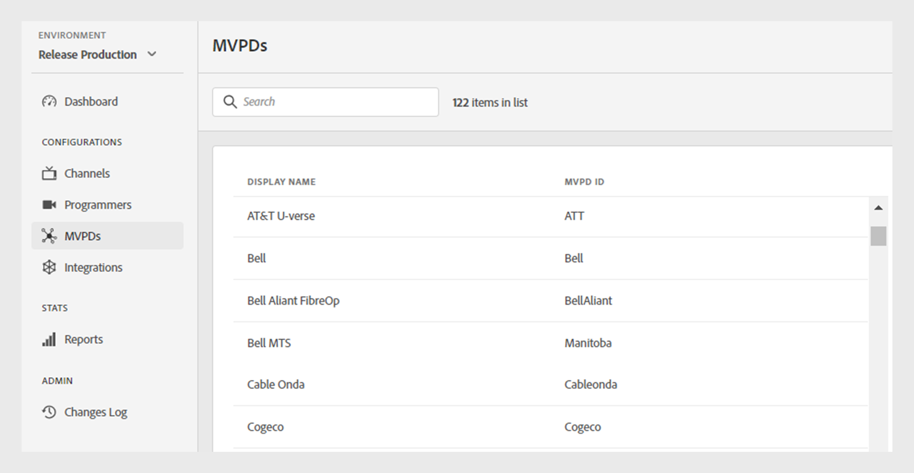

# MVPDs

The MVPDs section of the TVE Dashboard allows you to view a list of integrated MVPDs in the Adobe Pass Authentication ecosystem.

The **MVPDs** tab in the left panel displays a list of MVPDs with the following details:

* **Display name**: The commercial name of the MVPD used in the user selection.

* **MVPD ID**: A unique ID of MVPD used to set up a new integration in the system.

*List of integrated MVPDs*

To check for an active integration of a specific MVPD, enter the display name in the **Search** bar at the top of the list.
