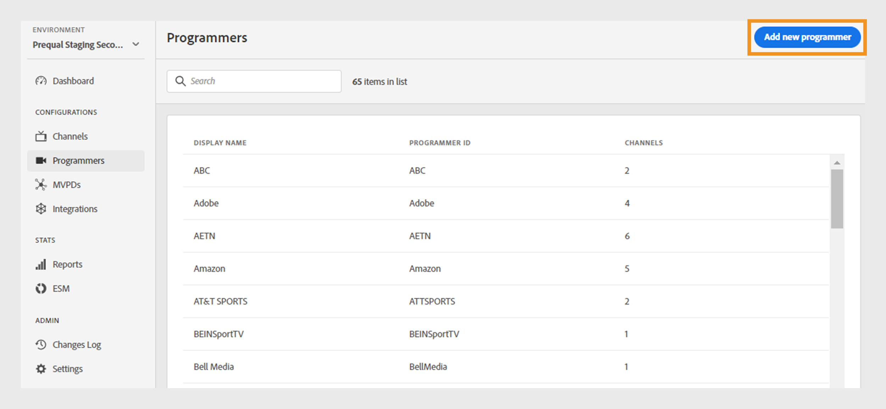

# Programmers {#programmers}

The Programmers section of the TVE Dashboard allows you to view and manage settings for the [programmers](/help/authentication/glossary.md#programmer) associated with your account entitlements. You can also [add a new programmer](#add-new-programmer) as per your requirement.

The **Programmers** tab in the left panel displays a list of existing programmers with the following details:

* **Programmer ID**: A media company identifier within the system.
* **Channels**: The number of associated channels linked to a programmer.

*List of existing programmers*

To locate a specific programmer, enter the display name in the **Search** bar at the top of the list.

## Manage programmer configurations {#manage-programmer-conf}

To manage various settings of a specific Programmer:

1. Navigate to the **Programmers** tab in the left panel.
1. Select a required programmer from the list. 
1. Select one of the following tabs to view and edit corresponding settings of the selected programmer.

   * [Channels](#channels)
   * [Certificates](#certificates)
   * [Registered Applications](#registered-applications)
   * [Custom Schemes](#custom-schemes)

   

   *Programmer settings*

>[!IMPORTANT]
>
> To activate the configuration changes for each setting, view [Review and push changes](/help/authentication/tve-dashboard-review-push-changes.md). 

### Channels {#channels}

This tab displays a list of channels linked with a current programmer. Select a specific channel from this list to access detailed information in the [Channels](/help/authentication/tve-dashboard-channels.md) section.

To add a new channel for the selected programmer, select **Add new channel** from the upper-right corner of **Available Channels** section. Learn [how to add a new channel](/help/authentication/tve-dashboard-channels.md#add-new-channel).

   

   *Add a new channel*

### Certificates {#certificates}

This tab displays a list of [available certificates](#available-certificates) used in the authentication flow, providing key details about each certificate. The details include:

* The status (whether enabled for *user metadata encryption* usage or not) 
* Serial number
* Name of the issuer organization 
* Name of the subject organization
* Activation date
* Expiry date 
* A dropdown menu to encrypt user metadata (If you select **Yes**, the certificate will encrypt sensitive user information, such as zip code values).

#### Available certificates {#available-certificates}

These certificates serve as Private/Public Keys and are used for validation purposes. All channels associated with the same media company can use these certificates.

You can make the following changes to available certificates:

* [Add new certificate](#add-new-certificate)
* [Delete certificate](#delete-certificate)

##### Add new certificate {#add-new-certificate}

To add a new certificate, follow these steps:

1. Select **Add new certificate** at the top of the **Programmers** section.

   

   *Add a new certificate*

1. Paste the public key of your certificate in the **New certificate** dialog box.
1. Select **Add certificate**.

>[!NOTE]
>
>A new local configuration change is pending and ready to be pushed to the server. The **Available Certificates** section will display the added certificate only after [review and push changes](/help/authentication/tve-dashboard-review-push-changes.md).

To activate a new certificate, navigate to the list of **Available certificates** and select **Yes** from **Used to encrypted user metadata** dropdown menu.

##### Delete certificate {#delete-certificate}

To delete a certificate, follow these steps:

1. Hover over the desired certificate you want to delete from the list of **Available certificates**.
1. Select **Remove**.

   

   *Remove the selected certificate*

1. Select **Delete** from the **Delete certificate** dialog box.

>[!NOTE]
>
>A new local configuration change is pending and ready to be pushed to the server. The certificate will be deleted from the **Available certificates** section only after [review and push changes](/help/authentication/tve-dashboard-review-push-changes.md).

The deleted certificate will no longer be available for use.

### Registered Applications {#registered-applications}

This tab provides a list of application registrations. For more details, view [Dynamic client registration management](/help/authentication/dynamic-client-registration-management.md).

### Custom Schemes {#custom-schemes}

This tab displays a list of custom schemes. For more details, view [iOS/tvOS application registration](/help/authentication/iostvos-application-registration.md) and [Dynamic client registration management](/help/authentication/dynamic-client-registration-management.md)

## Add new programmer {#add-new-programmer}

To add a new programmer entity, follow these steps:

1. Go to the **Programmers** tab in the left panel.
1. Select **Add new programmer** at the top of the **Programmers** section.

   

   *Add a new programmer*

1. Enter a media company identifier in **Programmer ID** in the **New programmer** dialog box.
1. Enter a commercial brand name you want to be shown in the console under **Display name**. 
1. Select **Add programmer**.

>[!NOTE]
>
>A new local configuration change is pending and ready to be pushed to the server. The **Programmers** section will display the added programmer only after [review and push changes](/help/authentication/tve-dashboard-review-push-changes.md).

