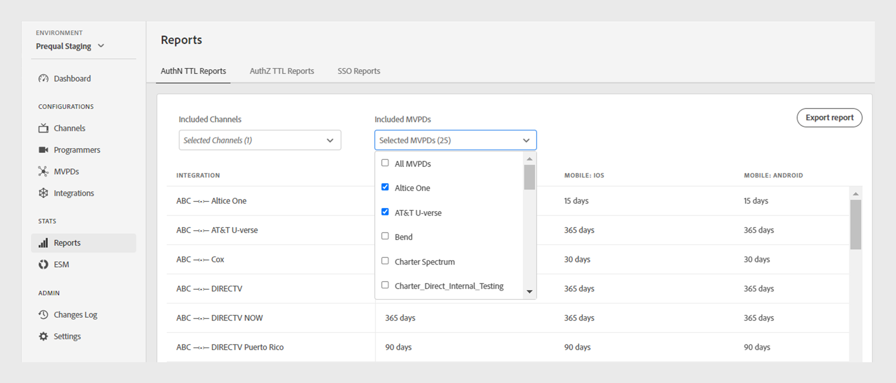

# Reports {#Reports}

The Reports section of the TVE Dashboard provides access to aggregated data for various reports. These reports include your channel integrations with different MVPDs across all [platforms](#platforms).

You can filter data and gather insights across [specific Channels or MVPDs](#selecting-specific-channels-mvpds) and export reports in a CSV file for further analysis.

The **Reports** tab in the left panel presents [AuthN TTL Reports](#authn-ttl-reports) by default. To access other reports, select the following tabs at the top of the **Reports** section:

* [AuthZ TTL Reports](#authz-ttl-reports)
* [SSO Reports](#sso-reports)

## AuthN TTL reports {#authn-ttl-reports}

The AuthN TTL reports, also referred as authentication token Time-To-Live (TTL), displays the duration of the authentication token configured for your Channels integrations with various MVPDs across all [platforms](#platforms). These reports allow you to visually inspect the amount of time a user remains authenticated for a specific MVPD and platform, with values presented in user-friendly formats like **days**, **hours**, **minutes**, and **seconds**. The AuthN TTL Reports table is designed with scrollable horizontal and vertical pages to accommodate various screen sizes.

>[!IMPORTANT]
>
> The **Set by MVPD** placeholder is used when the MVPD enforces the AuthN TTL value rather than the Adobe Pass Authentication configuration.

You can also view and download data for [specific channels or MVPDs](#selecting-specific-channels-mvpds).

*Export AuthN TTL Reports*

Select **Export reports** to save the data in a CSV file on your local machine.

## AuthZ TTL reports {#authz-ttl-reports}

The AuthZ TTL reports, also referred to as authorization token Time-To-Live (TTL), displays the duration of the authorization token configured for your Channels integrations with various MVPDs across all [platforms](#platforms). These reports allow you to visually inspect the amount of time a user remains authorized to watch content for a specific MVPD and platform, with values presented in user-friendly formats like **days**, **hours**, **minutes**, and **seconds**. The AuthZ TTL Reports table is designed with scrollable horizontal and vertical pages to accommodate various screen sizes.

>[!IMPORTANT]
>
> The **Set by MVPD** placeholder is used when the MVPD enforces the AuthZ TTL value rather than the Adobe Pass Authentication configuration.

You can also view and download the data for [specific channels or MVPDs](#selecting-specific-channels-mvpds).

*Export AuthZ TTL Reports*

Select **Export reports** to save the data in a CSV file on your local machine. 

## SSO Reports {#sso-reports}

The SSO reports, also referred as Single Sign-On, displays the single sign-on status configured for your Channels integrations with various MVPDs across all [platforms](#platforms). These reports allow you to visually inspect the expected user authentication SSO experience for a specific MVPD and platform, with values presented as a tri-state like **SSO Disabled**, **SSO Enabled**, and **SSO Uncertain**. The SSO Reports table is designed with scrollable horizontal and vertical pages to accommodate various screen sizes.

>[!IMPORTANT]
>
> The **SSO Uncertain** placeholder is used where Single Sign-On (SSO) is enabled and possible. But the following settings might prevent SSO authentication that are explained in the examples below:
>
> * User platform settings: The option to block third-party cookies.
> * User decisions: The users deny platform access to their TV provider subscription.
> * MVPD settings: MVPD requests authentication for each channel.

You can also view and download data for [specific channels or MVPDs](#selecting-specific-channels-mvpds).

*Export SSO Reports*

Select **Export reports** to save the data in a CSV file on your local machine.

## Platforms {#platforms}

The [AuthN TTL Reports](#authn-ttl-reports), [AuthZ TTL Reports](#authz-ttl-reports), and [SSO Reports](#sso-reports) present data across various platforms in a tabular format. These platforms include:

* **DESKTOP**: Displays values that are applied to the programmer implementations over the Adobe Pass Authentication JavaScript SDK.

* **MOBILE: IOS**: Displays values that will be applied to the programmer implementations over the Adobe Pass Authentication iOS SDK.

* **MOBILE: ANDROID**: Displays values that are applied to the programmer implementations over the Adobe Pass Authentication Android SDK.

* **MOBILE: OTHERS**: Displays values that are applied to the programmer implementations over the Adobe Pass Authentication REST API developed for mobile devices.

* **TVCD: ROKU**: Displays values that are applied to the programmer implementations over the Adobe Pass Authentication REST API and that are sending Roku as a device type.

* **TVCD: FIRETV**: Displays values that are applied to the programmer implementations over the Adobe Pass Authentication FireTV SDK.

* **TVCD: APPLETV**: Displays values that are applied to the programmer implementations over the Adobe Pass Authentication tvOS SDK.

* **TVCD: OTHERS**: Displays values that are applied to the programmer implementations over the Adobe Pass Authentication REST API developed for TV connected devices.

* **PLATFORM: UNIDENTIFIED** Displays values that are applied to the Programmer implementations for which Adobe Pass Authentication services detect an unknown device type.

To learn more about how to share the desired device type, such as **Roku** with Adobe Pass Authentication REST APIs or SDKs, view the mechanism of [passing client information](/help/authentication/passing-client-information-device-connection-and-application.md).

>[!IMPORTANT]
>
> The data aggregated is based on the specific configuration of each Adobe Pass Authentication environment. When switching between different TVE Dashboard environments, expect variations in the data across reports. Refer to the [Adobe Pass Authentication environments](/help/authentication/tve-dashboard-environments.md) to know more. 

## Selecting specific channels and MVPDs {#selecting-specific-channels-mvpds} 

The [AuthN TTL Reports](#authn-ttl-reports), [AuthZ TTL Reports](#authz-ttl-reports), and [SSO Reports](#sso-reports) present data for **All Channels** integrations with **All MVPDs** by default.

>[!NOTE]
>
> If you deselect **All Channels** or **All MVPDs** in the respective dropdown menus, a message is displayed to make a selection to view meaningful reports.

To generate a report for specific channels:

1. Select the **Included Channels** dropdown menu at the top of the required report.
1. Deselect **All Channels**.
1. Select the required channels listed in the **Included Channels** dropdown menu for which you want to generate data.

   

   *Select the required channels*

>[!NOTE]
>
> To have options available in the **Included MVPDs** dropdown menu, you must select at least one channel in the **Included channels** dropdown menu.

To generate a report for specific MVPDs:

1. Select the **Included MVPDs** dropdown menu at the top of the required report.
1. Deselect **All MVPDs**.
1. Select the required MVPDs listed in the **Included MVPDs** dropdown menu for which you want to generate data.

   

   *Select the required MVPDs*

