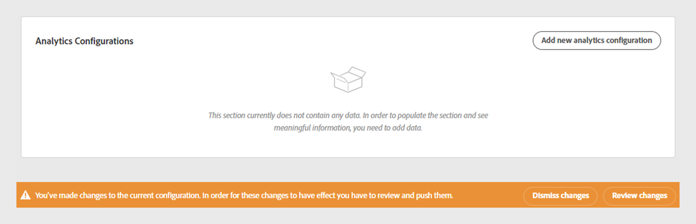

# Review and push changes

TVE Dashboard allows you to review the changes made to the current configurations and then push it live to the server. Each time you make changes in your current configurations, the screen shows a warning message to review changes at the bottom of the screen.

*Warning message to Review changes*

To review and push changes, follow these steps:

1. Select **Review changes** at the lower-right corner of the screen. 
1. Add a brief decription about the change in **Configuration Description**.

   

   *Add Configuration description*

1. Navigate to the **Configuration Changes** section.
1. Hover over each entry and select **View** to review old values and new values.
 
   

   *Select view to review Configuration changes*
   
1. Once you have reviewed all the changes, you have two options :

* If everything looks correct, select **Push Changes** to apply the configuration to the server.

   >[!NOTE]
   >
   >The **Push Changes** button will be activated only after you've entered a description for the change.

* If you want to go back to the previous configuration, select **Dismiss Changes**.

