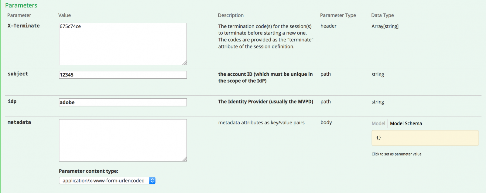
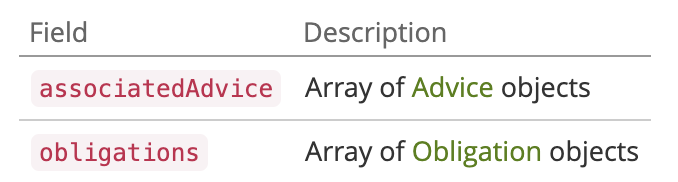

# API Overview {#api-overview}

View the [online API documentation](https://streams-stage.adobeprimetime.com/swagger-ui/index.html) for more details.

## Purpose and Prerequisites {#purpose-prerequisites}

This document assists application developers in using our Swagger API specification when implementing an integration with Concurrency Monitoring. It is highly recommended that the reader has a previous understanding of the concepts defined by the service before following this guideline. In order to have this understanding, it is necessary to have an overview of the [product documentation](../cm-home.md) and the [Swagger API specification](https://streams-stage.adobeprimetime.com/swagger-ui/index.html).

## Introduction {#api-overview-intro}

During the development process, the Swagger public documentation represents the reference guideline in understanding and testing the API flows. This is a great place to start in order to have a hands-on approach and get familiar with the way real world applications would behave in different scenarios of user interaction.

Submit a ticket in [Zendesk](mailto:tve-support@adobe.com) to register your company and applications in Concurrency Monitoring. Adobe will assign an application ID to each entity. In this guide we will use two reference applications with ids **demo-app** and **demo-app-2** which will be under the tenant Adobe.

### First application {#first-app-use-cases}

Application with id **demo-app** has been assigned by Adobe team a policy with one rule that restricts the number of concurrent streams to 3. A policy is assigned to a specific application based on the request submitted in Zendesk.

#### Retrieving metadata {#retrieve-metadata-use-case}

The first call we make is for the Metadata resource in order to obtain the list of metadata attributes needed to be passed as form data during session initialization. This metadata will be used to evaluate the policies assigned for this application.

```http
# Request
user = 'demo-app'
pass = ''
curl -i -u ${user}:%{pass} http://streams-stage.adobeprimetime.com/v2/metadata

# Response Code
200
# Response Body
[]
```

As we can see from the response body field, the list of metadata attributes is empty. This means that the attributes required by design are sufficient to evaluate the 3 streams policy assigned to this application. See also, the [Standard Metadata Fields documentation](../technical/standard-metadata-attributes.md). After this call, we can go on and create a new session on the Sessions REST resource.

#### Session initialization {#session-initial}

The session initialization call is done by an application after acquiring all the necessary information needed to perform it.

```http
# Request
user = 'demo-app'
pass = ''
curl -i -X POST -u ${user}:%{pass} http://streams-stage.adobeprimetime.com/v2/sessions/adobe/12345
```


There is no need to provide any termination code on the first call because we do not have any other active streams. And no metadata attribute because none was returned from the Retrieving Metadata call.

The **subject** and the **idp** parameters are mandatory, they will be specified as URI path variables. You can obtain the **subject** and **idp** parameters by making a call for the **mvpd** and **upstreamUserID** metadata fields from Adobe Pass Authentication. See also, the [overview of Metadata APIs](https://experienceleague.adobe.com/docs/primetime/authentication/auth-features/user-metadat/user-metadata-feature.html?lang=en#). For this example we will provide the value "12345" as the subject and "adobe" as the idp.

```
# Response Code
  202
# Response Body
  no content
# Response Headers
  {
    "cache-control": "no-store",
    "content-length": "0",
    "date": "Tue, 01 Jan 2022 12:00:00 GMT",
    "expires": "Tue, 01 Jan 2022 12:01:00 GMT",
    "location": "76378b50-4eb0-43b4-b144-51cb62d85563", 
    "content-type": null
  }
```

All the data we need is contained in the response headers. The **Location** header represents the id of the new created session and the **Date** and **Expires** headers represent the values used to schedule your application to make the next heartbeat in order to keep the session alive.

With every call you are allowed to send any metadata that you need, not only the mandatory metadata for you application. Sending metadata can be achieved in 2 ways:
* using **query** **parameters**:

  ```sh
  curl -i -XPOST -u "user:pass" "https://streams-stage.adobeprimetime.com/v2/sessions/some_idp/some_user?metadata1=value1&metadata2=value2"
  ```

* using **request** **body**:

  ```sh
  curl -i -XPOST -u "user:pass" https://streams-stage.adobeprimetime.com/v2/sessions/some_idp/some_user -d "metadata1=value1" -d "metadata2=value2" -H "Content-Type=application/x-www-form-urlencoded"
  ```

#### Heartbeat {#heartbeat}

Make a heartbeat call. Provide the **session id** obtained in the session initialization call, along with the **subject** and **idp** parameters used.

```http
# Request
user = 'demo-app'
pass = ''
curl -i -X POST -u ${user}:%{pass} http://streams-stage.adobeprimetime.com/v2/sessions/adobe/12345/76378b50-4eb0-43b4-b144-51cb62d85563
```

For heartbeat call you are allowed to send metadata in the same way you're doing for session init. One can add anytime new metadata and can update previously sent values with some **exceptions**. The following values, once set, cannot be changed: **package**, **channel**, **platform**, **assetId**, **idp**, **mvpd**, **hba_status**, **hba**,
**mobileDevice**

If the session is still valid (it has not expired or has been manually deleted), you will receive a successful result:

```
# Response Code
  202
# Response Body
  no content
# Response Headers
  {
    "cache-control": "no-store",
    "content-length": "0",
    "date": "Tue, 01 Jan 2022 12:00:00 GMT",
    "expires": "Tue, 01 Jan 2022 12:01:00 GMT",
    "content-type": null
  }
```

As in the first case, we will use the **Date** and **Expires** headers to schedule another heartbeat for this particular session. If the session is no longer valid, this call will fail with a 410 GONE HTTP Status code.

You can use the "Keep the stream alive" option available in the Swagger UI in order to execute automatic heartbeats on a specific session, this can help you test a rule without having to worry about the boilerplate needed to do timely session heartbeats. This button is placed alongside the "Try it out" button in the Swagger Heartbeat tab. To set an automatic heartbeat for all the sessions created, you need to have them scheduled each one in a separate Swagger UI opened in a web browser tab.


#### Session Termination {#session-termination}

Your company's business case might require Concurrency Monitoring to terminate a specific session when, for example, a user stops watching a video. This can be done by making a DELETE call on the Sessions resource.


```http
# Request
user = 'demo-app'
pass = ''
curl -i -X DELETE -u ${user}:%{pass} http://streams-stage.adobeprimetime.com/v2/sessions/adobe/12345/76378b50-4eb0-43b4-b144-51cb62d85563
```

Use the same parameters for the call as for the session heartbeat. The response HTTP status codes are:

* 202 ACCEPTED for a successful response
* 410 GONE if the session was already stopped.

#### Get all running streams {#get-all-running-streams}

This endpoint offers all currently running sessions for a specific tenant on all its applications. Use **subject** and **idp** parameters for the call:

```http
# Request
user = 'demo-app'
pass = ''
curl -i -X GET -u ${user}:%{pass} http://streams-stage.adobeprimetime.com/v2/runningStreams/{idp}/{user}
```

When you make the call you'll get the following response:

```http
# Response Code
  200 
# Response Body
  {
    "runningStreams": [
      {
        "sessionId": "76378b50-4eb0-43b4-b144-51cb62d85563",
        "startTime": 1738760521421,
        "applicationId": "demo-app",
        "applicationName": "Demo application",
        "terminationCode": "94c8f7d9",
        "metadata": {
          "package": "premium"  
        },
      }
    ]
  }
# Response Headers
  {
    "cache-control": "no-store",
    "content-type": "application/json;charset=utf-8",
    "date": "Tue, 01 Jan 2022 12:00:00 GMT",
    "expires": "Tue, 01 Jan 2022 12:01:00 GMT",
  }
```

For each sessions one will get the **terminationCode** and complete metadata.

Please note the **Expires** header. That is the time when the first session should expire unless a heartbeat is sent.
The metadata field will be populated with all the metadata sent when the session started. We do not filter it, you'll receive everything you sent.
The response include all streams running on other tenants' apps as long as the apps are sharing the same policy.
If there are no running sessions for a specific user when you do the call you'll get this response:

```http
# Response Code
  200 
# Response Body
  {
    "runningStreams": [],
    "otherStreams": 0
  }
# Response Headers
  {
    "cache-control": "no-store",
    "content-type": "application/json;charset=utf-8",
    "date": "Tue, 01 Jan 2022 12:00:00 GMT",
  }
```

Also note that in this case the **Expires** header is not present.

In case that a session was created killing another one, using **X-Terminate** header, under metadata you'll find field **superseded**. It's value is an indicator of the session killed to make room for the current one.

```http
# Response Code
  200 
# Response Body
  {
    "runningStreams": [
      {
        "sessionId": "76378b50-4eb0-43b4-b144-51cb62d85563",
        "startTime": 1738760521421,
        "applicationId": "demo-app",
        "applicationName": "Demo application",
        "terminationCode": "c424312e",
        "metadata": {
          "superseded": "ab1a9d54",
          "package": "premium"  
        },
      }
    ]
  }
# Response Headers
  {
    "cache-control": "no-store",
    "content-type": "application/json;charset=utf-8",
    "date": "Tue, 01 Jan 2022 12:00:00 GMT",
    "expires": "Tue, 01 Jan 2022 12:01:00 GMT",
  }
```

#### Breaking the policy {#breaking-policy-app-first}

In order to simulate the behavior of our application when the 3 streams policy assigned to it is broken we need to make 3 calls for session initialization. For the policy to take effect, the calls need to be done before one of the session expires due to lack of heartbeats. We will see that these calls all succeed but if we make a 4th one it will fail with the following error:

```http
# Response Code
409 
# Response Body
  {
    "associatedAdvice": [
      {
        "type": "rule-violation",
        "message": "Number of active streams exceeded",
        "policyName": "demo-policy",
        "threshold": 4,
        "ruleName": "3 streams cap",
        "conflicts": {
          "76378b50-4eb0-43b4-b144-51cb62d85563" : [
            { 
              "terminationCode": "51fd351f", 
              "metadata": {
                "package": "premium",
                "show": "Friends" 
              },
              "channel": "Unknown",
              "startedAt": "2024-11-25T09:06:12.951Z",
              "deviceName": "Unknown",
              "applicationName": "Demo application"
            }
          ]
        }
      }
    ]
  }
```

We get a 409 CONFLICT response along with an evaluation result object in the payload. This indicates that the server-side policies do not allow this session to be created or to continue. The response body will contain an EvaluationResult object with a non-empty AssociatedAdvice, which is the list of Advice objects containing explanations for each rule violation.

The application should prompt the user with the error message(s) carried by each Advice instance. Also, every advice also indicates the rule details like attribute, threshold, rule and policy names. Moreover, the conflicting values will also be included with the list of active sessions for each value.

This information is intended for advanced error message formatting and for allowing the user to take action regarding the conflicting sessions.

Every conflicting session will carry a **terminationCode** that can be used for **killing** that stream. This way, the application may allow the user to choose what session(s) to terminate in order to try to gain access for the current session.

The application can use the information from the evaluation result to display a certain message to the user when stopping the video and to take further actions if needed. One use case can be to stop other existing streams in order to start a new one. This is done by using the **terminationCode** value present in the **conflicts** field for a specific conflicting attribute. The value will be provided as the X-Terminate HTTP header in the call for a new session initialization.



When providing one or more termination codes at session initialization the call will succeed and a new session will be generated. Then, if we try and make a heartbeat with one of the sessions that have been remotely stopped we will get a 410 GONE response back with an evaluation result payload that describes the fact that the session has been remotely terminated, like in the example:


```http
# Response Code
  410 
# Response Body
  {
    "associatedAdvice": [
      {
        "type": "remote-termination",
        "message": "This session was terminated by a remote user",
        "terminator": {
          "channel": "Unknown",
          "startedAt": "2024-11-25T09:06:12.951Z",
          "deviceName": "Unknown",
          "applicationName": "Demo application"
        }     
      }
    ],
    "obligations": []
  }
```

410 can be returned with or without a body, based on what caused the current session to be terminated.

When the response has no body, 410 means that a heartbeat (or termination) call is attempted for a session that is no longer active (due to timeout or a previous conflict or whatever). The only way to recover from this state is for the application to initiate a new session. Since there is no body, the application is supposed to handle this error without the user being aware of it.

On the other hand, when a response body is provided, the application needs to look within the **associatedAdvice** attribute to find a **remote-termination** advice that indicates the remote session that was initiated with an explicit intention of **killing** the current one. This should result in an error message like "Your session was kicked out by device/application".


### Response Body {#response-body}

For all the session lifecycle API calls, the the response body (when present) will be a JSON object containing the following fields:



**Advice**
The **EvaluationResult** will include an array of Advice objects under **associatedAdvice**. The advices are intended for the application to display a comprehensive error message for the user and (potentially) allow the user to take action.

Currently, there are two types of advices (specified by their **type** attribute value): **rule-violation** and **remote-termination**. The first one provides details regarding a rule that was broken and the sessions that are conflicting with the current one (including the terminate attribute that can be used to terminate that session remotely). The second is just stating that the current session was deliberately terminated by a remote one, so the users will know who kicked them out when the limits were reached. In case **superseded** is included in the metadata then the session in question was created using **X-Terminate** header.


**Obligation**
The evaluation may also contain one or more predefined actions that must be triggered by the application as a result of this evaluation.


### Second application {#second-application}

The other example application that we will be using is the one with id **demo-app-2**. This one has been assigned a policy with one rule that limits the number of streams available for a channel to a maximum of 2.   You must provide the channel variable in order to evaluate this policy.

#### Retrieving metadata {#retrieving-metadata}

Set the new application ID in the top right corner of the page and make a call to the Metadata resource. You will get the following response:


```http
# Request
user = 'demo-app-2'
pass = ''
curl -i -u ${user}:%{pass} http://streams-stage.adobeprimetime.com/v2/metadata

# Response Code
200
# Response Body
[
  "channel"
]
```

This time, the response body is no longer an empty list, like in the example of the first application. Now the Concurrency Monitoring Service states in the response body that the **channel** metadata is required at session initialization in order to evaluate the policy.

If you make a call without providing a value for the **channel** parameter, you will get:

* Response Code - 400 BAD REQUEST
* Response Body - an evaluation result payload that describes in the **obligations** field what is expected in the request for session initialization in order for the operation to succeed.


```http
# Response Code
  400 Bad Request
# Response Body
  {
    "associatedAdvice": [],
    "obligations": {
      "namespace": "adobe.primetime.cm",
      "action": "refresh",
      "arguments": [
        "metadata"
      ]   
    }
  }
```

#### Session initialization {#session-init}

Assign a value for the required metadata key and set it as a form parameter in the session initialization request, as shown below:

```http
# Request
user = 'demo-app-2'
pass = ''
curl -i -X POST -u ${user}:%{pass} http://streams-stage.adobeprimetime.com/v2/sessions/adobe/12345?channel=channel-1
```

Now the call will succeed and a new session will be generated.

#### Breaking the policy {#breaking-policy-second-app}

In order to break the rule that we have in the policy assigned to this application, we need to make 2 calls with the same channel value. Like in the first example, the second call needs to be done while the first session generated is still valid.


```http
# Response Code
  409 
# Response Body
  {
    "associatedAdvice": [
      {
        "type": "rule-violation",
        "message": "Number of streams per channel exceeded",
        "policyName": "Adobe/demo-policy-2",
        "ruleName": "2 per channel",
        "conflicts": {
          "76378b50-4eb0-43b4-b144-51cb62d85563" : [
            { 
              "terminationCode": "51fd351f", 
              "channel": "Unknown",
              "startedAt": "2024-11-25T09:06:12.951Z",
              "deviceName": "Unknown",
              "applicationName": "Demo application"
            }
          ]
        }
      }
    ]
  }
``` 

If we use different values for the channel metadata each time we create a new session all calls will succeed because the threshold of 2 is scoped to each value individually.

Like in the first example, we can use the termination code in order to remotely stop conflicting streams or we can wait for one of the streams to expire, assuming that no heartbeat will be operated on them.
