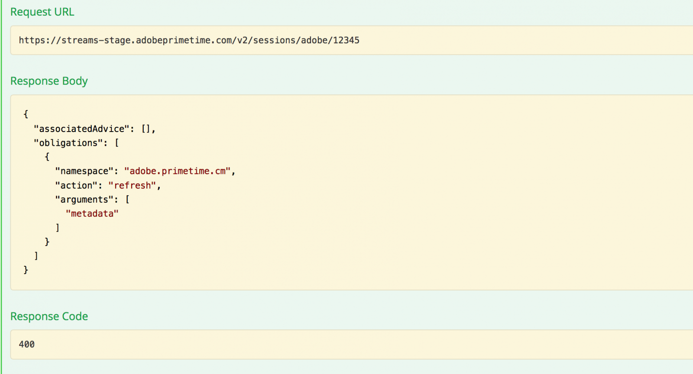

# API Overview {#api-overview}

View the [online API documentation](http://docs.adobeptime.io/cm-api-v2/) for more details.

## Purpose and Prerequisites {#purpose-prerequisites}

This document assists application developers in using our Swagger API specification when implementing an integration with Concurrency Monitoring. It is highly recommended that the reader has a previous understanding of the concepts defined by the service before following this guideline. In order to have this understanding, it is necessary to have an overview of the [product documentation](/help/concurrency-monitoring/cm-home.md) and the [Swagger API specification](http://docs.adobeptime.io/cm-api-v2/).

 
## Introduction {#api-overview-intro}

During the development process, the Swagger public documentation represents the reference guideline in understanding and testing the API flows. This is a great place to start in order to have a hands-on approach and get familiar with the way real world applications would behave in different scenarios of user interaction.

Submit a ticket in [Zendesk](mailto:tve-support@adobe.com) to register your company and applications in Concurrency Monitoring. Adobe will assign an application ID to each entity. In this guide we will use two reference applications with ids **demo-app** and **demo-app-2** which will be under the tenant Adobe.

 
## Use cases {#api-use-case}

The first step in testing a flow using Swagger is to enter the application id in the top right of the page like so: 

After this we press **Explore** to set the id that will be used in the Authorization header for all calls made to the REST API.  Every API call expects the application ID to be passed in via HTTP basic authentication. The username is the application id and the password is empty.

 
### First application {#first-app-use-cases}

Application with id **demo-app** has been assigned by Adobe team a policy with one rule that restricts the number of concurrent streams to 3. A policy is assigned to a specific application based on the request submitted in Zendesk.

 
#### Retrieving metadata {#retrieve-metadata-use-case}

The first call we make is for the Metadata resource in order to obtain the list of metadata attributes needed to be passed as form data during session initialization. This metadata will be used to evaluate the policies assigned for this application.

After pressing "Try it out", for the application with id **demo-app** we will get the following result:                      

As we can see from the response body field, the list of metadata attributes is empty. This means that the attributes required by design are sufficient to evaluate the 3 streams policy assigned to this application. See also, the [Standard Metadata Fields documentation](/help/concurrency-monitoring/standard-metadata-attributes.md). After this call, we can go on and create a new session on the Sessions REST resource.

 
#### Session initialization {#session-initial}

The session initialization call is done by an application after acquiring all the necessary information needed to perform it.

There is no need to provide any termination code on the first call because we do not have any other active streams. And no metadata attribute because none was returned from the Retrieving Metadata call.

The **subject** and the **idp** parameters are mandatory, they will be specified as URI path variables. You can obtain the **subject** and **idp** parameters by making a call for the **mvpd** and **upstreamUserID** metadata fields from Adobe Pass Authentication. See also, the [overview of Metadata APIs](https://experienceleague.adobe.com/docs/primetime/authentication/auth-features/user-metadat/user-metadata-feature.html?lang=en#). For this example we will provide the value "12345" as the subject and "adobe" as the idp.

Make the session initialization call. You will get the following response:

                                          

All the data we need is contained in the response headers. The **Location** header represents the id of the new created session and the **Date** and **Expires** headers represent the values used to schedule your application to make the next heartbeat in order to keep the session alive.

#### Heartbeat {#heartbeat} 

Make a heartbeat call. Provide the **session id** obtained in the session initialization call, along with the **subject** and **idp** parameters used.

If the session is still valid (it has not expired or has been manually deleted), you will receive a successful result: 

As in the first case, we will use the **Date** and **Expires** headers to schedule another heartbeat for this particular session. If the session is no longer valid, this call will fail with a 410 GONE HTTP Status code. 

You can use the "Keep the stream alive" option available in the Swagger UI in order to execute automatic heartbeats on a specific session, this can help you test a rule without having to worry about the boilerplate needed to do timely session heartbeats. This button is placed alongside the "Try it out" button in the Swagger Heartbeat tab. To set an automatic heartbeat for all the sessions created, you need to have them scheduled each one in a separate Swagger UI opened in a web browser tab.

#### Session Termination {#session-termination} 

Your company's business case might require Concurrency Monitoring to terminate a specific session when, for example, a user stops watching a video. This can be done by making a DELETE call on the Sessions resource.

                                       

Use the same parameters for the call as for the session heartbeat. The response HTTP status codes are:

* 202 ACCEPTED for a successful response 
* 410 GONE if the session was already stopped.
 
#### Breaking the policy {#breaking-policy-app-first}
 

In order to simulate the behavior of our application when the 3 streams policy assigned to it is broken we need to make 3 calls for session initialization. For the policy to take effect, the calls need to be done before one of the session expires due to lack of heartbeats. We will see that these calls all succeed but if we make a 4th one it will fail with the following error:
 

We get a 409 CONFLICT response along with an evaluation result object in the payload. Read a complete description of the evaluation result in the [Swagger API specification](http://docs.adobeptime.io/cm-api-v2/#evaluation-result).

The application can use the information from the evaluation result to display a certain message to the user when stopping the video and to take further actions if needed. One use case can be to stop other existing streams in order to start a new one. This is done by using the **terminationCode** value present in the **conflicts** field for a specific conflicting attribute. The value will be provided as the X-Terminate HTTP header in the call for a new session initialization.                                    

When providing one or more termination codes at session initialization the call will succeed and a new session will be generated. Then if we try and make a heartbeat with one of the sessions that have been remotely stopped we will get a 410 GONE response back with an evaluation result payload that describes the fact that the session has been remotely terminated, like in the example: 

### Second application {#second-application} 

The other example application that we will be using is the one with id **demo-app-2**. This one has been assigned a policy with one rule that limits the number of streams available for a channel to a maximum of 2.   You must provide the channel variable in order to evaluate this policy. 

#### Retrieving metadata {#retrieving-metadata}

Set the new application ID in the top right corner of the page and make a call to the Metadata resource. You will get the following response:

 

This time, the response body is no longer an empty list, like in the example of the first application. Now the Concurrency Monitoring Service states in the response body that the **channel** metadata is required at session initialization in order to evaluate the policy. 

If you make a call without providing a value for the **channel** parameter, you will get:

* Response Code - 400 BAD REQUEST
* Response Body - an evaluation result payload that describes in the **obligations** field what is expected in the request for session initialization in order for the operation to succeed. 

 

#### Session initialization {#session-init}

Assign a value for the required metadata key and set it as a form parameter in the session initialization request, as shown below: 

 

Now the call will succeed and a new session will be generated.

 
#### Breaking the policy {#breaking-policy-second-app}

In order to break the rule that we have in the policy assigned to this application, we need to make 2 calls with the same channel value. Like in the first example, the second call needs to be done while the first session generated is still valid.
 

If we use different values for the channel metadata each time we create a new session all calls will succeed because the threshold of 2 is scoped to each value individually.

Like in the first example, we can use the termination code in order to remotely stop conflicting streams or we can wait for one of the streams to expire, assuming that no heartbeat will be operated on them.
