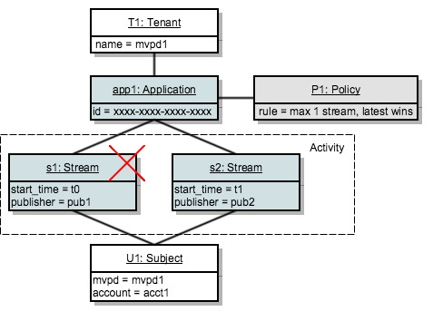

# Policy decision point {#policy-desc-pt}

## Domain model {#domain-model}

This page is meant to serve as a reference for different usecases and implementations of policies. We advise you to also consult the [Glossary](/help/concurrency-monitoring/cm-glossary.md) part of the documentation for term definitions. 

A **tenant** owns **applications** for which it wishes to enforce **policies**. **Client applications** must be configured with the **application ID** (provided by Adobe).

The tenant then associates each application with one or more policies, either created by him or created and shared by others. Policies can be linked between multiple tenants.

The **subject activity** consists of all the streams (no matter the application) that are reported to Concurrency Monitoring for a certain subject.

When a stream is to be authorized for a given subject, the system will first check all the policies defined for the application that created the stream.

For each of the applicable policies, we then need to collect all the **relevant activity** that will be passed to the rule. The **relevant activity** for a policy P will only include a stream S if it meets the following condition:

**Stream "S" is started by an application that includes policy "P" among its policies.**

 
## Dry Run Use Cases {#dry-run-use-cases}

The walkthrough below aims to validate the model against some use cases. We'll do that gradually, by starting with a basic setup and adding complexity in various ways. 

### 1. One tenant. One application. One policy. One stream {#onetenant-oneapp-onepolicy-onestream}

We'll start with a single tenant, with a single application and a single policy associated. Let's assume the policy states that there can be at most one active stream for any user (the latest stream is allowed to play).

Once a stream is started, the activity will only consist of that stream and it is allowed to play.

 

### 2. One tenant. One application. One policy. Two streams. {#onetenant-oneapp-onepolicy-twostreams}

Once a second stream is started (by the same subject using the same application), the activity used for validation will consist of both **s1** and **s2**.

The limit is exceeded because the policy states that only one stream is allowed to play, so we'll only allow the latest stream (**s2**) to play.

>[!NOTE]
>
>The diagrams represent the system view on the user activity. For stream initialization attempts, the access decision will be included in the response. For active streams the decision will be returned on the heartbeat response. 

### 3. Two tenants. Two applications. One policy. Two streams. {#twotenant-twoapp-onepolicy-twostreams}

Let's now assume that a new tenant wants to enforce the same policy in their applications:

Due to the two tenants being linked by the same policy, the situation described in usecase 2 is applicable here and **s3** is allowed to play as it is the latest stream.

### 4. Two tenants. Three applications. Two policies. Two streams. {#twotenants-threeapps-twopolicies-twostreams}

Now, let's assume that the second tenant deploys a new application and wants to define a new policy that will be shared between **app2** and **app3**.

At this moment, the active streams **s3** and **s4** are both allowed. For **s3**, when policy **P1** is evaluated, the system will only count **s3** as **relevant activity** (**s4** is in no way related to policy **P1**) so there is no violation.

Policy **P2** is applied to both streams and it will include both **s3** and **s4** as relevant activity. As this activity is within the bounds of two streams, both streams are allowed.

### 5. Two tenants. Three applications. Two policies. Three streams. {#twotenants-threeapps-twopolicies-threestreams}

Now assuming that a new stream initialization attempt is performed using **app2**:

**s5** is allowed to start by **P1** (which allows newer streams to take over) but it is denied by **P2**, so it won't start.

The same will happen if a stream init is attempted with app3: the same policy P2 will deny access for it.

Now, let's see what would happen if the user tries to create a new stream using app1:

The application app1 is in no way related to the policy **P2**, so it will only apply the policy **P1**: which allows the new stream to start and denies the older one (**s3** in this case).
